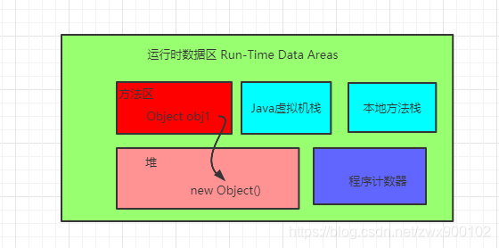
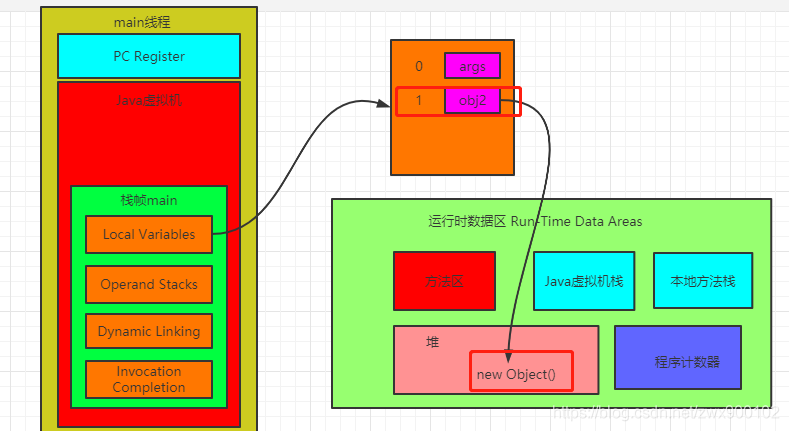
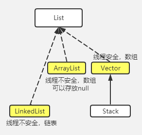
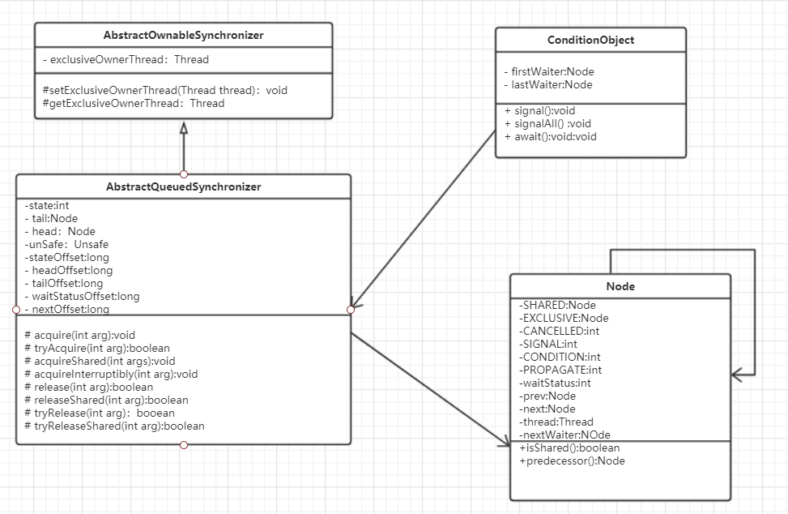
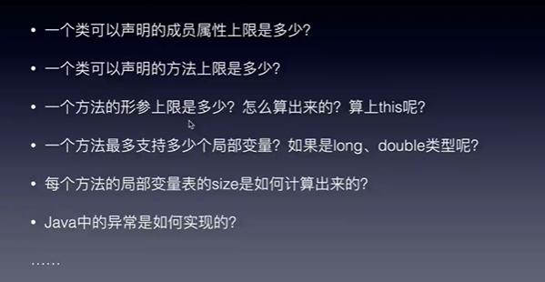
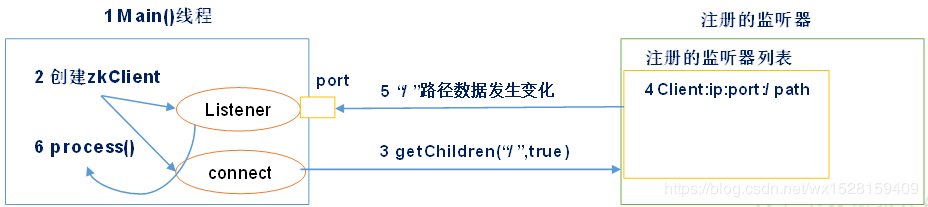

<div style="font-size: 36px; text-align:center; margin-bottom:30px;">CodeAnt  --  Java知多少<dix>


---

> v1.0 ：本文主要对Java基础知识、Java集合、多线程、计算机网络、Redis、JVM、排序算法进行了总结
>
> v1.1 ：网络编程、MySQL锁、分布式中RPC和消息队列以及对其他章节进行小篇幅的扩张
>
> v1.2 ：整理收拾未完成的Java基础，IO编程，netty，分布式事务初探，设计模式（单例，观察者）等
>
> v1.3 ：[主从复制、双向同步、环状同步](https://blog.csdn.net/rockyzhuo2014/article/details/82316619)---------

---

 [toc] 

<div STYLE="page-break-after: always;"></div>

---

## 1.Java基础知识

### 1.1 自动装箱和拆箱

> **装箱：**将**基本类型**用它们对应的**引用类型**包装起来；
> 
> **拆箱：**将包装类型转换为基本数据类型；

> **基本类型：**shrot、int、byte、long、char、float、duble、boolean
> 
> **引用类型：**类、接口和数组变量

```java
Integer a = 200;//a自动装箱
int b = 100;

a.equals(b);//b自动装箱
//b.equals(a);//会报错，equals是对象才拥有的方法。

a == b;//a自动拆箱
```
### 1.2  ==和equals

> **==：**基本类型比较值、引用类型比较地址
> 
> **equals：**equals等价于==，只是String和Integer重写了equals方法，改为了值比较。并且equal是对象才能调用的方法。

### 1.3 反射常用方法  

> [反射工具类](./代码/反射/ReflectionUtils.java)

```java
import java.lang.reflect.Field;
import java.lang.reflect.Method;

/**
 * 获取Class对象的方式： 1、Class.forName("类全名"); //加上包名的类名 
 * 2、类名.class
 * 3、new出一个对象后直接用getClass()方法来获取
 * 
 * 注意： 1、同一个字节码文件（*.class）在同一个程序当中只会被加载一次,不论用哪一种方式都得到的Class对象都是同一个。
 *          2、每一个类对应一个字节码文件（*.class）
 * 
 * 
 * Class对象的获取功能 1、获取成员变量们 Field[] getFields() : 获取所有的public成员变量
 * Field getField() : 获取特定的public成员变量(只能是公有)
 * 
 * Field[] getDeclaredFields(): 获取所有的成员变量，不考虑权限修饰符，但在使用非公有变量的时候要用setAccessible(ture)来忽略权限修饰符 
 * Field getDeclaredField()  : 获取特定的public成员变量
 * 
 * 2、获取构造方法们 Constructor<T> getConstructor(类<?>...parameterTypes) 
 * Constructor<?>[] getConstructors() 
 * Constructor<T> getDeclaredConstructor(类<?>... parameterTypes)
 * Constructor<?>[] getDeclaredConstructors()
 * 
 * 3、获取成员方法们 Method[] getMethods() Method getMethod(String name, 类<?>...parameterTypes)
 * 
 * Method[] getDeclaredMethods() Method getDeclaredMethod(String name, 类<?>...parameterTypes) 
 * 4、获取类名 getName()
 */

public class Day1 {

    public String name;
    public String game;
    private int number;

    public static void main(String[] args) throws Exception {

        // 1、Class.forName("类全名"); //加上包名的类名
        Class<?> class1 = Class.forName("com.hzu.se21090706.reflect.Day1");
        // 2、类名.class
        Class<?> class2 = Day1.class;
        // 3、new出一个对象后直接用getClass()方法来获取
        Day1 day1 = new Day1();
        Class<?> class3 = day1.getClass();
        // 注意： 1、同一个字节码文件（*.class）在同一个程序当中只会被加载一次,不论用哪一种方式都得到的Class对象都是同一个。
        // 2、每一个类对应一个字节码文件（*.class）
        System.out.println(class1 == class2);
        System.out.println(class1 == class3); // 两个结果都是true

        //Field[] getFields() : 获取所有的public成员变量
        Field[] fields = class1.getFields();
        for (Field field: fields) {
            System.out.println(field);
        }
         
        //Field getField() : 获取特定的public成员变量
        Field field = class1.getField("name");
        System.out.println(field);
        
        // Field[] getDeclaredFields(): 获取所有的成员变量，
        // 不考虑权限修饰符，但在使用非公有变量的时候要用setAccessible(ture)来忽略权限修饰符
        System.out.println("=========================");
        Field[] fields2 = class1.getDeclaredFields();
        for (Field field2 : fields2) {
            System.out.println(field2);
        }
        
        System.out.println("=====================");
        Method[] methods = class1.getMethods();
        for (Method method : methods) {
            System.out.println(method);
        }
    }

    @Override
    public String toString() {
        return "Day1 []";
    }

    public int getNumber() {
        return number;
    }

    public void setNumber(int number) {
        this.number = number;
    }

}
```

### 1.4 动态代理

> ```java
> public class JavaDynamicProxyDemo {
> 
>     interface InterfaceA {
>         void doSomething();
>     }
> 
>     static class InterfaceAImpl implements InterfaceA {
> 
>         @Override
>         public void doSomething() {
>             System.out.println("InterfaceImplA.doSomething()");
>         }
>     }
> 
>     static class InterfaceInvocationHandler implements InvocationHandler {
>         private Object obj;
> 
>         public InterfaceInvocationHandler(Object o) {
>             this.obj = o;
>         }
> 
>         @Override
>         public Object invoke(Object proxy, Method method, Object[] args) throws Throwable {
>             return method.invoke(this.obj, args);
>         }
>     }
> 
>     public static void main(String ... args) {
> 
>         InterfaceA interfaceA = new InterfaceAImpl();
> 
>         InterfaceA a = (InterfaceA) Proxy.newProxyInstance(
>                 interfaceA.getClass().getClassLoader(),
>                 interfaceA.getClass().getInterfaces(),
>                 new InterfaceInvocationHandler(interfaceA));
> 
>         a.doSomething();
>     }
> }
> ```

### 1.5 自定义注解 

```java
@Target(value = {ElementType.TYPE,ElementType.METHOD})
@Retention(RetentionPolicy.RUNTIME)//1、Java源文件阶段；2、编译到class文件阶段；3、运行期阶段。
public @interface CherryAnnotation {
	public String name();
	int age() default 18;
	int[] array();
}
```

### 1.6 String 、StringBuffer、StringBuilder

> String的长度是不可变的，其余两个是可变的，如果经常进行字符操作，特别是经常需要对内容进行修改的时候，使用StringBuffer，最后如果需要转换成String，那么再使用toString方法即可，该类是线程安全的类。 StringBuilder是普通类。
>
> 效率问题：String是最慢的，StringBuilder和StringBuffer在不同环境下结果不同。 
>
> 大致是：String > StringBuffer > StringBuilder（因为没有锁）


### 1.7 Exception和Error的区别，说一下常见的Exception和Error？
>一般来说Exception是可以预料的异常，我们可以通过代码进行捕获。
>Error是正常情况下不可能发生的错误，是不可逆的，事情发生了之久JVM会被停止。


>Exception：
>算数异常类：ArithmeticExecption
>空指针异常类型：NullPointerException
>类型强制转换类型：ClassCastException
>数组负下标异常：NegativeArrayException
>数组下标越界异常：ArrayIndexOutOfBoundsException
>文件已结束异常：EOFException
>文件未找到异常：FileNotFoundException
>操作数据库异常：SQLException


>Error：OutOfMerrory，StackOverFlow。

### 1.8谈一谈对Java泛型的理解？ 

> 泛型使用方式有：泛型类，泛型接口，泛型方法。
> 核心作用：限制插入数据的类型。 

### 1.9 泛型擦除？ 
> Java的泛型基本上都是在编译器这个层次上实现的，在生成的字节码中是不包含泛型中的类型信息的，使用泛型的时 候加上类型参数，在编译器编译的时候会去掉，这个过程成为类型擦除。

### 1.10 值传递和引用传递

> 参考文章 : https://juejin.im/post/6844903696996941832#comment

**结论**

> 因此可见：<font color="green">在Java中所有的参数传递，不管基本类型还是引用类型，都是值传递，或者说是副本传递。</font>
> 只是在传递过程中：
>
> **如果是对基本数据类型的数据进行操作，由于原始内容和副本都是存储实际值，并且是在不同的栈区，因此形参的操作，不影响原始内容。**
>
> **如果是对引用类型的数据进行操作，分两种情况，**
>
> **一种是形参和实参保持指向同一个对象地址，则形参的操作，会影响实参指向的对象的内容。**
>
> ```java
> public static void PersonCrossTest(Person person) {
>     System.out.println("传入的person的name：" + person.getName());
>     person.setName("我是张小龙");
>     System.out.println("方法内重新赋值后的name：" + person.getName());
> }
> ```
>
> **一种是形参被改动指向新的对象地址（如重新赋值引用），则形参的操作，不会影响实参指向的对象的内容。**
>
> ```java
> public static void PersonCrossTest(Person person) {
>     System.out.println("传入的person的name：" + person.getName());
>     person = new Person();//加多此行代码
>     person.setName("我是张小龙");
>     System.out.println("方法内重新赋值后的name：" + person.getName());
> }
> ```
>

### 1.11  new Object()到底占用几个字节

> 参考文章 :  https://juejin.cn/post/6844904113306615822 https://juejin.im/post/6873691965892853767






> 以64位操作系统为例，new Object()占用大小分为两种情况：
>
> - 未开启指针压缩
>    占用大小为：**8(Mark Word)+8(Class Pointer)=16字节**
> - 开启了指针压缩(默认是开启的)
>    开启指针压缩后，Class Pointer会被压缩为4字节，最终大小为：
>    **8(Mark Word)+4(Class Pointer)+4(对齐填充)=16字节**

#### MarkWord


> 表格中的“场景”，你也可以理解为“状态”，一个对象在一个时间点是处于一种状态的，但是状态之间**可能会切换**.
>
> 也就是你使用的对象，就处于当前表格中，其中“一行”的状态.
>
> Mark Word在64位虚拟机下，也就是占用64位大小即8个字节的空间.
>
> 内具体容包括：
>
> - unused：未使用的
> - hashcode：hashcode都是指identity hash code(*identity hash code是指**不经重写**过由jvm计算的hashcode.*)
> - thread: 偏向锁记录的线程标识
> - epoch: 验证偏向锁有效性的时间戳
> - age：分代年龄
> - biased_lock 偏向锁标志
> - lock 锁标志
> - pointer_to_lock_record 轻量锁lock record指针
> - pointer_to_heavyweight_monitor 重量锁monitor指针
>
> 如果你看cms_free这个字体有点奇怪那就对了，开始误画成了`unused`，后来反应过来默认开启“**指针压缩**”的情况，那么那一个bit应该是`cms_free`.
>
> `cms_free`从名字就能看出和cms收集器有关系，因为cms算法是**标记-清理**的一款收集器，所以内存碎片问题是将不可达对象维护在一个列表**free list**中，此处应该是标记对象是否在**free list**中.

> <font style="color: red">*为什么晋升到老年代的年龄设置(`XX:MaxTenuringThreshold`)不能超过**15** ？*</font>
>
> 因为就给了age**四个bit**空间，最大就是**1111**(二进制)也就是**15**，多了没地方存.
>
> <font style="color: red">*为什么你的**synchronized**锁住的对象，没有“传说中的”偏向锁优化？*</font>
>
> 因为hashcode并不是对象实例化完就计算好的，是调用计算出来放在mark word里的。
>
> 你调用过hashcode方法(或者隐式调用：存到hashset里，map的key，调用了默认未经重写的toString()方法等等)，把“坑位”占了，偏向锁想存的线程id没地方存了，自然就直接是**轻量级锁**了.

### 1.12 static 和 final

**static**

> 加载：static在类加载时初始化（加载）完成
>
> 含义：Static意为静态的，但凡被static 修饰说明属于类，不属于类的对象。
>
> 可修饰：Static 可以修饰 `内部类、方法、成员变量、代码块`。
>
> 不可修饰：Static不可修饰`外部类、局部变量`【static 属于类的，局部变量属于其方法，并不属于类】
>
> 注意：`static` 方法不能兼容`this`关键字【static代表类层次，this代表当前类的对象】

**final**

> 加载：final可以在编译（类加载）时初始化，也可以在运行时初始化，初始化后不能被改变。
>
> 可修饰：`类、内部类、方法、成员变量、局部变量、基本类型、引用类型`。
>
> 含义：final“最终的”的意思，在Java中又有意为常量的意思，也就是被final修饰的只能进行一次初始化！
>
> 被final修饰各种所蕴含的特殊意义：
>
> > 1、 final 修饰基本类型：值**不能被修改**；
> >
> > **2、final 修饰引用类型：引用不可以被修改也就是说不能指向其他对象，但是该引用的对象内容可以被修改；** 
> >
> > 3、final 修饰 方法，方法**不可以重写**，但是可以被子类访问 【前提：方法不是 private 类型】。
> >
> > 4、final 修饰 类，类**不可以被继承**。

**static fianl**

> 含义：从字面也可以知道，它代表Static与final二者的共同体。
>
> 可修饰：依旧是取二者的共同体，所以只能修饰`成员变量、方法、内部类`，被Static final修饰意义分别如下：
>
> > 1、成员变量：属于类的变量且只能赋值一次。
> >
> > 2、方法：属于类的方法且不可以被重写。 
> >
> > 3、内部类：属于外部类，且不能被继承

### 1.13 OutOfMerroryError和StackOverFlowError

> [OutOfMerroryError](https://juejin.cn/post/6844903615253987335)：堆中，无法再分配新的内存，内存耗尽，并且垃圾回收器无法及时回收内存，则抛出 OutOfMemoryError。（堆中主要存储的是对象）
>
> StackOverFlowError：调用栈过深，导致线程栈占用大小超过`-Xss`（或者是`-XX:ThreadStackSize`）的限制，如果没指定`-Xss`，则根据不同系统确定默认最大大小。该问题一般出现在递归的方法

### 1.14 计算机基础（科普篇）

#### 1.14.1 基本存储单位

> **位（bit）：**二进制数中的一个数位，可以是0或者1，是计算机中数据的最小单位。
>
> **字节（Byte，B）：**计算机中数据的基本单位，每8位组成一个字节。各种信息在计算机中存储、处理至少需要一个字节。例如，一个ASCII码用一个字节表示，一个汉字用两个字节表示。

#### 1.14.2 [原码](https://baike.baidu.com/item/原码/1097586)、[反码](https://baike.baidu.com/item/反码/769985)和补码（有符号数有三种表示方法）------


#### 1.14.3 位运算（源码中有较多的位运算）

下面的a和b都是整数类型，则：

| 含义                                            | Pascal语言 | C语言  | Java   |
| ----------------------------------------------- | ---------- | ------ | ------ |
| 按位与                                          | a and b    | a & b  | a & b  |
| [按位或](https://baike.baidu.com/item/按位或)   | a or b     | a \| b | a \| b |
| 按位[异或](https://baike.baidu.com/item/异或)   | a xor b    | a ^ b  | a ^ b  |
| 按位[取反](https://baike.baidu.com/item/取反)   | not a      | ~a     | ~a     |
| 左移                                            | a shl b    | a << b | a << b |
| 带符号[右移](https://baike.baidu.com/item/右移) | a shr b    | a >> b | a >> b |
| 无符号右移                                      | /          | /      | a>>> b |

### 1.15 Hash算法


---

<div STYLE="page-break-after: always;"></div>
## 2.Java集合

> Java集合分为collection和map

> ArrayList   一种可以动态增长和缩减的索引序列
> LinkedList   一种可以在任何位置进行高效插入和删除操作的有序序列
> ArrayDeque   一种用循环数组实现的双端队列
> HashSet   一种没有重复元素的无序集合
> TreeSet   一种有序集
> EnumSet   一种包含枚举类型值的集合
> LinkedHashSet   一种可以记住元素插入次序的集
> PriorityQueue   一种允许高效删除最小元素的集合
> HashMap   一种存储键/值关联的数据结构
> TreeMap   一种键值有序排列的映射表
> EnumMap   一种键值属于枚举类型的映射表
> LinkedHashMap   一种可以记住键/值项添加次序的映射表
> WeakHashMap   一种其值无用武之地后可以被垃圾回收期回收的映射表
> IdentityHashMap   一种用==而不是用equals比较键值的映射表

### 2.1 HashMap

> **实现原理：** HashMap 基于 Hash 算法实现的，我们通过 put(key,value)存储，get(key)来获取。当传入 key 时，HashMap 会根据 key. hashCode() 计算出 hash 值，根据 hash 值将 value 保存在 bucket 里。当计算出的 hash 值相同时，我们称之为 hash 冲突，HashMap 的做法是用链表和红黑树存储相同 hash 值的 value。当 hash 冲突的个数比较少时，使用链表否则使用红黑树。 

> **Java7：** 数组 + 链表
> **Java8：** 数组 + 链表 + 红黑树 （链表中的元素超过了 8 个以后，会将链表转换为红黑树）
>
> 	初始容量16，扩容*2
> 	数据结构：数组+单向链表/红黑树
> 	线程不安全，允许null键null值
> 	key不重复，不保证顺序
> 	最大容量2的30次方
> 	容量大于64，且链表长度达到8时树形化。降到6时链化。
> 	容量达到容量*负载因子（默认0.75）时扩容

#### 2.1.1 <font color="red">为什么要重写equals()和hashCode()</font>

> [为什么使用HashMap需要重写hashcode和equals方法？.md](./文章/为什么使用HashMap需要重写hashcode和equals方法？.md) 

#### 2.1.2 HashMap为什么是2的n次幂-----

> 参考文章 : 

### 2.2 ConcurrentHashMap

> **Java7：** **分段**数组 + 链表
> **Java8：** 数组 + 链表 + 红黑树 （链表中的元素超过了 8 个以后，会将链表转换为红黑树）

#### 2.2.1 如何实现线程安全的 ( 源码阅读 )

> 研究一个数据集合的安全性, 其实也就是从他的数据结构的`Get`和`Put`方法看, 是否保证了线程安全.
>
> https://www.jianshu.com/p/f9b3e76951c2

> 并发控制使用 synchronized 和 CAS算法（版本号管理机制） 来操作
>
> ```java
> public V put(K key, V value) {
>     return putVal(key, value, false);
> }
> 
>     /** Implementation for put and putIfAbsent */
> final V putVal(K key, V value, boolean onlyIfAbsent) {
>     //ConcurrentHashMap 不允许插入null键，HashMap允许插入一个null键
>     if (key == null || value == null) throw new NullPointerException();
>     //计算key的hash值
>     int hash = spread(key.hashCode());
>     int binCount = 0;
>     //for循环的作用：因为更新元素是使用CAS机制更新，需要不断的失败重试，直到成功为止。
>     for (Node<K,V>[] tab = table;;) {
>         // f：链表或红黑二叉树头结点，向链表中添加元素时，需要synchronized获取f的锁。
>         Node<K,V> f; int n, i, fh;
>         //判断Node[]数组是否初始化，没有则进行初始化操作
>         if (tab == null || (n = tab.length) == 0)
>             tab = initTable();
>         //通过hash定位Node[]数组的索引坐标，是否有Node节点，如果没有则使用CAS进行添加（链表的头结点），添加失败则进入下次循环。
>         else if ((f = tabAt(tab, i = (n - 1) & hash)) == null) {
>             if (casTabAt(tab, i, null,
>                          new Node<K,V>(hash, key, value, null)))
>                 break;                   // no lock when adding to empty bin
>         }
>         //检查到内部正在移动元素（Node[] 数组扩容）
>         else if ((fh = f.hash) == MOVED)
>             //帮助它扩容
>             tab = helpTransfer(tab, f);
>         else {
>             V oldVal = null;
>             //锁住链表或红黑二叉树的头结点
>             synchronized (f) {
>                 //判断f是否是链表的头结点
>                 if (tabAt(tab, i) == f) {
>                     //如果fh>=0 是链表节点
>                     if (fh >= 0) {
>                         binCount = 1;
>                         //遍历链表所有节点
>                         for (Node<K,V> e = f;; ++binCount) {
>                             K ek;
>                             //如果节点存在，则更新value
>                             if (e.hash == hash &&
>                                 ((ek = e.key) == key ||
>                                  (ek != null && key.equals(ek)))) {
>                                 oldVal = e.val;
>                                 if (!onlyIfAbsent)
>                                     e.val = value;
>                                 break;
>                             }
>                             //不存在则在链表尾部添加新节点。
>                             Node<K,V> pred = e;
>                             if ((e = e.next) == null) {
>                                 pred.next = new Node<K,V>(hash, key,
>                                                           value, null);
>                                 break;
>                             }
>                         }
>                     }
>                     //TreeBin是红黑二叉树节点
>                     else if (f instanceof TreeBin) {
>                         Node<K,V> p;
>                         binCount = 2;
>                         //添加树节点
>                         if ((p = ((TreeBin<K,V>)f).putTreeVal(hash, key,
>                                                       value)) != null) {
>                             oldVal = p.val;
>                             if (!onlyIfAbsent)
>                                 p.val = value;
>                         }
>                     }
>                 }
>             }
>             
>             if (binCount != 0) {
>                 //如果链表长度已经达到临界值8 就需要把链表转换为树结构
>                 if (binCount >= TREEIFY_THRESHOLD)
>                     treeifyBin(tab, i);
>                 if (oldVal != null)
>                     return oldVal;
>                 break;
>             }
>         }
>     }
>     //将当前ConcurrentHashMap的size数量+1
>     addCount(1L, binCount);
>     return null;
> }
> ```
>
> > 1. 判断Node[]数组是否初始化，没有则进行初始化操作
> >
> > 2. 通过hash定位Node[]数组的索引坐标，是否有Node节点，如果没有则使用CAS进行添加（链表的头结点），添加失败则进入下次循环。
> >
> > 3. 检查到内部正在扩容，如果正在扩容，就帮助它一块扩容。
> >
> > 4. 如果f!=null，则使用synchronized锁住f元素（链表/红黑二叉树的头元素）
> >     4.1 如果是Node(链表结构)则执行链表的添加操作。
> >     4.2 如果是TreeNode(树型结果)则执行树添加操作。
> >
> > 5. 判断链表长度已经达到临界值8 就需要把链表转换为树结构。

#### 2.2.2 **ConcurrentHashMap扩容机制**

> 

#### 2.2.3 **ConcurrentHashMap的get方法是否要加锁，为什么？**

> 不加锁, 因为是Node的元素val和指针next是用volatile修饰的, 在多线程环境下线程A修改结点的val或者新增节点的时候是对线程B可见的。

### 2.3 HashMap、HashTable、ConcurrentHashMap

> **HashMap：**
>
> - 值可以为null；
> - **线程不安全**
> - 默认的初始化大小为16。之后每次扩充，容量变为原来的2倍。为什么是2倍？

> **HashTable：**
> - 值不能为null；	
>
> - **线程安全，**但是效率不高，用的重量级锁synchronized；
>
>   ```java
>   //hashtable的put / get源码
>   public synchronized V put(K key, V value) {
>   	//...省略
>   }
>   public synchronized V get(Object key) {
>       //...省略
>   }
>   ```
>
> - 默认的初始大小为11，之后每次扩充，容量变为原来的2n+1。为什么是2n+1？

> **ConcurrentHashMap:**
>
> - **线程安全；**
>
> - 并发控制使用 synchronized 和 CAS算法（版本号管理机制） 来操作
>
>


> HashTable性能差主要是由于所有操作需要竞争同一把锁，而如果容器中有多把锁，每一把锁锁一段数据，这样在多线程访问时不同段的数据时，就不会存在锁竞争了，这样便可以有效地提高并发效率。这就是ConcurrentHashMap所采用的"分段锁"思想。


#### 2.3.1 红黑树

> https://juejin.im/post/6844903519632228365
>
> 视频讲解 : https://www.bilibili.com/video/BV1tE411f7tP?p=1

**概念**

> 红黑树是一种自平衡的二叉查找树
>
> 1.节点是红色或黑色。
>
> 2.根节点是黑色。
>
> 3.每个叶子节点都是黑色的空节点（NIL节点）。
>
> 4 每个红色节点的两个子节点都是黑色。(从每个叶子到根的所有路径上不能有两个连续的红色节点)
>
> 5.从任一节点到其每个叶子的所有路径都包含相同数目的黑色节点。
>
> 

**红黑树的变色和旋转是怎样实现的**

> **变色：**为了重新符合红黑树的规则，尝试把红色节点变为黑色，或者把黑色节点变为红色。
>
> **左旋转：** **逆时针**旋转红黑树的两个节点，使得父节点被自己的右孩子取代，而自己成为自己的左孩子。
>
> **右旋转：** **顺时针**旋转红黑树的两个节点，使得父节点被自己的左孩子取代，而自己成为自己的右孩子。

### 2.4 linkedHashMap

>LinkedHashMap是HashMap的一个子类，<font color="red">利用双链表保存了记录的插入顺序.</font>
>
>其他特性和HashMap一样的.

### 2.5 List



#### 2.5.1 ArrayList

> 数组实现的, 可以存放null
>
> 线程不安全的, 源码中对add/get等操作并没有加锁

**初始化**

> ```java
> // 初始化完成, 长度为0
> ArrayList list = new ArrayList(); 
> ```
>
> **源码**
>
> ```java
> private static final Object[] DEFAULTCAPACITY_EMPTY_ELEMENTDATA = {};
> 
> public ArrayList() { this.elementData = DEFAULTCAPACITY_EMPTY_ELEMENTDATA; }
> ```

**add操作**

> ```java
> //list第一次add, 初始化长度为10
> list.add(obj);
> ```
>
> ```java
>private static final int DEFAULT_CAPACITY = 10;
> public boolean add(E e) {
>  ensureCapacityInternal(size + 1);  // Increments modCount!!
>  elementData[size++] = e;
>     return true;
>    }
>    private static int calculateCapacity(Object[] elementData, int minCapacity) {
>  if (elementData == DEFAULTCAPACITY_EMPTY_ELEMENTDATA) {
>      return Math.max(DEFAULT_CAPACITY, minCapacity);
>     }
>     return minCapacity;
>    }
>    ```

**扩容**

> 1.5倍长度扩容, 利用Arrays.copyOf()来实现
>
> ```java
> private void grow(int minCapacity) {
>     // overflow-conscious code
>     int oldCapacity = elementData.length;
>     int newCapacity = oldCapacity + (oldCapacity >> 1);
>     if (newCapacity - minCapacity < 0)
>         newCapacity = minCapacity;
>     if (newCapacity - MAX_ARRAY_SIZE > 0)
>         newCapacity = hugeCapacity(minCapacity);
>     // minCapacity is usually close to size, so this is a win:
>     elementData = Arrays.copyOf(elementData, newCapacity);
> }
> ```

#### 2.5.2 LinkedList

> 双向链表, 可以存放null, 线程不安全

#### 2.5.3 线程安全的list

##### 2.5.3.1 Vector

> 数组实现的, 线程安全
>
> 利用的是`synchronized`加锁
>
> ```java
> public synchronized boolean add(E e) {
>     modCount++;
>     ensureCapacityHelper(elementCount + 1);
>     elementData[elementCount++] = e;
>     return true;
> }
> ```

**初始化**

> ```java
> //初始化长度为10
> public Vector() {
>     this(10);
> }
> ```

**扩容**

> 扩容的时候它是直接扩容两倍的	

##### 2.5.3.2 CopyOnWriteArrayList

> `java.util.concurrent`包下, `写入时复制`

**add方法**

> `getArray()`获取旧的数组放入`elements`
>
>   -- >  放入新的数组`newElements`, 并且长度`+1`
>
>   -- > `将传入的参数放入`newElements
>
>   -- >  `setArray(newElements);`**将旧的数组变量指向新数组地址**
>
> ```java
> private transient volatile Object[] array;
> 
> public boolean add(E e) {
>     final ReentrantLock lock = this.lock;
>     lock.lock();
>     try {
>         Object[] elements = getArray();
>         int len = elements.length;
>         Object[] newElements = Arrays.copyOf(elements, len + 1);
>         newElements[len] = e;
>         setArray(newElements);
>         return true;
>     } finally {
>         lock.unlock();
>     }
> }
> 
> final void setArray(Object[] a) {
>     array = a;
> }
> ```
>

**缺点**

- CopyOnWriteArrayList是很耗费内存的，每次`set()/add()`都会复制一个数组出来
- CopyOnWriteArrayList只能保证数据的**最终一致性**，不能保证数据的实时一致性。假设两个线程，线程A去读取CopyOnWriteArrayList的数据，还没读完，现在线程B把这个List给清空了，线程A此时还是可以把剩余的数据给读出来。

---

<div STYLE="page-break-after: always;"></div>
## 3.多线程

> 多线程面试如何问 : https://juejin.im/post/6863862256791191560  [个人珍藏的80道多线程并发面试题（1-10答案解析）](https://github.com/whx123/JavaHome/blob/master/Java面试题集结号/Java 并发 %26%26 多线程/个人珍藏的80道多线程并发面试题（1-10答案解析）.md)
>
> 视频教程 : https://www.bilibili.com/video/BV16J411h7Rd?p=129
>
> 思维导图 : https://www.processon.com/special/template/5cd36b96e4b08b66b9cb2378#map

### 3.1 串行 / 并行 / 并发

> **串行 : ** 多个线程顺序执行

> **并行 :** 多个线程**同时**执行 ( 多个CPU, 每个CPU分配一个任务 )

> **并发 : **多个线程交替执行 ( 单CPU ) 

### 3.2 同步 & 异步 

- **同步方法**调用一旦开始，调用者必须等到方法调用返回后，才能继续后续的行为。

- **异步方法**调用更像一个消息传递，一旦开始，方法调用就会立即返回，调用者就可以继续后续的操作。而，异步方法通常会在另外一个线程中，“真实”地执行着。整个过程，不会阻碍调用者的工作。


### 3.3 共享&互斥

> 资源H / 线程A & 线程B
>
> **共享**
>
> 线程A在操作资源H, 同时线程B也可以操作资源H
>
> **互斥**
>
> 线程A在操作资源H,  线程B就不能操作资源H; 

### 3.4 Java内存模型( JMM - Java Memory Model )

> 视频教程 : https://www.bilibili.com/video/BV1RE411q7Yd
>
> java内存模型是根据cpu内存模型建立的
>
> **JMM模型**是将主存的变量读取到线程的工作内存, 生成一个副本, 然后线程对这个副本进行操作

>  ​							**CPU模型**																				**JMM**
>
>  

**JMM数据原子操作**


#### 3.4.1 JMM的体现( 也叫并发编程三大特性 )

##### 3.4.1.1 原子性

**概念**

> 保证指令不会受到线程上下文切换的影响

**如何保证原子性**

> 在Java内存模型中，只保证了基本读取和赋值的原子性操作。如果想保证多个操作的原子性，需要使用`synchronized`关键字或者`Lock`相关的工具类。如果想要使int、long等类型的自增操作具有原子性，可以用java.util.concurrent.atomic包下的工具类，如：`AtomicInteger`、`AtomicLong`等。另外需要注意的是，**`volatile`关键字不具有保证原子性的语义**。

###### 3.4.1.1.1  示例 : i++和i--的线程安全问题

> `i++`和`i--`并不是原子操作, 所以会导致线程安全问题

示例

> 这里有个`i`, 分别创建两个线程对其进行`5000`次`+1`操作和`5000`次`-1`操作, 按照常理来说, 最终的`i=0`,但并不是

```java
public class Test {

    static int i = 0;

    public static void main(String[] args) throws InterruptedException {

        Thread t1 = new Thread(()->{
            for (int j = 0; j < 5000; j++) {
                i++;
            }
        });
        Thread t2 = new Thread(()->{
            for (int j = 0; j < 5000; j++) {
                i--;
            }
        });

        //启动线程
        t1.start();
        t2.start();
        //等待线程执行完毕再打印i
        t1.join();
        t2.join();
        System.out.println(i);
    }
}
//结果
-1218 ( 每次都会不一样 )
```

> 因为`i++`和`i--`并不是原子操作, 在这里也就是对于虚拟机来说就是, 虚拟机将Java语言`i++`编译为字节码后, 并不是一条指令, 再加上操作系统线程调度机制, 就会导致`i++`操作未完成的时候, 就暂停`i++`, 切换到`i--`执行
>
> ```java
> getstatic	i	//获取静态变量i的值
> iconst_1	 	//准备常量1
> iadd			//自增
> putstatic		//将修改后的值存入静态变量
> ```
>
> 

**如何解决上述问题 ? **

>阻塞式的解决方案：`synchronized`，`Lock`
>
>非阻塞式的解决方案：原子变量

> 利用原子类`AtomicInteger`

```java
public class Test {
    
    static AtomicInteger i = new AtomicInteger(0);

    public static void main(String[] args) throws InterruptedException {
        Thread t1 = new Thread(()->{
            for (int j = 0; j < 5000; j++) {
                i.addAndGet(1);
            }
        });
        Thread t2 = new Thread(()->{
            for (int j = 0; j < 5000; j++) {
                i.getAndAdd(-1);
            }
        });

        //启动线程
        t1.start();
        t2.start();
        //等待线程执行完毕再打印i
        t1.join();
        t2.join();
        System.out.println(i);
    }
}
//结果
0
```

> 利用`synchronized`

```java
public class Test {

    static int i = 0;
    static Object object = new Object();

    public static void main(String[] args) throws InterruptedException {

        Thread t1 = new Thread(()->{
            for (int j = 0; j < 5000; j++) {
                synchronized (object){
                    i++;
                }
            }
        });
        Thread t2 = new Thread(()->{
            for (int j = 0; j < 5000; j++) {
                synchronized (object){
                    i--;
                }
            }
        });

        //启动线程
        t1.start();
        t2.start();
        //等待线程执行完毕再打印i
        t1.join();
        t2.join();
        System.out.println(i);
    }
}
```

> 思考 : 如果线程t1加锁, t2不加锁, 会怎样 ? 
>
> 结论 : **t2**线程不会阻塞

##### 3.4.1.2 可见性

**概念**

>  保证指令不会受 cpu 缓存的影响
>
> 当一个线程对共享变量进行修改后，另外一个线程可以立即看到该变量修改后的最新值。

**如何保证可见性**

> **使用`volatile`关键字**
>
> 当一个变量被`volatile`关键字修饰时，其他线程对该变量进行了修改后，会导致当前线程在工作内存中的变量副本失效，必须从主内存中再次获取，当前线程修改工作内存中的变量后，同时也会立刻将其修改刷新到主内存中。
>
> **使用`synchronized`关键字**
>
> `synchronized`关键字能够保证同一时刻只有一个线程获得锁，然后执行同步方法或者代码块，并且确保在锁释放之前，会把变量的修改刷新到主内存中。
>
> **使用`Lock`相关的工具类**
>
> `Lock`相关的工具类的`lock`方法能够保证同一时刻只有一个线程获得锁，然后执行同步代码块，并且确保执行`Lock`相关的工具类的`unlock`方法在之前，会把变量的修改刷新到主内存中。

###### 3.4.1.2.1 示例

> 从运行的输出看出，
>
> 读取count值的线程一直没有读取到count的最新值，这是为什么呢？因为在读取count值的线程中，第一次读取count值时，从主内存中读取count的值后写入到自己的工作内存中，再从工作内存中读取，**之后的读取的count值都是从自己的工作内存中读取**，并没有发现更新count值的线程对count值的修改。
>
> 更新count值的线程第一次读取count值时，从主内存中读取count的值后写入到自己的工作内存中，再从工作内存中读取，**待线程结束后将数据写会主存。**

```java
public class VisibilityTest {
    public static int count = 0;

    public static void main(String[] args) {
        final SimpleDateFormat sdf = new SimpleDateFormat("HH:mm:ss.SSS");

        //读取count值的线程A
        new Thread(() -> {
            System.out.println("开始读取count...");
            int i = count;//存放count的更新前的值
            while (count < 3) {
                if (count != i) {//当count的值发生改变时，打印count被更新
                    System.out.println(sdf.format(new Date()) + " count被更新为" + count);
                    i = count;//存放count的更新前的值
                }
            }
        }).start();

        //更新count值的线程B
        new Thread(() -> {
            for (int i = 1; i <= 3; i++) {
                //每隔1秒为count赋值一次新的值
                try {
                    Thread.sleep(1000);
                } catch (InterruptedException e) {
                    e.printStackTrace();
                }
                System.out.println(sdf.format(new Date()) + " 赋值count为" + i);
                count = i;

            }
        }).start();
    }
}
//结果
开始读取count...
17:21:54.796 赋值count为1
17:21:55.798 赋值count为2
17:21:56.799 赋值count为3
```

##### 3.4.1.3 有序性

**概念**

> 保证指令不会受 cpu 指令并行优化的影响
>
> 虚拟机在进行代码编译时，对于那些改变顺序之后不会对最终结果造成影响的代码，虚拟机不一定会按照我们写的代码的顺序来执行，有可能将他们重排序, 这叫做指令重排。实际上，对于有些代码进行重排序之后，虽然对变量的值没有造成影响，但有可能会出现线程安全问题。

###### 3.4.1.3.1 示例 : 一个有问题的单例模式

```java
public class Singleton {
    private Singleton (){}

    private static boolean isInit = false;
    private static Singleton instance;

    public static Singleton getInstance() {
        if (!isInit) {//判断是否初始化过
            instance = new Singleton();//初始化
            isInit = true;//初始化标识赋值为true
        }
        return instance;
    }
}
```

> 这是一个有问题的单例模式示例，假如在编译期或运行期时指令重排，把`isInit = true;`重新排序到`instance = new Singleton();`的前面。在单线程运行时，程序重排后的执行结果和代码顺序执行的结果是完全一样的，但是多个线程一起执行时就极有可能出现问题。比如，一个线程先判断`isInit`为false进行初始化，本应在初始化后再把`isInit`赋值为true，但是因为指令重排没后初始化就把`isInit`赋值为true，恰好此时另外一个线程在判断是否初始化过，`isInit`为true就执行返回了`instance`，这是一个没有初始化的`instance`，肯定造成不可预知的错误。

**添加volatile**

```java
public class Singleton {
    private Singleton (){}

    private static volatile boolean isInit = false;
    private static Singleton instance;

    public static Singleton getInstance() {
        if (!isInit) {//判断是否初始化过
            instance = new Singleton();//初始化
            isInit = true;//初始化标识赋值为true
        }
        return instance;
    }
}
```

> `volatile`他保证了关于`isInit`操作之前的指令不会重排序, 这里也就是`instance = new Singleton();`一直会在`isInit = true;`之前执行

### 3.5 <font color="red">volatile</font>

> 缓存可见性 , 指令有序性, 不保证原子性
>
> 视频教程 : https://www.bilibili.com/video/BV1RE411q7Yd?t=486

#### 3.5.1 可见性问题来源

```java
static boolean initFlag = false;
    public static void main(String[] args) throw InterruptedException{

        Thread t1 = new Thread( ()->{
            while(!initFlag){
            }
            System.out.println("end");
        });

        Thread t2 = new Thread( ()->{
            //这里是为了先让线程t1先执行
            Thread.sleep(1000);
            initFlag = true;
            System.out.println("initFlag = " + initFlag);
        });

        t1.start();
        t2.start();
    }
```

> 上诉代码按照咱们的理解, `t2`线程启动后, 将`initFlag`设置为`true`, `t1`线程就会结束`while`循环, 并打印`end`;  但结果并不是这样

**不添加volatile**

> **多线程处理共享变量问题;  该图片是早期的<font color="red">JMM操作流程</font>;会有对<font color="yellow">总线加锁</font>的操作** 
>
> 图片中线程2展示了JMM原子操作第一次读取count值时，从主内存中读取count的值后写入到自己的工作内存中，再从工作内存中读取，**待线程结束后将数据写会主存。**
>
> 其中线程1第一次读取count值时，从主内存中读取count的值后写入到自己的工作内存中，再从工作内存中读取，**之后的读取的count值都是从自己的工作内存中读取**，并没有发现更新count值的线程对count值的修改。<font color="greeen">出现了可见性的问题</font>
>
> 
>
> <font color="red">**因为加锁的粒度太大,对总线加锁 , 会将所有的线程串化, 失去了多线程的意义, 后期添加了MESI缓存一致性协议 , 只针对缓存行加锁, 可以指定变量开启该协议.**</font>

**添加volatile**

> 线程2中设置为volatile的变量,<font color="grenn">**在更改值后马上同步回主存, 线程2的后续代码在值写回主存完成后再执行**</font>
>
> 所有CPU ( 这里指线程1 ) 会不断地<font color="red">**监听总线是否有更新共享变量的操作**</font>, <font color="grenn">有更改操作就把所有CPU( 这里指线程1 )上的工作内存中的共享变量变为**失效,  **</font><font color="yellow">然后线程1中执行的代码中用到了这个共享变量, 去工作区间拿这个共享变量, 发现该值已经失效, 就会重新去主存获取值</font>

#### 3.5.2 MESI缓存一致性协议 原理

> 参考文章 : https://www.cnblogs.com/yanlong300/p/8986041.html
>
> MESI 是指4种状态的首字母。每个Cache line有4个状态，可用2个bit表示，它们分别是：
>
> > **缓存行（Cache line）**:缓存存储数据的单元。
>
> | 状态                     | 描述                                                         | 监听任务                                                     |
> | :----------------------- | :----------------------------------------------------------- | :----------------------------------------------------------- |
> | M 修改 (Modified)        | 该Cache line有效，数据被修改了，和内存中的数据不一致，数据只存在于本Cache中。 | 缓存行必须时刻监听所有试图读该缓存行相对就主存的操作，这种操作必须在缓存将该缓存行写回主存并将状态变成S（共享）状态之前被延迟执行。 |
> | E 独享、互斥 (Exclusive) | 该Cache line有效，数据和内存中的数据一致，数据只存在于本Cache中。 | 缓存行也必须监听其它缓存读主存中该缓存行的操作，一旦有这种操作，该缓存行需要变成S（共享）状态。 |
> | S 共享 (Shared)          | 该Cache line有效，数据和内存中的数据一致，数据存在于很多Cache中。 | 缓存行也必须监听其它缓存使该缓存行无效或者独享该缓存行的请求，并将该缓存行变成无效（Invalid）。 |
> | I 无效 (Invalid)         | 该Cache line无效。                                           | 无                                                           |

#### 3.5.3 volatile的底层 - 汇编

> 其实在变量前面添加`volatile`关键字, 在汇编语言层次上看, 也就是在未添加关键字的指令上多了一个`lock`
>
> ```
> //添加volatile
> lock add dword ptr [rsp]....
> //未添加
> add dword ptr [rsp]....
> ```
>
> **lock指令的作用**
>
> 1. 重排序时不能把后面的指令重排序到lock之前的位置
> 2. 锁定当前**缓存行**区域, 并**写回主内存** ( 防止其他线程操作改变量 )
> 3. 这些写回主存的操作会引起其他CPU中的工作内存的该变量失效( MESI协议 )
>
> **2、3点保证可见性，第1点禁止指令重排**

#### 3.5.4  **happens-before**

> happens-before 规定了对共享变量的写操作对其它线程的读操作可见，**它是可见性与有序性的一套规则总结**，抛开以下 happens-before 规则，JMM 并不能保证一个线程对共享变量的写，对于其它线程对该共享变量的读可见

#### 3.5.5 指令重排问题

>  https://www.cnblogs.com/lifegoeson/p/13533873.html

> 指令重排是指在程序执行过程中,为了提高性能, 编译器和CPU可能会对指令进行重新排序。

#### 3.5.6 如何保证原子性

> 结合`synchronized`, 尽量原子操作类, juc下的atomic包下的类

#### 示例 : 单例模式

**1. 不考虑线程安全的懒汉式单例模式**

> ```java
> public class Test {
> 
>     private static Test single = null;
>     
>     public static Test getInstance(){
>         if (single == null) return new Test();
>         return single;
>     }
> }
> ```

**2. 考虑过线程安全问题的懒汉式单例模式( DCL double-checked- locking )**

>  ```java
> public class Test {
> 
>     private static Test single = null;
> 
>     public static Test getInstance(){
>         if(single == null){
>             synchronized(Test.class){
>                 if (single == null) return new Test();
>             }
>         }
>         return single;
>     }
> }
>  ```
>
> **字节码 : **可根据字节码分析, 会发现有`有序性`的问题存在
>
> **锁粒度 : **`Test.class` - 类对象
>
> **问题 : **大量线程访问时候, 虽然保证`synchronized`代码块里面的代码线程安全的问题, 但是对于**`synchronized`代码块外面的代码有序性无法保证**
>
> 由于锁的粒度太大, 对`.class`加锁, **阻塞时间会更长,阻塞线程会变得更多**( <font color="red">需要细细体会加粗字体</font> )

**3. 考虑过线程安全问题 / 锁粒度更小的懒汉式单例模式**

> ```java
> public class Test {
> 
>     private static volatile Test single = null;
> 
>     public static Test getInstance(){
>         if(single == null){
>             synchronized(single){
>                 if (single == null) return new Test();
>             }
>         }
>      	return single;
>     }
> }
> ```
>
> **锁粒度 : **`single` - 类中的变量对象
>
> **优势 : **`volatile`保证了变量的缓存可见性, 有序性, 但是不保证原子性, 所以这里添加 `synchronized`包装`single`的原子性, 并且在外层再添加了一个`if`

### 3.6 信号量

> Semaphore与CountDownLatch

### 3.7  Thread常见方法

| **方法名** | **static** | **功能说明** | **注意** |
| ---------- | ---------- | ------------ | -------- |
| start()    |            |启动一个新线程，在新的线程运行 run 方法中的代码              |start 方法只是让程进入就绪，里面代码不一定立刻运行（CPU 的时间片还没分给它）。每个线程对象的start方法只能调用一次，如果调用了多次会出现IllegalThreadStateException          |
| run() |            | 新线程启动后会调用的方法 | 如果在构造 Thread 对象时传递了 Runnable 参数，则线程启动后会调用 Runnable 中的 run 方法，否则默认不执行任何操作。但可以创建 Thread 的子类对象，来覆盖默认行为          |
| join() |            | 等待线程运行结束 |          |
| join(long n) |            | 等待线程运行结束,最多等待 n 毫秒  |          |
|  getId()          |            |  获取线程长整型的 id            |  id 唯一        |
|   getName()           |            |    获取线程名          |          |
|    setName(String)        |            |       修改线程名       |          |
|   getPriority()         |            |   获取线程优先级           |          |
|     setPriority(int)       |            |    修改线程优先级          |     java中规定线程优先级是1~10 的整数,较大的优先级能提高该线程被 CPU 调度的机率     |
|   getState()         |            |     获取线程状态         |  Java 中线程状态是用 6 个 enum 表示，分别为：NEW, RUNNABLE, BLOCKED, WAITING, TIMED_WAITING, TERMINATED        |
|   isInterrupted()         |            |     判断是否被打断，         |   不会清除 打断标记       |
|     isAlive()       |            |    线程是否存活（还没有运行完毕）          |          |
|   interrupt()         |            |    打断线程          |   如果被打断线程正在 sleep，wait，join 会导致被打断的线程抛出 InterruptedException，并清除 打断标记 ；如果打断的正在运行的线程，则会设置 打断标记 ；park 的线程被打断，也会设置 打断标记       |
|    interrupted()        |      static      |     判断当前线程是否被打断         |    会清除 打断标记      |
|   currentThread()         |    static         |     获取当前正在执行的线程         |          |
|  sleep(long n)          |     static        |        让当前执行的线程休眠n毫秒，休眠时让出 cpu 的时间片给其它线程      |          |
|     yield()       |      static      |  提示线程调度器让出当前线程对CPU的使用            |   主要是为了测试和调试       |

>阻塞式的解决方案：synchronized，Lock
>
>非阻塞式的解决方案：原子变量

### 3.8 创建线程的几种方式： Tread、runable、callable

- 继承Tread实现run方法
- 实现runable接口
- 实现callable接口

**注：**有返回值的任务必须实现 Callable 接口，类似的，无返回值的任务必须 Runnable 接口

### 3.9 线程的状态：新建  、就绪、执行、阻塞、死亡

- NEW 尚未启动
- RUNNABLE 正在执行中
- BLOCKED 阻塞的（被同步锁或者IO锁阻塞）
- WAITING 永久等待状态
- TIMED_WAITING 等待指定的时间重新被唤醒的状态
- TERMINATED 执行完成

### 3.10 线程池

> **参考文章 :** https://juejin.im/post/6844903889678893063#heading-34
>
> 本地文章 : [线程池](./文章/线程池.md)

> 面试问题1：Java的线程池说一下，各个参数的作用，如何进行的?
>
> 面试问题2：按线程池内部机制，当提交新任务时，有哪些异常要考虑。
>
> 面试问题3：线程池都有哪几种工作队列？
>
> 面试问题4：使用无界队列的线程池会导致内存飙升吗？
>
> 面试问题5：说说几种常见的线程池及使用场景?

### 3.11 sleep和wait的区别

- 类的不同：sleep() 来自 Thread，**wait() 来自 Object**。
- 释放锁：sleep() 不释放锁；**wait() 释放锁**。
- 用法不同：sleep() 时间到会自动恢复；**wait() 可以使用 notify() / notifyAll()直接唤醒**。
- 搭配：sleep 不需要强制和 synchronized 配合使用，但 wait 需要和 synchronized 一起用 

### 3.12 synchronized 和 Lock 有什么区别？

- synchronized 可以给类、方法、代码块加锁；而 lock 只能给代码块加锁。
- synchronized 不需要手动获取锁和释放锁，使用简单，发生异常会自动释放锁，不会造成死锁；而 lock 需要自己加锁和释放锁，如果使用不当没有 unLock()去释放锁就会造成死锁。
- 通过 Lock 可以知道有没有成功获取锁，而 synchronized 却无法办到。

### 3.13 Java后台线程

笔记： https://lijinhongpassion.github.io/codeant/25c3.html 

1. 定义：守护线程--也称“服务线程”，他是后台线程，它有一个特性，即为用户线程 提供 公共服务，在没有用户线程可服务时会自动离开。
2. 优先级：守护线程的优先级比较低，用于为系统中的其它对象和线程提供服务。
3. 设置：通过 setDaemon(true)来设置线程为“守护线程”；将一个用户线程设置为守护线程的方式是在 线程对象创建 之前 用线程对象的 setDaemon 方法。
4. 在 Daemon 线程中产生的新线程也是 Daemon 的。
5. 线程则是 JVM 级别的，以 Tomcat 为例，如果你在 Web 应用中启动一个线程，这个线程的生命周期并不会和 Web 应用程序保持同步。也就是说，即使你停止了 Web 应用，这个线程依旧是活跃的。
6. example: **垃圾回收线程就是一个经典的守护线程**，当我们的程序中不再有任何运行的Thread,程序就不会再产生垃圾，垃圾回收器也就无事可做，所以当垃圾回收线程是 JVM 上仅剩的线程时，垃圾回收线程会自动离开。它始终在低级别的状态中运行，用于实时监控和管理系统中的可回收资源。
7. 生命周期：守护进程（Daemon）是运行在后台的一种特殊进程。它独立于控制终端并且周期性地执行某种任务或等待处理某些发生的事件。也就是说守护线程不依赖于终端，但是依赖于系统，与系统“同生共死”。当 JVM 中所有的线程都是守护线程的时候，JVM 就可以退出了；如果还有一个或以上的非守护线程则 JVM 不会退出。

### 3.14 Java锁

> [本地文章-java21种锁图解](./文章/24张图带你彻底理解Java中的21种锁.pdf)

| 1    | 乐观锁   | CAS                                                          |
| ---- | -------- | ------------------------------------------------------------ |
| 2    | 悲观锁   | synchronized、vector、hashtable                              |
| 3    | 自旋锁   | CAS                                                          |
| 4    | 可重入锁 | synchronized、Reentrantlock、Lock                            |
| 5    | 读写锁   | ReentrantReadWriteLock，CopyOnWriteArrayList、CopyOnWriteArraySet |
| 6    | 公平锁   | Reentrantlock(true)                                          |
| 7    | 非公平锁 | synchronized、reentrantlock(false)                           |
| 8    | 共享锁   | ReentrantReadWriteLock中读锁                                 |
| 9    | 独占锁   | synchronized、vector、hashtable、ReentrantReadWriteLock中写锁 |
| 10   | 重量级锁 | synchronized                                                 |
| 11   | 轻量级锁 | 锁优化技术                                                   |
| 12   | 偏向锁   | 锁优化技术                                                   |
| 13   | 分段锁   | concurrentHashMap                                            |
| 14   | 互斥锁   | synchronized                                                 |
| 15   | 同步锁   | synchronized                                                 |
| 16   | 死锁     | 相互请求对方的资源                                           |
| 17   | 锁粗化   | 锁优化技术                                                   |
| 18   | 锁消除   | 锁优化技术                                                   |

上面是很多锁的名词，这些分类并不是全是指锁的状态，有的指锁的特性，有的指锁的设计，下面总结的内容是对每个锁的名词进行一定的解释。

> **实现了AQS的锁有：自旋锁、互斥锁、读锁写锁、条件产量、信号量、栅栏都是AQS的衍生物**

---

> 参考文章：https://mp.weixin.qq.com/s/XpZW52WoBnS3IJnwlDhEuQ作者：搜云库技术团队
>
> 在读很多并发文章中，会提及各种各样锁如公平锁，乐观锁等等，这篇文章介绍各种锁的分类。介绍的内容如下：

#### 3.14.1 公平锁 / 非公平锁

**公平锁**

> 公平锁是指多个线程按照申请锁的顺序来获取锁。

**非公平锁**

> 非公平锁是指多个线程获取锁的顺序并不是按照申请锁的顺序，有可能后申请的线程比先申请的线程优先获取锁。有可能，会造成优先级反转或者饥饿现象。

> 对于`Java ReentrantLock`而言，通过构造函数指定该锁是否是公平锁，默认是非公平锁。非公平锁的优点在于吞吐量比公平锁大。
> 对于`Synchronized`而言，也是一种非公平锁。由于其并不像`ReentrantLock`是通过`AQS`的来实现线程调度，所以并没有任何办法使其变成公平锁。

---

#### 3.14.2  可重入锁 / 不可重入锁

**可重入锁**

> 广义上的可重入锁指的是可重复可递归调用的锁，在外层使用锁之后，在内层仍然可以使用，并且不发生死锁（前提得是同一个对象或者class），这样的锁就叫做可重入锁。`ReentrantLock`和`synchronized`都是可重入锁

```java
synchronized void setA() throws Exception{
   Thread.sleep(1000);
   setB();
}
synchronized void setB() throws Exception{
   Thread.sleep(1000);
}
```

> 上面的代码就是一个可重入锁的一个特点，如果不是可重入锁的话，setB可能不会被当前线程执行，可能造成死锁。

**不可重入锁**

> 不可重入锁，与可重入锁相反，不可递归调用，递归调用就发生死锁。看到一个经典的讲解，使用自旋锁来模拟一个不可重入锁，代码如下

```java
import java.util.concurrent.atomic.AtomicReference;

public class UnreentrantLock {

   private AtomicReference<Thread> owner = new AtomicReference<Thread>();

   public void lock() {
       Thread current = Thread.currentThread();
       //这句是很经典的“自旋”语法，AtomicInteger中也有
       for (;;) {
           if (!owner.compareAndSet(null, current)) {
               return;
           }
       }
   }

   public void unlock() {
       Thread current = Thread.currentThread();
       owner.compareAndSet(current, null);
   }
}
```

> 代码也比较简单，使用原子引用来存放线程，同一线程两次调用lock()方法，如果不执行unlock()释放锁的话，第二次调用自旋的时候就会产生死锁，这个锁就不是可重入的，而实际上同一个线程不必每次都去释放锁再来获取锁，这样的调度切换是很耗资源的。

**把它变成一个可重入锁**：

> <font color="red">这里的state必须为volatil; 否则在多线程情况下会造成数据污染</font>
>
> **volatil的作用 ?** ( 保证可见性, 不保证原子性 )
>
> 使变量不再是线程私有的, 而是变成所有线程共享的, 当线程1改变了变量A的值,  线程2得到的是更改后的变量A
> 这里有份测试案例: https://www.cnblogs.com/frankyou/p/9067867.html   https://www.cnblogs.com/Mainz/p/3556430.html

```java
import java.util.concurrent.atomic.AtomicReference;

public class UnreentrantLock {

   private AtomicReference<Thread> owner = new AtomicReference<Thread>();
   
   //这里的state必须为volatil; 否则在多线程情况下会造成数据污染
   private volatile int state = 0;

   public void lock() {
       Thread current = Thread.currentThread();
       if (current == owner.get()) {
           state++;
           return;
       }
       //这句是很经典的“自旋”式语法，AtomicInteger中也有
       for (;;) {
           if (!owner.compareAndSet(null, current)) {
               return;
           }
       }
   }

   public void unlock() {
       Thread current = Thread.currentThread();
       if (current == owner.get()) {
           if (state != 0) {
               state--;
           } else {
               owner.compareAndSet(current, null);
           }
       }
   }
}
```

> 在执行每次操作之前，判断当前锁持有者是否是当前对象，采用state计数，不用每次去释放锁。

**ReentrantLock中可重入锁实现**

> 这里看非公平锁的锁获取方法：

```java
final boolean nonfairTryAcquire(int acquires) {
   final Thread current = Thread.currentThread();
   int c = getState();
   if (c == 0) {
       if (compareAndSetState(0, acquires)) {
           setExclusiveOwnerThread(current);
           return true;
       }
   }
   //就是这里
   else if (current == getExclusiveOwnerThread()) {
       int nextc = c + acquires;
       if (nextc < 0) // overflow
           throw new Error("Maximum lock count exceeded");
       setState(nextc);
       return true;
   }
   return false;
}
```

> 在AQS中维护了一个private volatile int state来计数重入次数，避免了频繁的持有释放操作，这样既提升了效率，又避免了死锁。

---

#### 3.14.3  独享锁 / 共享锁

> 独享锁和共享锁在你去读C.U.T包下的ReeReentrantLock和ReentrantReadWriteLock你就会发现，它俩一个是独享一个是共享锁。
>
> **独享锁**：该锁每一次只能被一个线程所持有。
>
> **共享锁**：该锁可被多个线程共有，典型的就是ReentrantReadWriteLock里的读锁，它的读锁是可以被共享的，但是它的写锁确每次只能被独占。
>
> 另外读锁的共享可保证并发读是非常高效的，但是读写和写写，写读都是互斥的。
>
> 独享锁与共享锁也是通过AQS来实现的，通过实现不同的方法，来实现独享或者共享。
> 对于Synchronized而言，当然是独享锁。

---

#### 3.14.4  互斥锁 / 读写锁

**互斥锁**

> 在访问共享资源之前对进行加锁操作，在访问完成之后进行解锁操作。 加锁后，任何其他试图再次加锁的线程会被阻塞，直到当前进程解锁。

> 如果解锁时有一个以上的线程阻塞，那么所有该锁上的线程都被编程就绪状态， 第一个变为就绪状态的线程又执行加锁操作，那么其他的线程又会进入等待。 在这种方式下，只有一个线程能够访问被互斥锁保护的资源

**读写锁**

> 读写锁既是互斥锁，又是共享锁，read模式是共享，write是互斥(排它锁)的。
>
> **读写锁有三种状态**：读加锁状态、写加锁状态和不加锁状态
>
> **读写锁在Java中的具体实现就是**`ReadWriteLock`
>
> 一次只有一个线程可以占有写模式的读写锁，但是多个线程可以同时占有读模式的读写锁。
> 只有一个线程可以占有写状态的锁，但可以有多个线程同时占有读状态锁，这也是它可以实现高并发的原因。当其处于写状态锁下，任何想要尝试获得锁的线程都会被阻塞，直到写状态锁被释放；如果是处于读状态锁下，允许其它线程获得它的读状态锁，但是不允许获得它的写状态锁，直到所有线程的读状态锁被释放；为了避免想要尝试写操作的线程一直得不到写状态锁，当读写锁感知到有线程想要获得写状态锁时，便会阻塞其后所有想要获得读状态锁的线程。所以读写锁非常适合资源的读操作远多于写操作的情况。

---

#### 3.14.5  乐观锁 / 悲观锁

**悲观锁**

> 总是假设最坏的情况，每次去拿数据的时候都认为别人会修改，所以每次在拿数据的时候都会上锁，这样别人想拿这个数据就会阻塞直到它拿到锁（**共享资源每次只给一个线程使用，其它线程阻塞，用完后再把资源转让给其它线程**）。传统的关系型数据库里边就用到了很多这种锁机制，比如行锁，表锁等，读锁，写锁等，都是在做操作之前先上锁。`Java`中`synchronized`和`ReentrantLock`等独占锁就是悲观锁思想的实现。

**乐观锁**

> 总是假设最好的情况，每次去拿数据的时候都认为别人不会修改，所以不会上锁，但是在更新的时候会判断一下在此期间别人有没有去更新这个数据，可以使用版本号机制和CAS算法实现。乐**观锁适用于多读的应用类型，这样可以提高吞吐量**，像数据库提供的类似于`write_condition`机制，其实都是提供的乐观锁。在`Java`中`java.util.concurrent.atomic`包下面的**原子变量类就是使用了乐观锁的一种实现方式CAS实现的**。

---

#### 3.14.6  分段锁

> 分段锁其实是一种锁的设计，并不是具体的一种锁，对于`ConcurrentHashMap`而言，其并发的实现就是通过分段锁的形式来实现高效的并发操作。
>
> 并发容器类的加锁机制是基于粒度更小的分段锁，分段锁也是提升多并发程序性能的重要手段之一。
>
> 在并发程序中，串行操作是会降低可伸缩性，并且上下文切换也会减低性能。在锁上发生竞争时将通水导致这两种问题，使用独占锁时保护受限资源的时候，基本上是采用串行方式—-每次只能有一个线程能访问它。所以对于可伸缩性来说最大的威胁就是独占锁。

> **我们一般有三种方式降低锁的竞争程度**：
> 1、减少锁的持有时间
> 2、降低锁的请求频率
> 3、使用带有协调机制的独占锁，这些机制允许更高的并发性。

> 在某些情况下我们可以将锁分解技术进一步扩展为一组独立对象上的锁进行分解，这成为分段锁。
>
> **其实说的简单一点就是**：
>
> 容器里有多把锁，每一把锁用于锁容器其中一部分数据，那么当多线程访问容器里不同数据段的数据时，线程间就不会存在锁竞争，从而可以有效的提高并发访问效率，这就是`ConcurrentHashMap`所使用的锁分段技术，首先将数据分成一段一段的存储，然后给每一段数据配一把锁，当一个线程占用锁访问其中一个段数据的时候，其他段的数据也能被其他线程访问。
>
> **比如：**在ConcurrentHashMap中使用了一个包含16个锁的数组，每个锁保护所有散列桶的1/16，其中第N个散列桶由第（N mod 16）个锁来保护。假设使用合理的散列算法使关键字能够均匀的分部，那么这大约能使对锁的请求减少到越来的1/16。也正是这项技术使得ConcurrentHashMap支持多达16个并发的写入线程。

---

#### 3.14.7  <font color="red">偏向锁01 / 轻量级锁10 / 重量级锁11 ( synchronized原理)</font>

<font color="red">偏向锁 / 轻量级锁 / 重量级锁 ( synchronized 在JDK1.8的优化)</font>

> **对象头**
>
> 

**锁的状态**：

1.无锁状态

2.偏向锁状态

3.轻量级锁状态

4.重量级锁状态

锁的状态是通过对象监视器在**对象头**中的字段来表明的。
四种状态会随着竞争的情况逐渐升级，而且是不可逆的过程，即不可降级。
**这四种状态都不是Java语言中的锁**，而是Jvm为了提高锁的获取与释放效率而做的优化(**使用synchronized时**)。

>```java
>static final Object obj = new Object();
>public static void method1() {
>    synchronized( obj ) {
>        // 同步块 A
>        method2();
>    }
>}
>public static void method2() {
>    synchronized( obj ) {
>    	// 同步块 B
>    }
>}
>```
>
>利用`synchronized`加锁的时候, 首先<font color="green">`JVM`会对`obj`对象加上`轻量级锁`, 当`轻量级锁`加锁失败后, 再尝试加`重量级锁`</font>,重量级锁过后, 会标记把标志位设为11, 等待GC回收
>
>锁升级流程如下图 : ( 图片来源于 : https://www.cnblogs.com/sevencutekk/archive/2019/09/21/11563367.html  更详细的图 : https://www.processon.com/special/template/5ef83ec65653bb2925b99219)
>
>


**偏向锁**

> 偏向锁是指一段同步代码一直被一个线程所访问，那么该线程会自动获取锁。降低获取锁的代价。
>
> **使用场景：**适用于只有一个线程访问同步块场景

**轻量级**

> 轻量级锁是指当锁是偏向锁的时候，被**另一个线程**所访问，偏向锁就会升级为轻量级锁，其他线程会通过自旋的形式尝试获取锁，不会阻塞，提高性能。
>
> **使用场景：**如果一个对象虽然有多线程要加锁，但加锁的时间是错开的（也就是没有竞争），那么可以使用轻量级锁来优化。

**重量级锁**

> 重量级锁是指当锁为轻量级锁的时候，另一个线程虽然是自旋，但自旋不会一直持续下去，当自旋一定次数的时候，还没有获取到锁，就会进入阻塞，该锁膨胀为重量级锁。膨胀为重量级锁之后, 会让其他申请的线程直接进入阻塞( 不会再自旋 )，性能降低。
>
> **使用场景：**

---

#### 3.14.8  自旋锁

> 我们知道CAS算法是乐观锁的一种实现方式，CAS算法中又涉及到自旋锁，所以这里给大家讲一下什么是自旋锁。

###### 简单回顾一下CAS算法

`CAS`是英文单词`Compare and Swap`（比较并交换），是一种有名的无锁算法。无锁编程，即不使用锁的情况下实现多线程之间的变量同步，也就是在没有线程被阻塞的情况下实现变量的同步，所以也叫非阻塞同步（`Non-blocking Synchronization`）。CAS算法涉及到三个操作数

1.需要读写的内存值 V

2.进行比较的值 A

3.拟写入的新值 B

更新一个变量的时候，只有当变量的预期值A和内存地址V当中的实际值相同时，才会将内存地址V对应的值修改为B，否则不会执行任何操作。一般情况下是一个自旋操作，即不断的重试。

###### 什么是自旋锁？

> **自旋锁（spinlock）：是指当一个线程在获取锁的时候，如果锁已经被其它线程获取，那么该线程将循环等待，然后不断的判断锁是否能够被成功获取，直到获取到锁才会退出循环**。

> 它是为实现保护共享资源而提出一种锁机制。其实，自旋锁与互斥锁比较类似，它们都是为了解决对某项资源的互斥使用。**无论是互斥锁，还是自旋锁，在任何时刻，最多只能有一个保持者，也就说，在任何时刻最多只能有一个执行单元获得锁**。但是两者在调度机制上略有不同。对于互斥锁，如果资源已经被占用，资源申请者只能进入睡眠状态。但是自旋锁不会引起调用者睡眠，如果自旋锁已经被别的执行单元保持，调用者就一直循环在那里看是否该自旋锁的保持者已经释放了锁，”自旋”一词就是因此而得名。

###### Java如何实现自旋锁？

> 下面是个简单的例子：

```java
public class SpinLock {
   private AtomicReference<Thread> cas = new AtomicReference<Thread>();
   public void lock() {
       Thread current = Thread.currentThread();
       // 利用CAS
       while (!cas.compareAndSet(null, current)) {
           // DO nothing
       }
   }
   public void unlock() {
       Thread current = Thread.currentThread();
       cas.compareAndSet(current, null);
   }
}
```

> lock（)方法利用的CAS，当第一个线程A获取锁的时候，能够成功获取到，不会进入while循环，如果此时线程A没有释放锁，另一个线程B又来获取锁，此时由于不满足CAS，所以就会进入while循环，不断判断是否满足CAS，直到A线程调用unlock方法释放了该锁。

###### 自旋锁存在的问题

> 1、如果某个线程持有锁的时间过长，就会导致其它等待获取锁的线程进入循环等待，消耗CPU。使用不当会造成CPU使用率极高。
> 2、上面Java实现的自旋锁不是公平的，即无法满足等待时间最长的线程优先获取锁。不公平的锁就会存在“线程饥饿”问题。

###### 自旋锁的优点

> 1、自旋锁不会使线程状态发生切换，一直处于用户态，即线程一直都是active的；不会使线程进入阻塞状态，减少了不必要的上下文切换，执行速度快
> 2、非自旋锁在获取不到锁的时候会进入阻塞状态，从而进入内核态，当获取到锁的时候需要从内核态恢复，需要线程上下文切换。 （线程被阻塞后便进入内核（Linux）调度状态，这个会导致系统在用户态与内核态之间来回切换，严重影响锁的性能）

###### 可重入的自旋锁和不可重入的自旋锁

> 文章开始的时候的那段代码，仔细分析一下就可以看出，它是不支持重入的，即当一个线程第一次已经获取到了该锁，在锁释放之前又一次重新获取该锁，第二次就不能成功获取到。由于不满足CAS，所以第二次获取会进入while循环等待，而如果是可重入锁，第二次也是应该能够成功获取到的。

> 而且，即使第二次能够成功获取，那么当第一次释放锁的时候，第二次获取到的锁也会被释放，而这是不合理的。

> 为了实现可重入锁，我们需要引入一个计数器，用来记录获取锁的线程数。

```java
public class ReentrantSpinLock {
   private AtomicReference<Thread> cas = new AtomicReference<Thread>();
   private int count;
   public void lock() {
       Thread current = Thread.currentThread();
       if (current == cas.get()) { // 如果当前线程已经获取到了锁，线程数增加一，然后返回
           count++;
           return;
       }
       // 如果没获取到锁，则通过CAS自旋
       while (!cas.compareAndSet(null, current)) {
           // DO nothing
       }
   }
   public void unlock() {
       Thread cur = Thread.currentThread();
       if (cur == cas.get()) {
           if (count > 0) {// 如果大于0，表示当前线程多次获取了该锁，释放锁通过count减一来模拟
               count--;
           } else {// 如果count==0，可以将锁释放，这样就能保证获取锁的次数与释放锁的次数是一致的了。
               cas.compareAndSet(cur, null);
           }
       }
   }
}
```

###### 自旋锁与互斥锁

1.自旋锁与互斥锁都是为了实现保护资源共享的机制。

2.无论是自旋锁还是互斥锁，在任意时刻，都最多只能有一个保持者。

3.获取互斥锁的线程，如果锁已经被占用，则该线程将进入睡眠状态；获取自旋锁的线程则不会睡眠，而是一直循环等待锁释放。

###### 自旋锁总结

1.自旋锁：线程获取锁的时候，如果锁被其他线程持有，则当前线程将循环等待，直到获取到锁。

2.自旋锁等待期间，线程的状态不会改变，线程一直是用户态并且是活动的(active)。

3.自旋锁如果持有锁的时间太长，则会导致其它等待获取锁的线程耗尽CPU。

4.自旋锁本身无法保证公平性，同时也无法保证可重入性。

5.基于自旋锁，可以实现具备公平性和可重入性质的锁。

### 3.15 Monitor原理( synchronized原理 )

**Monitor是什么**

> 其实在使用`Java`的`synchronized`锁的时候, 就是利用`monitor`原理实现的
>
> 流程图 : https://www.processon.com/special/template/5ef83ec65653bb2925b99219


### 3.16 Synchronized  & ReentrantLock

#### 3.16.1 Synchronized  &  ReentrantLock 锁类型的区别

|                       **Synchronized**                       |            **ReentrantLock**             |
| :----------------------------------------------------------: | :--------------------------------------: |
| <font color="blue">偏向锁 / 轻量级锁 / 重量级锁( JDK1.8优化 )</font> |                   ---                    |
|                           可重入锁                           |                 可重入锁                 |
|                           非公平锁                           | 可设置为<font color="blue">公平锁</font> |
|                            悲观锁                            |                  悲观锁                  |
|                            独享锁                            |                                          |

#### 3.16.2 ReentrantLock基础

**之前对ReentrantLock没有学习过, 这里简单写一下**

 它具备如下特点

- 可中断
- 可重入
- 可以设置超时时间
- 可以设置为公平锁`ReentrantLock(boolean fair)`, 默认为非公平锁
- 支持多个条件变量

##### **语法**

> ```java
> static ReentrantLock lock = new ReentrantLock();
> 
> public static void main(String[] args) {
>     method1();
> }
> 
> public static void method1() {
>     lock.lock();
>     try {
>         log.debug("execute method1");
>         method2();
>     } finally {
>         lock.unlock();
>     }
> }
> 
> public static void method2() {
>     lock.lock();
>     try {
>         log.debug("execute method2");
>     } finally {
>         lock.unlock();
>     }
> }
> ```

##### 常用方法

|                                                方法 | 描述                                                         |
| --------------------------------------------------: | :----------------------------------------------------------- |
|                                         lock():void | 获得锁，如果锁被占用则等待。                                 |
|                            lockInterruptibly():void | 如果当前线程未被中断，则获取锁定，已被中断则抛异常。         |
| tryLock():boolean / tryLock(long, TimeUnit):boolean | 尝试获得锁，如果成功，则返回true；失败返回false。tryLock()方法不等待，立即返回。tryLock(long, TimeUnit)方法等待尝试获取指定时间, 然后在返回获取结果 |
|                                       unlock():void | 释放锁。                                                     |
|                                  getHoldCount():int | 查询当前线程保持此锁定的个数，也就是调用lock()方法的次数。   |
|                                getQueueLength():int | 返回正等待获取此锁定的线程数。                               |
|                   getWaitQueueLength(Condition):int | 返回等待与此锁定相关的给定Condition的线程数。就是有多少个指定的Condition实例在等待此锁定。 |
|                      hasQueueThread(Thread):boolean | 查询参数Thread这个线程是否正在等待获取此锁定。               |
|                          hasQueuedThreads():boolean | 查询是否有线程正在等待获取此锁定。                           |
|                       hasWaiters(Condition):boolean | 检测当前是否有线程已调用condition.await()并且处于await状态   |
|                                     isFai():boolean | 判断是不是公平锁, 默认为false                                |
|                     isHeldByCurrentThread():boolean | 查询当前线程是否保持此锁定。                                 |

> **常用方法示例代码: **
>
> ```java
> public class Test{
>     static ReentrantLock lock = new ReentrantLock();
> 
>     public static void main(String[] args) throws InterruptedException {
> 
>         Thread t1 = new Thread(()->{
>             lock.lock();
>             try{
>                 System.out.println("t1------start");
>                 Thread.sleep(3000);
>                 System.out.println("t1--getHoldCount()  == " + lock.getHoldCount());
>                 System.out.println("t1--getQueueLength()  == " + lock.getQueueLength());
>                 Thread.sleep(7000);
>                 System.out.println("t1------end");
>             } catch (InterruptedException e) {
>                 e.printStackTrace();
>             } finally {
>                 lock.unlock();
>             }
>         });
>         Thread t2 = new Thread(()->{
>             lock.lock();
>             try{
>                 System.out.println("t2------start");
>                 System.out.println("t2------end");
>             } finally {
>                 lock.unlock();
>             }
>         });
>         Thread t3 = new Thread(()->{
>             lock.lock();
>             try{
>                 System.out.println("t3------start");
>                 System.out.println("t3------end");
>             } finally {
>                 lock.unlock();
>             }
>         });
>         t1.start();
>         Thread.sleep(1000);
>         t2.start();
>         t3.start();
>     }
> }
> //结果
> t1------start
> t1--getHoldCount()  == 1
> t1--getQueueLength()  == 2
> t1------end
> t2------start
> t2------end
> t3------start
> t3------end
> ```
>
> 

##### 条件变量 - Condition

> 这里的条件变量说的是`ReentrantLock`的api中参数有一个叫`Condition`的接口参数
>
> 其中的`newCondition()`方法返回的是一个`ConditionObject`对象

**使用流程**

>await 前需要获得锁
>
>await 执行后，会释放锁，进入 conditionObject 等待
>
>await 的线程被唤醒（或打断、或超时）取重新竞争 lock 锁
>
>竞争 lock 锁成功后，从 await 后继续执行

|                  方法 | 描述             |
| --------------------: | :--------------- |
|          await():void | 进入等待         |
|    void signal():void | 随机唤醒一个线程 |
| void signalAll():void | 唤醒所有线程     |


#### 3.16.3 ReentrantReadWriteLock


### 3.17 CAS / AQS

#### 3.17.1 CAS : 比较并交换

> CAS 是 compare and swap 的简写，即比较并交换。它是指一种操作机制，而不是某个具体的类或方法。在 Java 平台上对这种操作进行了包装。在 Unsafe 类中，调用代码如下：
>
> ```java
> unsafe.compareAndSwapInt(this, valueOffset, expect, update);
> ```
>
> **它需要三个参数，分别是内存位置 V，旧的预期值 A 和新的值 B。操作时，先从内存位置读取到值，然后和预期值A比较。如果相等，则将此内存位置的值改为新值 B，返回 true。如果不相等，说明和其他线程冲突了，则不做任何改变，返回 false。**
>
> 这种机制在不阻塞其他线程的情况下避免了并发冲突，比独占锁的性能高很多。 CAS 在 Java 的**原子类( Aotmic包)**和并发包中有大量使用。**`synchronized`的锁升级中也是利用的`CAS`算法**

**下图是执行原理图**


###### **示例 : AtomicInteger 的 incrementAndGet源码**

```java
public final int incrementAndGet() {
    return unsafe.getAndAddInt(this, valueOffset, 1) + 1;
}

public final int getAndAddInt(Object var1, long var2, int var4) {
    int var5;
    do {
        var5 = this.getIntVolatile(var1, var2);
    } while(!this.compareAndSwapInt(var1, var2, var5, var5 + var4));//CAS 这里有四个参数, 上面定义中之三个参数: 内存值V, 旧值A, 新值B
    														  // 多的一个参数是什么 ? 版本号参数, 用于解决ABA问题
    return var5;
}
```

###### 问题 : ABA问题

> **什么是ABA ?** 
>
> 1. 线程 1 从内存位置V中取出A。
> 2. 线程 2 从位置V中取出A。
> 3. 线程 2 进行了一些操作，将B写入位置V。
> 4. 线程 2 将A再次写入位置V。
> 5. 线程 1 进行CAS操作，发现位置V中仍然是A，操作成功。
>
> 尽管线程 1 的CAS操作成功，但不代表这个过程没有问题——*对于线程 1 来说，线程 2 的修改已经丢失,*。

**解决**

> 添加一个版本号

###### Aotmic包

|                |                                                              |
| -------------: | :----------------------------------------------------------: |
|   **原子整数** |       AotmicInteger<br />AotmicBoolean<br />AotmicLong       |
|   **原子引用** | AtomicReference( CAS )<br />AtomicMarkableReference( CAS + 版本号[可得知中间更改的次数] )<br />AtomicStampedReference( CAS + 版本号[可得知中间是否更改过] ) |
|   **原子数组** | AtomicIntegerArray<br />AtomicLongArray<br />AtomicReferenceArray |
| **字段更新器** | AtomicReferenceFieldUpdater<br />AtomicIntegerFieldUpdater<br />AtomicLongFieldUpdater |
| **原子累加器** |                  LongAdder<br />DoubleAdder                  |
|     **Unsafe** | Unsafe对象<br />`static final Unsafe unsafe = Unsafe.getUnsafe();`这段代码可获取`UnSafe`对象 |

**原子整数使用**

>
>```java
>AtomicInteger i = new AtomicInteger(0);
>
>// 获取并自增（i = 0, 结果 i = 1, 返回 0），类似于 i++
>System.out.println(i.getAndIncrement());
>// 自增并获取（i = 1, 结果 i = 2, 返回 2），类似于 ++i
>System.out.println(i.incrementAndGet());
>// 自减并获取（i = 2, 结果 i = 1, 返回 1），类似于 --i
>System.out.println(i.decrementAndGet());
>// 获取并自减（i = 1, 结果 i = 0, 返回 1），类似于 i--
>System.out.println(i.getAndDecrement());
>// 获取并加值（i = 0, 结果 i = 5, 返回 0）
>System.out.println(i.getAndAdd(5));
>// 加值并获取（i = 5, 结果 i = 0, 返回 0）
>System.out.println(i.addAndGet(-5));
>// 获取并更新（i = 0, p 为 i 的当前值, 结果 i = -2, 返回 0）
>// 其中函数中的操作能保证原子，但函数需要无副作用
>System.out.println(i.getAndUpdate(p -> p - 2));
>// 更新并获取（i = -2, p 为 i 的当前值, 结果 i = 0, 返回 0）
>// 其中函数中的操作能保证原子，但函数需要无副作用
>System.out.println(i.updateAndGet(p -> p + 2));
>// 获取并计算（i = 0, p 为 i 的当前值, x 为参数1, 结果 i = 10, 返回 0）
>// 其中函数中的操作能保证原子，但函数需要无副作用
>// getAndUpdate 如果在 lambda 中引用了外部的局部变量，要保证该局部变量是 final 的
>// getAndAccumulate 可以通过 参数1 来引用外部的局部变量，但因为其不在 lambda 中因此不必是 final
>System.out.println(i.getAndAccumulate(10, (p, x) -> p + x));
>// 计算并获取（i = 10, p 为 i 的当前值, x 为参数1, 结果 i = 0, 返回 0）
>// 其中函数中的操作能保证原子，但函数需要无副作用
>System.out.println(i.accumulateAndGet(-10, (p, x) -> p + x));
>```

**原子引用使用**

> ```java
> //Student是用户自定义的对象
> AtomicReference<Student> ref;
> ```

**原子累加器和原子整数类比较 --  AtomicLong 与 LongAdder**

> 性能提升的原因很简单，就是在有竞争时，设置多个累加单元，Therad-0 累加 Cell[0]，而 Thread-1 累加Cell[1]... 最后将结果汇总。这样它们在累加时操作的不同的 Cell 变量，因此减少了 CAS 重试失败，从而提高性能。

**省略.......**

#### 3.17.2 AQS : 抽象队列同步器( AbstractQueuedSynchronizer ) -------------------- 

> 参考文章 : https://juejin.im/post/6844903903188746247#heading-0

**概念**

> 全称是 AbstractQueuedSynchronizer，是**阻塞式锁**和相关的**同步器**工具的框架, 它使用了一个int成员变量表示同步状态，通过内置的FIFO队列来完成资源获取线程的排队工作, `ReentrantLock`就使用AQS实现的阻塞锁
>
> 使用的是**模板方法设计模式**

**特性**

> - 用 state 属性来表示资源的状态（分独占模式和共享模式），子类需要定义如何维护这个状态，控制如何获取锁和释放锁
>   - getState - 获取 state 状态
>   - setState - 设置 state 状态
>   - compareAndSetState - cas 机制设置 state 状态
>   - 独占模式是只有一个线程能够访问资源，而共享模式可以允许多个线程访问资源
>
> - 提供了基于 FIFO 的等待队列，类似于 Monitor 的 EntryList
>
> - 条件变量来实现等待、唤醒机制，支持多个条件变量，类似于 Monitor 的 WaitSet

**常用方法**

> 子类主要实现这样一些方法（默认抛出 UnsupportedOperationException）
>
> isHeldExclusively()	//该线程是否正在独占资源。只有用到condition才需要去实现它。
> tryAcquire(int)	//独占方式。尝试获取资源，成功则返回true，失败则返回false。
>  tryRelease(int)	//独占方式。尝试释放资源，成功则返回true，失败则返回false。 
> tryAcquireShared(int)	//共享方式。尝试获取资源。负数表示失败；0表示成功，但没有剩余可用资源；正数表示成功，且有剩余资源。
> tryReleaseShared(int)	//共享方式。尝试释放资源，成功则返回true，失败则返回false。

**1) state** **设计**

state 使用 volatile 配合 cas 保证其修改时的原子性

state 使用了 32bit int 来维护同步状态，因为当时使用 long 在很多平台下测试的结果并不理想

**2)** **阻塞恢复设计**

早期的控制线程暂停和恢复的 api 有 suspend 和 resume，但它们是不可用的，因为如果先调用的 resume 那么 suspend 将感知不到,

解决方法是使用 park & unpark 来实现线程的暂停和恢复，具体原理在之前讲过了，先 unpark 再 park 也没问题, park & unpark 是针对线程的，而不是针对同步器的，因此控制粒度更为精细, park 线程还可以通过 interrupt 打断

**3)** **队列设计**

使用了 FIFO 先入先出队列，并不支持优先级队列

设计时借鉴了 CLH 队列，它是一种单向无锁队列

##### 3.17.2.1 类图



##### 3.17.2.2 state 状态的维护

- state，int变量，锁的状态，用volatile修饰，保证多线程中的可见性。
- getState()和setState()方法采用final修饰，限制AQS的子类重写它们两。
- compareAndSetState（）方法采用乐观锁思想的CAS算法操作确保线程安全,保证状态 设置的原子性。

##### 3.17.2.3 CLH同步队列


> **CLH(Craig, Landin, and Hagersten locks) 同步队列** 是一个FIFO双向队列，其内部通过节点head和tail记录队首和队尾元素，队列元素的类型为Node。AQS依赖它来完成同步状态state的管理，当前线程如果获取同步状态失败时，AQS则会将当前线程已经等待状态等信息构造成一个节点（Node）并将其加入到CLH同步队列，同时会阻塞当前线程，当同步状态释放时，会把首节点唤醒（公平锁），使其再次尝试获取同步状态。

###### 3.17.2.3.1 Node节点

>  CLH同步队列中，一个节点表示一个线程，它保存着线程的引用（thread）、状态（waitStatus）、前驱节点（prev）、后继节点（next），condition队列的后续节点（nextWaiter）
>
> **状态（waitStatus）的值**
>
> 

###### 3.17.2.3.2 入列

>  CLH队列入列就是**tail指向新节点、新节点的prev指向当前最后的节点，当前最后一个节点的next指向当前节点**。addWaiter方法如下：
>
> ```java
> private Node addWaiter(Node mode) {
>     Node node = new Node(Thread.currentThread(), mode);
>     // Try the fast path of enq; backup to full enq on failure
>     Node pred = tail;
>     if (pred != null) {
>         node.prev = pred;
>         if (compareAndSetTail(pred, node)) {//CAS入列
>             pred.next = node;
>             return node;
>         }
>     }
>     enq(node);//如果上面CAS失败, 则在这里调用死循环自旋入列
>     return node;
> }
> ```
>
> ```java
> private Node enq(final Node node) {
>     //死循环尝试，知道成功为止
>     for (;;) {
>         Node t = tail;
>         //tail 不存在，设置为首节点
>         if (t == null) { // Must initialize
>             if (compareAndSetHead(new Node()))
>                 tail = head;
>         } else {
>             node.prev = t;
>             if (compareAndSetTail(t, node)) {
>                 t.next = node;
>                 return t;
>             }
>         }
>     }
> }
> ```

###### 3.17.2.3.3 出列

> 首节点的线程释放同步状态后，将会唤醒它的后继节点（next），而后继节点将会在获取同步状态成功时将自己设置为首节点。
>
> ```java
> public final boolean release(int arg) {
>     if (tryRelease(arg)) { // 先释放掉锁
>         Node h = head;
>         if (h != null && h.waitStatus != 0) // 唤醒下一个线程node
>             unparkSuccessor(h);
>         return true;
>     }
>     return false;
> }
> ```
>
> ```java
> private void unparkSuccessor(Node node) {
>     
>     //如果状态为负数(例如，可能需要信号)，请尝试在信号发出前清除。如果失败或者状态被等待的线程改变了，也没有问题。
>     int ws = node.waitStatus;
>     if (ws < 0)
>         compareAndSetWaitStatus(node, ws, 0);
> 
>     //要唤醒的线程被保存在后继节点中，后继节点通常就是下一个节点。但如果取消明显为空，从尾部向后遍历以找到实际的未取消的节点。
>     Node s = node.next;
>     if (s == null || s.waitStatus > 0) {
>         s = null;
>         for (Node t = tail; t != null && t != node; t = t.prev)
>             if (t.waitStatus <= 0)
>                 s = t;
>     }
>     if (s != null)
>         LockSupport.unpark(s.thread);
> }
> ```

##### 3.17.2.4 ConditionObject通知

我们都知道，synchronized控制同步的时候，可以配合Object的wait()、notify()，notifyAll() 系列方法可以实现等待/通知模式。而Lock呢？它提供了条件Condition接口，配合await(),signal(),signalAll() 等方法也可以实现等待/通知机制。ConditionObject实现了Condition接口，给AQS提供条件变量的支持 。


ConditionObject队列与CLH队列的爱恨情仇：

- 调用了await()方法的线程，会被加入到conditionObject等待队列中，并且唤醒CLH队列中head节点的下一个节点。
- 线程在某个ConditionObject对象上调用了singnal()方法后，等待队列中的firstWaiter会被加入到AQS的CLH队列中，等待被唤醒。
- 当线程调用unLock()方法释放锁时，CLH队列中的head节点的下一个节点(在本例中是firtWaiter)，会被唤醒。

##### 3.17.2.5 独占模式 -- ReentrantLock

> 独占式: 同一时刻仅有一个线程持有同步状态，如ReentrantLock。又可分为公平锁和非公平锁。
>
> > 公平锁：多个线程按照申请锁的顺序去获得锁，**线程会直接进入队列去排队**，永远都是队列的第一位才能得到锁。
> >
> > - 优点：所有的线程都能得到资源，不会饿死在队列中。
> > - 缺点：吞吐量会下降很多，队列里面除了第一个线程，其他的线程都会阻塞，cpu唤醒阻塞线程的开销会很大。
> >
> > ```java
> > //ReentrantLock中 FairSync同步器 的lock方法
> > final void lock() {
> >     acquire(1);
> > }
> > ```
>
> 
>
> > 非公平锁：多个线程去获取锁的时候，**会直接去尝试获取，获取不到，再去进入等待队列**，如果能获取到，就直接获取到锁。
> >
> > - 优点：可以减少CPU唤醒线程的开销，整体的吞吐效率会高点，CPU也不必取唤醒所有线程，会减少唤起线程的数量。
> > - 缺点：你们可能也发现了，这样可能导致队列中间的线程一直获取不到锁或者长时间获取不到锁，导致饿死。
> >
> > ```java
> > //ReentrantLock中 NonFairSync同步器 的lock方法
> > final void lock() {
> >     if (compareAndSetState(0, 1)) // 先获取锁
> >         setExclusiveOwnerThread(Thread.currentThread());
> >     else
> >         acquire(1);
> > }
> > ```

> 通过查看`ReentrantLock`的源码, 我们发现它的构造函数中利用的是`sync`, `sync`是由`AQS`实现的
>
> 

##### FutureTask

##### ReentrantReadWriteLock

##### 3.17.2.6 共享模式 -- Semaphore与CountDownLatch

> 共享模式:多个线程可同时执行，如Semaphore/CountDownLatch等都是共享式的产物。

> 参考文章 : [Semaphore](https://juejin.im/post/6844903605883895821)

##### 3.17.2.7 自定义同步器-----

> 

### 3.18 引发死锁的四个条件

> 互斥条件：一个资源每次只能被一个进程使用，即在一段时间内某 资源仅为一个进程所占有。此时若有其他进程请求该资源，则请求进程只能等待。
>
> 请求与保持条件：进程已经保持了至少一个资源，但又提出了新的资源请求，而该资源 已被其他进程占有，此时请求进程被阻塞，**但对自己已获得的资源保持不放。**
>
> 不可剥夺条件:进程所获得的资源在未使用完毕之前，不能被其他进程强行夺走，即只能 由获得该资源的进程自己来释放（只能是主动释放)。
>
> 循环等待条件: 若干进程间形成首尾相接循环等待资源的关系

一个资源M是互斥的( 互斥条件 ), 现在有一个线程A对该资源M进行了加锁, 然后新来了一个线程B去获取该资源M, 获取失败, 线程B就会阻塞, 但是线程B对自己已经获取到了的其他资源( 这些资源中有线程A需要的资源 )不释放( 请求与保持 ); 由于资源M被线程A使用, 只能当线程A自动释放, 线程B才能去获取( 不可剥夺条件 ); 

### 3.19 什么是多线程环境下的伪共享( 缓存行的问题 )

#### 3.19.1 什么是伪共享

> CPU的缓存是以缓存行(cache line)为单位进行缓存的，当多个线程修改相互独立的变量，而这些变量又处于同一个缓存行时就会影响彼此的性能。这就是伪共享


- CPU执行速度比内存速度快好几个数量级，为了提高执行效率，现代计算机模型演变出CPU、缓存（L1，L2，L3），内存的模型。
- CPU执行运算时，如先从L1缓存查询数据，找不到再去L2缓存找，依次类推，直到在内存获取到数据。
- 为了避免频繁从内存获取数据，聪明的科学家设计出缓存行，缓存行大小为64字节。

也正是因为缓存行，就导致伪共享问题的存在，如图所示：


假设数据a、b被加载到同一个缓存行。

- 当线程1修改了a的值，这时候CPU1就会通知其他CPU核，当前缓存行（Cache line）已经失效。
- 这时候，如果线程2发起修改b，因为缓存行已经失效了，所以**core2 这时会重新从主内存中读取该 Cache line 数据**。读完后，因为它要修改b的值，那么CPU2就通知其他CPU核，当前缓存行（Cache line）又已经失效。
- 如果同一个Cache line的内容被多个线程读写，就很容易产生相互竞争，频繁回写主内存，会大大降低性能。

#### 3.19.2 如何解决伪共享问题

既然伪共享是因为相互独立的变量存储到相同的缓存行导致的，一个缓存行大小是64字节。那么，我们就可以**使用空间换时间**，即数据填充的方式，把独立的变量分散到不同的缓存行

共享内存demo例子:

```java
public class FalseShareTest  {

    public static void main(String[] args) throws InterruptedException {
        Rectangle rectangle = new Rectangle();
        long beginTime = System.currentTimeMillis();
        Thread thread1 = new Thread(() -> {
            for (int i = 0; i < 100000000; i++) {
                rectangle.a = rectangle.a + 1;
            }
        });

        Thread thread2 = new Thread(() -> {
            for (int i = 0; i < 100000000; i++) {
                rectangle.b = rectangle.b + 1;
            }
        });

        thread1.start();
        thread2.start();
        thread1.join();
        thread2.join();

        System.out.println("执行时间" + (System.currentTimeMillis() - beginTime));
    }

}

class Rectangle {
    volatile long a;
    volatile long b;
}
```

运行结果：

```
执行时间2815
```

一个long类型是8字节，我们在变量a和b之间不上7个long类型变量呢，输出结果是啥呢？如下：

```java
class Rectangle {
    volatile long a;
    long a1,a2,a3,a4,a5,a6,a7;
    volatile long b;
}
```

运行结果：

```
执行时间1113
```

可以发现利用填充数据的方式，让读写的变量分割到不同缓存行，可以很好挺高性能~


### 3.20 <font color="red">ThreadLocal</font>--------------

> 参考文章 : https://juejin.im/post/6844903575026401288#heading-3

#### 3.20.1 是什么

**场景分析**

> 

##### ThreadLocal和线程内局部变量的区别

> 线程与线程之间是相互隔离的, 为什么还需要ThreadLocal

#### 3.20.2 怎么用

**常见方法**

> public ThreadLocal()
>
> public T get() 
> public void set(T value) 
> public void remove() 
> protected T initialValue()

initialValue方法的访问修饰符是protected，该方法为第一次调用get方法提供一个初始值。默认情况下，第一次调用get方法返回值null。在使用时，我们一般会复写ThreadLocal的initialValue方法,使第一次调用get方法时返回一个我们设定的初始值。

> ```java
> 
> ```
>
> 

#### 3.20.3 ThreadLocalMap

#### 应用场景

##### Session

> Web系统Session的存储就是ThreadLocal一个典型的应用场景。
>
> Web容器采用线程隔离的多线程模型，也就是每一个请求都会对应一条线程，线程之间相互隔离，没有共享数据。这样能够简化编程模型，程序员可以用单线程的思维开发这种多线程应用。
>
> 当请求到来时，可以将当前Session信息存储在ThreadLocal中，在请求处理过程中可以随时使用Session信息，每个请求之间的Session信息互不影响。当请求处理完成后通过remove方法将当前Session信息清除即可。

#### 问题

##### ThreadLocal内存泄露

**前提**

> Java设计之初的一大宗旨就是——弱化指针。 Java设计者希望通过合理的设计简化编程，让程序员无需处理复杂的指针操作。然而指针是客观存在的，在目前的Java开发中也不可避免涉及到“指针操作”。如：
>
> ```
> Object a = new Object();
> ```
>
> 上述代码创建了一个强引用a，只要强引用存在，垃圾收集器是不会回收该对象的。如果该对象非常庞大，那么为了节约内存空间，在该对象使用完成后，我们需要手动拆除该强引用，如下面代码所示：
>
> ```
> a = null;
> ```
>
> 此时，指向该对象的强引用消除了，垃圾收集器便可以回收该对象。但在这个过程中，仍然需要程序员处理指针。为了弱化指针这一概念，弱引用便出现了，如下代码创建了一个Person类型的弱引用：
>
> ```
> WeakReference<Person> wr = new WeakReference<Person>(new Person()); 
> ```
>
> 此时程序员不用再关注指针，只要没有强引用指向Person对象，垃圾收集器每次运行都会自动将该对象释放。
>
> 那么，ThreadLocalMap中的key使用弱引用的原因也是如此。当一条线程中的ThreadLocal对象使用完毕，没有强引用指向它的时候，垃圾收集器就会自动回收这个Key，从而达到节约内存的目的。
>
> 那么，问题又来了——这会导致内存泄漏问题！

**问题来源**

>在ThreadLocalMap中，只有key是弱引用，value仍然是一个强引用。当某一条线程中的ThreadLocal使用完毕，没有强引用指向它的时候，这个key指向的对象就会被垃圾收集器回收，从而这个key就变成了null；然而，此时value和value指向的对象之间仍然是强引用关系，只要这种关系不解除，value指向的对象永远不会被垃圾收集器回收，从而导致内存泄漏！

**解决方式**

> 每次操作set、get、remove操作时，ThreadLocal都会将key为null的Entry删除，从而避免内存泄漏。
>
> 那么问题又来了，如果一个线程运行周期较长，而且将一个大对象放入LocalThreadMap后便不再调用set、get、remove方法，此时该仍然可能会导致内存泄漏。
>
> 这个问题确实存在，没办法通过ThreadLocal解决，而是需要程序员在完成ThreadLocal的使用后要养成手动调用remove的习惯，从而避免内存泄漏。

##### ThreadLocalMap中如何解决Hash冲突

##### ThreadLocal和Synchronized的区别


---

### 连接池

---

<div STYLE="page-break-after: always;"></div>
## 4.计算机网络


**<font color="red">什么是协议</font>**

> 大白话讲,就是服务器与服务器之间通信的一种规范
>
> 服务器A向B传输信息
>
> A将数据依照协议规定的格式传输到B
>
> B接收到数据,按照协议的格式解析, 获取自己想要的数据

### 4.1 网络层

#### 4.1.1 ARP / RARP

> **地址解析协议，即ARP（Address Resolution Protocol），是根据IP地址获取物理地址的一个TCP/IP协议。**主机发送信息时将包含目标IP地址的ARP请求广播到网络上的所有主机，并接收返回消息，以此确定目标的物理地址；收到返回消息后将该IP地址和物理地址存入本机ARP缓存中并保留一定时间，下次请求时直接查询ARP缓存以节约资源。地址解析协议是建立在网络中各个主机互相信任的基础上的，网络上的主机可以自主发送ARP应答消息，其他主机收到应答报文时不会检测该报文的真实性就会将其记入本机ARP缓存；由此攻击者就可以向某一主机发送伪ARP应答报文，使其发送的信息无法到达预期的主机或到达错误的主机，这就构成了一个ARP欺骗。 **ARP命令可用于查询本机ARP缓存中IP地址和MAC地址的对应关系、添加或删除静态对应关系等。**
>
> 　　ARP工作流程举例：
>
> 主机A的IP地址为192.168.1.1，MAC地址为0A-11-22-33-44-01； 　　
>
> 主机B的IP地址为192.168.1.2，MAC地址为0A-11-22-33-44-02； 　　
>
> 当主机A要与主机B通信时，地址解析协议可以将主机B的IP地址（192.168.1.2）解析成主机B的MAC地址，以下为工作流程： 　　
>
> （1）根据主机A上的路由表内容，IP确定用于访问主机B的转发IP地址是192.168.1.2。然后A主机在自己的本地ARP缓存中检查主机B的匹配MAC地址。 
>
> （2）如果主机A在ARP缓存中没有找到映射，它将询问192.168.1.2的硬件地址，从而将ARP请求帧广播到本地网络上的所有主机。源主机A的IP地址和MAC地址都包括在ARP请求中。本地网络上的每台主机都接收到ARP请求并且检查是否与自己的IP地址匹配。如果主机发现请求的IP地址与自己的IP地址不匹配，它将丢弃ARP请求。 　　
>
> （3）主机B确定ARP请求中的IP地址与自己的IP地址匹配，则将主机A的IP地址和MAC地址映射添加到本地ARP缓存中。 　　
>
> （4）主机B将包含其MAC地址的ARP回复消息直接发送回主机A。 　　
>
> （5）当主机A收到从主机B发来的ARP回复消息时，会用主机B的IP和MAC地址映射更新ARP缓存。本机缓存是有生存期的，生存期结束后，将再次重复上面的过程。主机B的MAC地址一旦确定，主机A就能向主机B发送IP通信了。


> **逆地址解析协议，即RARP，功能和ARP协议相对，其将局域网中某个主机的物理地址转换为IP地址**，比如局域网中有一台主机只知道物理地址而不知道IP地址，那么可以通过RARP协议发出征求自身IP地址的广播请求，然后由RARP服务器负责回答。
>
> 　　RARP协议工作流程：
>
> 　　（1）给主机发送一个本地的RARP广播，在此广播包中，声明自己的MAC地址并且请求任何收到此请求的RARP服务器分配一个IP地址；
>
> 　　（2）本地网段上的RARP服务器收到此请求后，检查其RARP列表，查找该MAC地址对应的IP地址；
>
> 　　（3）如果存在，RARP服务器就给源主机发送一个响应数据包并将此IP地址提供给对方主机使用；
>
> ​       （4）如果不存在，RARP服务器对此不做任何的响应；
>
> ​       （5）源主机收到从RARP服务器的响应信息，就利用得到的IP地址进行通讯；如果一直没有收到RARP服务器的响应信息，表示初始化失败。 

#### 4.1.2 IP、ICMP协议（了解）


### 4.2 传输层

#### 4.2.1 TCP和UDP

##### 4.2.1.1 osi七层模型、ticp/ip四层模型


##### 4.2.1.2 TCP和UDP的区别


**UDP示例：**QQ 语音、 QQ 视频 、直播
**TCP示例：**文件传输、发送和接收邮件、远程登录

##### 4.2.1.3 TCP三次握手、四次挥手

######  4.2.1.3.1 三次握手 ： syn / ack   **确认双方收发功能都正常**


**为什么是三次握手？**

> 三次握手的目的是建立可靠的通信信道，说到通讯，简单来说就是数据的发送与接收，而三次握手最主要的目的就是双方确认自己与对方的发送与接收是正常的。

第一次握手：Client 什么都不能确认；Server 确认了对方发送正常
第二次握手：Client 确认了：自己发送、接收正常，对方发送、接收正常；Server 确认了：自己接收正常，对方发送正常
第三次握手：Client 确认了：自己发送、接收正常，对方发送、接收正常；Server 确认了：自己发送、接收正常，对方发送接收正常

所以三次握手就能**确认双方收发功能都正常**，缺一不可。

###### 4.21.3.2 四次挥手 ： fin / ack   保证服务器端将剩余消息发送完


**为什么要四次挥手**

> 任何一方都可以在数据传送结束后发出连接释放的通知，待对方确认后进入半关闭状态。当另一方也没有数据再发送的时候，则发出连接释放通知，对方确认后就完全关闭了TCP连接。

举个例子：A 和 B 打电话，通话即将结束后，A 说“我没啥要说的了”，B回答“我知道了”，但是 B 可能还会有要说的话，A 不能要求 B 跟着自己的节奏结束通话，于是 B 可能又巴拉巴拉说了一通，最后 B 说“我说完了”，A 回答“知道了”，这样通话才算结束。

### 4.3 应用层

#### 4.3.1 HTTP / HTTPS

###### 4.3.1.1 常用状态码

| 分类 | 分类描述                                       |
| :--- | :--------------------------------------------- |
| 1**  | 信息，服务器收到请求，需要请求者继续执行操作   |
| 2**  | 成功，操作被成功接收并处理                     |
| 3**  | 重定向，需要进一步的操作以完成请求             |
| 4**  | 客户端错误，请求包含语法错误或无法完成请求     |
| 5**  | 服务器错误，服务器在处理请求的过程中发生了错误 |


| 状态码 | 状态码英文名称                  | 中文描述                                                     |
| :----- | :------------------------------ | :----------------------------------------------------------- |
| 100    | Continue                        | 继续。[客户端](http://www.dreamdu.com/webbuild/client_vs_server/)应继续其请求 |
| 101    | Switching Protocols             | 切换协议。服务器根据客户端的请求切换协议。只能切换到更高级的协议，例如，切换到HTTP的新版本协议 |
|        |                                 |                                                              |
| 200    | OK                              | 请求成功。一般用于GET与POST请求                              |
| 201    | Created                         | 已创建。成功请求并创建了新的资源                             |
| 202    | Accepted                        | 已接受。已经接受请求，但未处理完成                           |
| 203    | Non-Authoritative Information   | 非授权信息。请求成功。但返回的meta信息不在原始的服务器，而是一个副本 |
| 204    | No Content                      | 无内容。服务器成功处理，但未返回内容。在未更新网页的情况下，可确保浏览器继续显示当前文档 |
| 205    | Reset Content                   | 重置内容。服务器处理成功，用户终端（例如：浏览器）应重置文档视图。可通过此返回码清除浏览器的表单域 |
| 206    | Partial Content                 | 部分内容。服务器成功处理了部分GET请求                        |
|        |                                 |                                                              |
| 300    | Multiple Choices                | 多种选择。请求的资源可包括多个位置，相应可返回一个资源特征与地址的列表用于用户终端（例如：浏览器）选择 |
| 301    | Moved Permanently               | 永久移动。请求的资源已被永久的移动到新URI，返回信息会包括新的URI，浏览器会自动定向到新URI。今后任何新的请求都应使用新的URI代替 |
| 302    | Found                           | 临时移动。与301类似。但资源只是临时被移动。客户端应继续使用原有URI |
| 303    | See Other                       | 查看其它地址。与301类似。使用GET和POST请求查看               |
| 304    | Not Modified                    | 未修改。所请求的资源未修改，服务器返回此状态码时，不会返回任何资源。客户端通常会缓存访问过的资源，通过提供一个头信息指出客户端希望只返回在指定日期之后修改的资源 |
| 305    | Use Proxy                       | 使用代理。所请求的资源必须通过代理访问                       |
| 306    | Unused                          | 已经被废弃的HTTP状态码                                       |
| 307    | Temporary Redirect              | 临时重定向。与302类似。使用GET请求重定向                     |
|        |                                 |                                                              |
| 400    | Bad Request                     | 客户端请求的语法错误，服务器无法理解                         |
| 401    | Unauthorized                    | 请求要求用户的身份认证                                       |
| 402    | Payment Required                | 保留，将来使用                                               |
| 403    | Forbidden                       | 服务器理解请求客户端的请求，但是拒绝执行此请求               |
| 404    | Not Found                       | 服务器无法根据客户端的请求找到资源（网页）。通过此代码，网站设计人员可设置"您所请求的资源无法找到"的个性页面 |
| 405    | Method Not Allowed              | 客户端请求中的方法被禁止                                     |
| 406    | Not Acceptable                  | 服务器无法根据客户端请求的内容特性完成请求                   |
| 407    | Proxy Authentication Required   | 请求要求代理的身份认证，与401类似，但请求者应当使用代理进行授权 |
| 408    | Request Time-out                | 服务器等待客户端发送的请求时间过长，超时                     |
| 409    | Conflict                        | 服务器完成客户端的 PUT 请求时可能返回此代码，服务器处理请求时发生了冲突 |
| 410    | Gone                            | 客户端请求的资源已经不存在。410不同于404，如果资源以前有现在被永久删除了可使用410代码，网站设计人员可通过301代码指定资源的新位置 |
| 411    | Length Required                 | 服务器无法处理客户端发送的不带Content-Length的请求信息       |
| 412    | Precondition Failed             | 客户端请求信息的先决条件错误                                 |
| 413    | Request Entity Too Large        | 由于请求的实体过大，服务器无法处理，因此拒绝请求。为防止客户端的连续请求，服务器可能会关闭连接。如果只是服务器暂时无法处理，则会包含一个Retry-After的响应信息 |
| 414    | Request-URI Too Large           | 请求的URI过长（URI通常为网址），服务器无法处理               |
| 415    | Unsupported Media Type          | 服务器无法处理请求附带的媒体格式                             |
| 416    | Requested range not satisfiable | 客户端请求的范围无效                                         |
| 417    | Expectation Failed              | 服务器无法满足Expect的请求头信息                             |
|        |                                 |                                                              |
| 500    | Internal Server Error           | 服务器内部错误，无法完成请求                                 |
| 501    | Not Implemented                 | 服务器不支持请求的功能，无法完成请求                         |
| 502    | Bad Gateway                     | 作为网关或者代理工作的服务器尝试执行请求时，从远程服务器接收到了一个无效的响应 |
| 503    | Service Unavailable             | 由于超载或系统维护，服务器暂时的无法处理客户端的请求。延时的长度可包含在服务器的Retry-After头信息中 |
| 504    | Gateway Time-out                | 充当网关或代理的服务器，未及时从远端服务器获取请求           |
| 505    | HTTP Version not supported      | 服务器不支持请求的HTTP协议的版本，无法完成处理               |

###### 4.3.1.2长连接和短链接的区别

> **如何设置：**http协议首部字段中设置Connection：keep-alive；Keep-alive：timeout=20；

> **优缺点：**TCP的三次握手和四次挥手表明了TCP创建连接和释放链接会消耗大量时间。长连接会**节省大量的时间成本**，但是因为要保持长连接的状态，需要不断地发送探测包，**会增加服务器的压力**。

###### 4.3.1.3 http协议结构：**请求行（request line）、请求头部（header）、空行和请求数据四个部分** 


###### 4.3.1.4 http和https的区别

**概览**

> HTTPS是在HTTP上建立SSL加密层，并对传输数据进行加密，是HTTP协议的安全版。HTTPS主要作用是：
>
> - 对数据进行加密，**并建立一个信息安全通道**，来保证传输过程中的数据安全
> - **对**网站**服务器**进行真实身份**认证**
>
> 

######  4.3.1.5 **TLS/SSL工作原理**

> https://juejin.im/post/6844903604868874247#heading-31

###### 4.3.1.6 HTTP1.1 / 2 / 3--------

> https://www.hollischuang.com/archives/5928?hmsr=toutiao.io&utm_medium=toutiao.io&utm_source=toutiao.io

#### 4.3.2 DNS(了解)

#### 4.3.3 FTP(了解)


### 4.4 session/cookie和token

>session/cookie是有状态的
>
>token是无状态的

##### **你真的了解cookie吗**

> 一个域名下可以存在多个多个cookie，每个cookie都有自己独立的属性

**cookie的结构**

> 

> **name**　　字段为一个cookie的名称。
>
> **value**　　字段为一个cookie的值。
>
> **domain**　　字段为可以访问此cookie的域名。
>
> 非顶级域名，如二级域名或者三级域名，设置的cookie的domain只能为顶级域名或者二级域名或者三级域名本身，不能设置其他二级域名的cookie，否则cookie无法生成。
>
> 顶级域名只能设置domain为顶级域名，不能设置为二级域名或者三级域名，否则cookie无法生成。
>
> 二级域名能读取设置了domain为顶级域名或者自身的cookie，不能读取其他二级域名domain的cookie。所以要想cookie在多个二级域名中共享，需要设置domain为顶级域名，这样就可以在所有二级域名里面或者到这个cookie的值了。
> 顶级域名只能获取到domain设置为顶级域名的cookie，其他domain设置为二级域名的无法获取。
>
> **path**　　字段为可以访问此cookie的页面路径。 比如domain是abc.com,path是/test，那么只有/test路径下的页面可以读取此cookie。
>
> **expires/Max-Age** 　字段为此cookie超时时间。若设置其值为一个时间，那么当到达此时间后，此cookie失效。不设置的话默认值是Session，意思是cookie会和session一起失效。当浏览器关闭(不是浏览器标签页，而是整个浏览器) 后，此cookie失效。
>
> **Size**　　字段 此cookie大小。
>
> **http**　　字段  cookie的httponly属性。若此属性为true，则只有在http请求头中会带有此cookie的信息，而不能通过document.cookie来访问此cookie。
>
> **secure**　　 字段 设置是否只能通过https来传递此条cookie

---

<div STYLE="page-break-after: always;"></div>

## 5 <font color="red">网络编程</font>

### 5.1 TCP/UDP -- Java实现

> [代码](./代码/网络编程TCPUDP)
>
> 上面将TCP、UDP的概念讲解清楚了， 这里来讲一下关于Java对这两个协议如何使用，其中示例中的流为bio，具体流程如下：


**TCP-client**

>```java
>public class Client {
>    static final String ip = "127.0.0.1";
>    static final int port = 8888;
>
>    public static void main(String[] args) throws IOException {
>        //1.定义客户端 Socket
>        Socket socket = new Socket(ip,port);//ip ->服务器的ip   端口:服务端的端口号
>        //2.bio
>        //获取输出流   OutputStream getOutputStream()   返回此套接字的输出流。
>        DataOutputStream os=new DataOutputStream(socket.getOutputStream());
>        os.writeUTF("TCP - 哈哈哈");
>        os.flush();
>        //3.关闭
>        os.close();
>        socket.close();
>    }
>}
>```

**TCP-server**

> ```java
> public class Server {
>     static final int port = 8888;
> 
>     public static void main(String[] args) throws IOException {
>         //1.定义服务端
>         ServerSocket server=new ServerSocket(port);
>         //2.阻塞式监听   Socket accept()
>         Socket client=server.accept();
>         //3.bio操作
>         //输入流
>         DataInputStream is=new DataInputStream(client.getInputStream());
>         System.out.println(is.readUTF());
>         //4.关闭
>         is.close();
>     }
> }
> ```

**UDP-client**

> ```java
> public class Client {
>     public static void main(String[] args) throws IOException {
>         System.out.println("-----------发送端--------------");
>         //1.定义发送端  DatagramSocket(端口)
>         DatagramSocket send=new DatagramSocket(8888);
>         //2.准备数据+打包DatagramPacket(byte[] buf, int length, InetAddress address, int port)  构造数据报包，用来将长度为 length 的包发送到指定主机上的指定端口号。
>         String str="UDP - 网络编程";
>         byte[] arr=str.getBytes();
>         DatagramPacket packet=new DatagramPacket(arr,arr.length, InetAddress.getLocalHost(),9999);
>         //3.发送
>         send.send(packet);
>         //4.关闭
>         send.close();
>     }
> }
> ```

**UDP-server**

> ```java
> public class Server {
>     public static void main(String[] args) throws IOException {
>         System.out.println("-----------接收端--------------");
>         //1.定义接收端   DatagramSocket(端口)
>         DatagramSocket receive=new DatagramSocket(9999);
>         //2.准备字节数组进行打包
>         byte[] arr=new byte[1024*60];
>         //DatagramPacket(byte[] buf, int length)  构造 DatagramPacket，用来接收长度为 length 的数据包。
>         DatagramPacket packet=new DatagramPacket(arr,arr.length);
>         //3.接收
>         receive.receive(packet);
>       /*
>        * 4.处理数据
>        *  byte[] getData() 返回数据缓冲区。
>          int getLength() 返回将要发送或接收到的数据的长度。
>        */
>         byte[] datas=packet.getData();
>         int len=packet.getLength();
>         System.out.println(new String(datas,0,len).length());
>         System.out.println(new String(arr).length());
>         //5.关闭
>         receive.close();
>     }
> }
> ```

### 5.2 socket

> **什么是socket ? **
>
> socket是网络编程接口, tcp/udp是网络协议;
> 通过socket的接口来实现两台机器之间的通信;
> 通信内容要满足tcp/udp协议;
>
> **和websocket区分开来, websocket是应用层协议, 例如HTTP; 而socket是编程接口**
>
> 

### 5.3 IO

> liunx的io模型是5种,这里只对Java的3种io模型进行简单介绍
>
> 视频讲解 : https://www.bilibili.com/video/BV1mA411q7Ry?from=search&seid=17536797699801891105
>
> 参考文章 : https://juejin.im/post/6844903664256024584  https://juejin.im/post/6844903975448215560

#### 5.3.1 同步阻塞I/O(BIO)

> java中IO包下的


##### **缺陷**

> 阻塞模型，**客户端的性能会影响阻塞时间**，当客户端的读写速度十分的缓慢，则阻塞时间越长
>
> 线程开销大。**一个客户端就需要新建一个线程**

**注意：**有一种伪异步BIO的模型，就是利用线程池和任务队列，线程池固定线程数量，任务队列存储任务，但是本质通信还是BIO，还是会存在同步阻塞的问题

---

**BIO编程流程梳理**

> 1) 服务器端启动一个ServerSocket
> 2) 客户端启动Socket对服务器进行通信，默认情况下服务器端需要对每个客户建立一个线程与之通讯
> 3)客户端发出请求后,先咨询服务器是否有线程响应，如果没有则会等待，或者被拒绝
> 4)如果有响应，客户端线程会等待请求结束后，在继续执行

#### 5.3.2 同步非阻塞I/O(NIO)

JDK1.4时，提供了很多进行异步I/O开发的API和类库，主要的类和接口如下:

> - 进行异步I/O操作的缓冲区 ByteBuffer等;
> - 进行异步1/O操作的管道Pipe;
> - 进行各种IO操作（异步或者同步)的 Channel，包括 ServerSocketChannel 和SocketChannel;
> - 多种字符集的编码能力和解码能力;
> - 实现非阻塞I/O操作的多路复用器selector;
> - 基于流行的Perl 实现的正则表达式类库;
> - 文件通道FileChannel。

**缺陷**

> - 没有统一的文件属性（例如读写权限);
> - API能力比较弱，例如目录的级联创建和递归遍历，往往需要自己实现;底层存储系统的一些高级API无法使用;
> - 所有的文件操作都是同步阻塞调用，不支持异步文件读写操作。

> 一个线程维护多个连接，多路复用


##### Channels

> - Channels
>   - FileChannel 从文件中读写数据。
>   - DatagramChannel 能通过UDP读写网络中的数据。
>   - SocketChannel 能通过TCP读写网络中的数据。
>   - ServerSocketChannel可以监听新进来的TCP连接，像Web服务器那样。对每一个新进来的连接都会创建一个SocketChannel。
>
> > NIO中的ServerSocketChannel 功能类似ServerSocket，SocketChannel功能类似Socket

##### Buffers

> - Buffers
>   - ByteBuffer
>   - CharBuffer
>   - DoubleBuffer
>   - FloatBuffer
>   - IntBuffer
>   - LongBuffer
>   - ShortBuffer
>   - MappedByteBuffer

buffer是缓冲区， 本质与其他缓冲(如BufferInputStream)一样， 里面都是字节数组(byte[])， 它在于控制一次性从数据源(磁盘等)读取多个字节，减少与数据源的交互次数，从而提高性能。

　　 a. buffer有几个重要属性：
    　　capacity: 缓冲区数组的长度
    　　position: 下一个要操作元素的位置
    　　limit: 下一个不可操作元素的位置
    　　mark: 用于记录当前position的前一个位置或者默认是0

　　 b. ByteBuffer几个重要方法

```java
// 创建缓冲区
ByteBuffer allocate(int capacity);  //在堆中创建缓冲区
ByteBuffer allocateDirect(int capacity); //在堆外内存中创建缓冲区

// 存数据进buffer, position位置会随着数据的增加而变化
ByteBuffer put(byte b);
ByteBuffer put(byte[] src);

// 读取buffer中的缓冲数据
byte get();  //读取position对应的位置的数据， 并"移动"position (+1)

// 将position设置为0， 一般用于读操作之后的写操作
Buffer flip();

// 判断是否还有元素可操作，(position<limit)
boolean hasRemaining();

// 清空数据
Buffer clear();

// 使用mark标记position的位置
Buffer mark();

// 重置position, 将position变为之前mark的操作
Buffer reset();
```

　c. 注意事项
    在调用#put(byte[])方法将数据存进buffer中后， 需要调用#flip()方法， 将position指针移到开头， 然后才能将数据写进其他地方， 因为position表示下一个要操作的元素的位置, 操作示意图可以查看[此博文](https://www.jianshu.com/p/dd05b079e308)

##### Selectors

> 选择器，用于注册各种channel感兴趣的事件, 共有4种感兴趣的事件： **OP_READ, OP_WRITE, OP_CONNECT（连接已经建立）, OP_ACCEPT（有新的网络连接可以accept）**

> - Selectors
>
> > **selector相关方法说明**
> >
> > selector.select()//阻塞
> > selector.select(1000);//阻塞1000毫秒，在1000毫秒后返回
> > selector.wakeup();//唤醒selector
> > selector.selectNow();//不阻塞，立马返还

```java
ServerSocketChannel ssc=ServerSocketChannel.open();
ssc.configureBlocking(false); // 设置非阻塞io
//绑定端口 backlog设为1024; 存放还没有来得及处理的客户端Socket，这个队列的容量就是backlog的含义
ssc.socket().bind(new InetSocketAddress(8040),1024000000);
ssc.register(selector, SelectionKey.OP_ACCEPT);
```

```java
SocketChannel sc=ssc.accept();
sc.configureBlocking(false);
sc.register(selector, SelectionKey.OP_READ);
```

```java
selector.select(); //是一个阻塞方法， 当没有感兴趣的事件时，会阻塞等待。
selector.selectedKeys(); //返回感兴趣的所有事
```

SelectionKey **#isAcceptable(), #isReadable(), #isWritable(), #isConnectable()** 判断发生的是哪种事件。

##### 示例：简单信息传递

**Server**

>```java
>/**
> * 描述:
> *
> * @author lijinhong
> * @date 20.11.20
> */
>public class Server {
>
>    static Integer port = 6000;
>
>    public static void main(String[] args) throws IOException {
>
>        // channel , selector , buffer
>        ServerSocketChannel ssc = ServerSocketChannel.open();
>        ByteBuffer buffer = ByteBuffer.allocate(5);
>        Selector selector = Selector.open();
>        // 设置非阻塞io
>        ssc.configureBlocking(false);
>        //绑定端口 backlog设为1024
>        ssc.socket().bind(new InetSocketAddress(port), 1024000000);
>        ssc.register(selector, SelectionKey.OP_ACCEPT);
>
>
>        while (true) {
>            System.out.println("阻塞等待...");
>
>            /**
>             * selector相关方法说明
>             *  - selector.select()//阻塞
>             *  - selector.select(1000);//阻塞1000毫秒，在1000毫秒后返回
>             *  - selector.wakeup();//唤醒selector
>             *  - selector.selectNow();//不阻塞，立马返还
>             */
>            selector.select(100); //阻塞等待
>            //返回感兴趣的所有事
>            Set<SelectionKey> selectedKeys = selector.selectedKeys();
>            //迭代器
>            Iterator<SelectionKey> iter = selectedKeys.iterator();
>
>            while (iter.hasNext()) {
>                //  OP_READ, OP_WRITE, OP_CONNECT, OP_ACCEPT
>                SelectionKey selectionKey = iter.next();
>                iter.remove(); //移除被选择的通道, 防止重复处理
>                if (selectionKey.isAcceptable()) {
>                    ssc = (ServerSocketChannel) selectionKey.channel();
>
>                    // 需要注册channel
>                    SocketChannel sc = ssc.accept();
>                    sc.configureBlocking(false);
>                    sc.register(selector, SelectionKey.OP_READ);
>
>                    System.out.println("服务端接受连接...");
>                } else if (selectionKey.isReadable()) {
>                    SocketChannel sc = (SocketChannel) selectionKey.channel();
>
>                    int len = -1;
>
>                    ByteArrayOutputStream baos = new ByteArrayOutputStream();
>
>                    while ((len = sc.read(buffer)) > 0) {
>                        buffer.flip(); // 反转postion, position表示操作的下一个位置
>
>                        byte b = -1;
>                        while (buffer.hasRemaining()) {
>                            b = buffer.get();
>                            baos.write(b);
>                        }
>
>                        buffer.clear();
>                    }
>                    if (baos.size() > 0) {
>                        System.out.println("服务端接收消息为: " + baos.toString());
>                    }
>                    if (len == -1) { // -1, 表示客户端主动关闭连接关闭,
>                        System.out.println("关闭连接...");
>                        sc.close(); // 服务端也需要关闭连接, 否则该链接仍然会可读
>                    }
>                }
>            }
>        }
>    }
>}
>```

**Client**

> ```java
> /**
>  * 描述:
>  *
>  * @author lijinhong
>  * @date 20.11.20
>  */
> public class Client {
>     static String IP = "127.0.0.1";
>     static Integer port = 6000;
> 
>     public static void main(String[] args) throws IOException, InterruptedException {
>         SocketChannel sc=SocketChannel.open(new InetSocketAddress(IP, port));
> 
>         sc.configureBlocking(false); // 设置成非阻塞io
>         ByteBuffer buffer=ByteBuffer.allocate(102400000);
> 
>         int i=0;
>         while(true){
>             System.out.println("发送消息...");
>             buffer.clear(); //清空消息
>             buffer.put("timfruit, 您好...".getBytes());
> 
>             buffer.flip(); // 将position反转至开始的位置, 用于写
>             sc.write(buffer);
> 
>             i++;
>             if(i>1){
>                 break;
>             }
>             Thread.sleep(1000);
>         }
>         sc.socket().close();
> //        sc.close();
>     }
> }
> ```

##### NIO的缺陷

> - NIO的类库和API繁杂，使用麻烦：需要熟练掌握Selector、ServerSocketChannel、SocketChannel、ByteBuffer等。
> - 需要具备其他的额外技能：要熟悉Java多线程编程，因为 NIO编程涉及到Reactor模式，你必须对多线程和网络编程非常熟悉，才能编写出高质量的NIO程序。
> - 开发工作量和难度都非常大：例如客户端面临断连重连、网络闪断、半包读写、失败缓存、网络拥塞和异常流的处理等等。
> - <font style="color:red">JDKNIO的 Bug：例如臭名昭著的 Epoll Bug,它会导致Selector空轮询，最终导致CPU 100%。直到JDK 1.7版本该问题仍旧存在，没有被根本解决。</font>

#### 5.3.3 BIO和NIO的区别

> 1) BIO以流的方式处理数据,而NIO 以块的方式处理数据,块IO的效率比流IO高很多
>
> 2) BIO是阻塞的，NIO 则是非阻塞的
>
> 3)BIO基于字节流和字符流进行操作，而NIO 基于Channel(通道)和Buffer(缓冲区)进行操作，数据总是从通道读取到缓冲区中，或者从缓冲区写入到通道中。Selector(选择器)用于监听多个通道的事件（比如:连接请求，数据到达等），因此使用单个线程就可以监听多个客户端通道

#### 5.3.4 NIO与零拷贝

> 参考文档：https://juejin.cn/post/6844903556345135118

> 零拷贝主要的任务就是**避免**CPU将数据从一块存储拷贝到另外一块存储，主要就是利用各种零拷贝技术，避免让CPU做大量的数据拷贝任务，减少不必要的拷贝，或者让别的组件来做这一类简单的数据传输任务，让CPU解脱出来专注于别的任务。这样就可以让系统资源的利用更加有效。	
>
> 原始拷贝流程：
>
> 
>
> liunx的三种拷贝方式：mmap、sendfile、splice 主要是减去从内核（kernel space）到用户缓存（user space）的读写过程

#### 5.3.5 异步非阻塞I/O(AIO/NIO2)

JDK1.7正式发布。它的一个比较大的亮点就是将原来的NIO类库进行了升级，被称为NIO2.0。NIO2.0由JSR-203演进而来，它主要提供了如下三个方面的改进。

> - 提供能够批量获取文件属性的API，这些API具有平台无关性，不与特性的文件系统相耦合。另外它还提供了标准文件系统的SPI，供各个服务提供商扩展实现;
>
> - 提供AIO功能，支持基于文件的异步IO操作和针对网络套接字的异步操作;
> - 完成JSR-51定义的通道功能，包括对配置和多播数据报的支持等。

### 5.4 netty

> 初学理论参考：https://juejin.im/post/6844903703183360008（netty是什么）

> Netty是 *一个异步事件驱动的网络应用程序框架，*用于快速开发可维护的高性能协议服务器和客户端。Netty是一个**NIO客户端**服务器框架，可以快速轻松地开发网络应用程序，例如协议服务器和客户端。它极大地简化了TCP和UDP套接字服务器等网络编程。

- 为什么选择 Netty

##### 说说业务中，Netty 的使用场景

> - 构建高性能、低时延的各种 Java 中间件，例如 MQ、分布式服务框架、ESB 消息总线等，Netty 主要作为基础通信框架提供高性能、低时延的通信服务；
>
> - 公有或者私有协议栈的基础通信框架，例如可以基于 Netty 构建异步、高性能的 WebSocket 协议栈；
>
> - 各领域应用，例如大数据、游戏等，Netty 作为高性能的通信框架用于内部各模块的数据分发、传输和汇总等，实现模块之间高性能通信。

- 原生的 NIO 在 JDK 1.7 版本存在 epoll bug

- 说说 Netty 的零拷贝

- Netty 线程模型

  

- 什么是TCP 粘包/拆包

- TCP粘包/拆包的解决办法

- Netty 内部执行流程

- Netty 重连实现

### 5.5 音视频通信----

> 上面知道服务器之间的通信可以利用socket根据特定协议来进行通信,但是对于视频音频这类信息通信到底该选用哪一种协议呢?
>
> TCP : 创建连接的时候比较耗时, 作为视频传输协议效果不好, 但是TCP创建连接后比较稳定
>
> UDP : 服务器只管发送, 不管客户端是否接收到数据
>
> 网络实时传输协议 : RTSP/RTMP/SRT/RTP

### 5.6 系统学习TCP

> 视频 : https://www.bilibili.com/video/BV1Mx411v7rJ?p=1

#### TCP的结构

#### 数据的传输

#### 粘包拆包

> https://juejin.im/post/6844904083430572046

#### 窗口滑动

> 参考文章 : [一篇带你读懂TCP之“滑动窗口”协议](https://juejin.im/post/6844903809995505671)

---

<div STYLE="page-break-after: always;"></div>
## 6.Spring

> 思维导图 : https://www.processon.com/view/5eb221ac1e08530713a7b4e2#map
>
> 简明教程：https://www.w3cschool.cn/wkspring/dcu91icn.html

### 6.1 IOC - 控制反转、依赖注入

### 6.2 简单介绍一下bean;知道Spring的bean的作用域与生命周期吗?

### 6.3 AOP

#### 6.3.1 示例：全局事务怎么开启

#### 6.3.2 AOP两种代理方式：jdk代理 / CGLib代理

> **JDK动态代理的话：**他有一个限制，就是它只能为接口创建代理实例

> **CGLib动态代理：**通过字节码底层继承要代理类来实现（如果被代理类被final关键字所修饰，那么抱歉会失败）

### 6.4 @requestbody和@responsebody

> 参考文章 : https://www.cnblogs.com/daimajun/p/7152970.html  

#### 6.4.1 @ResponseBody

> 一般在异步获取数据时使用【也就是AJAX】，在使用 @RequestMapping后，返回值通常解析为跳转路径，但是加上 @ResponseBody 后返回结果不会被解析为跳转路径，而是直接写入 HTTP response body 中。 比如异步获取 json 数据，加上 @ResponseBody 后，会直接返回 json 数据。

#### 6.4.2    @RequestBody 

> 参考文章 : https://blog.csdn.net/qq_36090463/article/details/80990938
>
> ```txt
> //官方文档
> You can use the @RequestBody annotation to have the request body read and deserialized into an Object through an HttpMessageConverter. The following example uses a @RequestBody argument:
> 
> @PostMapping("/accounts")
> public void handle(@RequestBody Account account) {
>     // ...
> }
> You can use the Message Converters option of the MVC Config to configure or customize message conversion.
> 
> You can use @RequestBody in combination with javax.validation.Valid or Spring’s @Validated annotation, both of which cause Standard Bean Validation to be applied. By default, validation errors cause a MethodArgumentNotValidException, which is turned into a 400 (BAD_REQUEST) response. Alternatively, you can handle validation errors locally within the controller through an Errors or BindingResult argument, as the following example shows:
> 
> @PostMapping("/accounts")
> public void handle(@Valid @RequestBody Account account, BindingResult result) {
>     // ...
> }
> ```

> @RequestBody是作用在形参列表上，用于将前台发送过来固定格式的数据【xml 格式或者 json等】封装为对应的 JavaBean 对象，封装时使用到的一个对象是系统默认配置的 HttpMessageConverter进行解析，然后封装到形参上。 

### 6.5 spring的分发器什么作用，用了什么组件


### 6.6 spring事务

#### 6.6.1 spring事务的传播性

> 参考文章 : https://my.oschina.net/u/4030990/blog/3118266?_from=gitee_rec

这里需要重新认识一下`Transactional`这个注解 : 

| **readOnly**                             | 该属性用于设置当前事务是否为只读事务，设置为true表示只读，false则表示可读写，默认值为false。例如：@Transactional(readOnly=true) |
| ---------------------------------------- | ------------------------------------------------------------ |
| **rollbackFor**                          | 该属性用于设置需要进行回滚的异常类数组，当方法中抛出指定异常数组中的异常时，则进行事务回滚。例如：指定单一异常类：@Transactional(rollbackFor=RuntimeException.class)指定多个异常类：@Transactional(rollbackFor={RuntimeException.class, Exception.class}) |
| **rollbackForClassName**                 | 该属性用于设置需要进行回滚的异常类名称数组，当方法中抛出指定异常名称数组中的异常时，则进行事务回滚。例如：指定单一异常类名称：@Transactional(rollbackForClassName="RuntimeException")指定多个异常类名称：@Transactional(rollbackForClassName={"RuntimeException","Exception"}) |
| **noRollbackFor**                        | 该属性用于设置不需要进行回滚的异常类数组，当方法中抛出指定异常数组中的异常时，不进行事务回滚。例如：指定单一异常类：@Transactional(noRollbackFor=RuntimeException.class)指定多个异常类：@Transactional(noRollbackFor={RuntimeException.class, Exception.class}) |
| **noRollbackForClassName**               | 该属性用于设置不需要进行回滚的异常类名称数组，当方法中抛出指定异常名称数组中的异常时，不进行事务回滚。例如：指定单一异常类名称：@Transactional(noRollbackForClassName="RuntimeException")指定多个异常类名称：@Transactional(noRollbackForClassName={"RuntimeException","Exception"}) |
| <font color="red">**propagation**</font> | 该属性用于设置事务的传播行为，具体取值有7种。例如：@Transactional(propagation=Propagation.NOT_SUPPORTED,readOnly=true) |
| **isolation**                            | 该属性用于设置底层数据库的事务隔离级别，事务隔离级别用于处理多事务并发的情况，通常使用数据库的默认隔离级别即可，基本不需要进行设置 |
| **timeout**                              | 该属性用于设置事务的超时秒数，默认值为-1表示永不超时         |

#### 6.6.2 spring事务怎么实现的--------

#### 6.6.3 在一个`selecte`接口添加了事务注解, 会怎样--------------


## 6. spring mvc


---

<div STYLE="page-break-after: always;"></div>
## 7.mysql

> 数据库常见面试 : https://juejin.im/post/6844903569632526343#heading-0
>
> MySQL知识图谱 : https://www.processon.com/special/template/5e5b9831e4b0541c5e154fab#map

### 三范式
	第一范式：数据库表中的所有字段值都是不可分解的原子值
	第二范式：没有部分依赖，一张数据表中的任何非主键字段都全部依赖于主键字段，没有任何非主键字段只依赖于主键字段的一部分
	第三范式：没有传递依赖，数据表的任何非主键字段之间都不产生函数依赖，即非主键字段之间没有依赖关系，全部只依赖于主键字段
### 7.1 MySQL的请求步骤

>**连接管理** -> **解析优化** -> **存储引擎**

#### 7.1.1 连接管理

有多种方式连接

- TCP/IP
- 命名管道或共享内存
- Unix域套接字

#### 7.1.2 解析优化

- ~~查询缓存~~(已废除)
- 语法解析
- 查询优化

#### 7.1.3 存储引擎

> MySQL服务器把数据的存储和提取操作都封装到了⼀个叫存储引擎的模块⾥.

​		常见的存储引擎:


**MySQL编码UTF8和UTFmb4**

> utf8mb3：阉割过的utf8字符集，只使⽤1～3个字节表示字符。
>
> utf8mb4：正宗的utf8字符集，使⽤1～4个字节表示字符。 

有⼀点需要⼤家⼗分的注意，在MySQL中utf8是utf8mb3的别名，所以之后在MySQL中提到utf8就意味着使⽤1~3个字节来表示⼀个字符，如果⼤家有使⽤4字节编 码⼀个字符的情况，⽐如存储⼀些emoji表情啥的，那请使⽤utf8mb4。

### 7.2 索引

> 参考文章 : https://juejin.im/post/6844903645125820424#heading-1

#### 7.2.1 索引概念

> 帮助MySQL告诉获取数据的**排好序**的**数据结构**
>
> **创建索引**
>
> ```sql
> #方法一：创建表时
>     　　CREATE TABLE 表名 (
>                 字段名1  数据类型 [完整性约束条件…],
>                 字段名2  数据类型 [完整性约束条件…],
>                 [UNIQUE | FULLTEXT | SPATIAL ]   INDEX | KEY
>                 [索引名]  (字段名[(长度)]  [ASC |DESC]) 
>                 );
> 
> 
> #方法二：CREATE在已存在的表上创建索引
>         CREATE  [UNIQUE | FULLTEXT | SPATIAL ]  INDEX  索引名 
>                      ON 表名 (字段名[(长度)]  [ASC |DESC]) ;
> 
> 
> #方法三：ALTER TABLE在已存在的表上创建索引
>         ALTER TABLE 表名 ADD  [UNIQUE | FULLTEXT | SPATIAL ] INDEX
>                              索引名 (字段名[(长度)]  [ASC |DESC]) ;
>                              
> #删除索引：DROP INDEX 索引名 ON 表名字;
> ```
>
> 

##### Normal 普通索引( 非聚簇索引 )

> 表示普通索引，大多数情况下都可以使用

##### Unique 唯一索引

> 表示唯一的，不允许重复的索引，如果该字段信息保证不会重复例如身份证号用作索引时，可设置为unique。

> 约束唯一标识数据库表中的每一条记录，即在单表中不能用每条记录是唯一的（例如身份证就是唯一的），Unique(要求列唯一)和Primary Key(primary key = unique + not null 列唯一)约束均为列或列集合中提供了唯一性的保证，Primary Key是拥有自动定义的Unique约束，但是每个表中可以有多个Unique约束，但是只能有一个Primary Key约束。

##### Full Text 全文索引

> 表示全文收索，在检索长文本的时候，效果最好，短文本建议使用Index,但是在检索的时候数据量比较大的时候，现将数据放入一个没有全局索引的表中，然后在用Create Index创建的Full Text索引，要比先为一张表建立Full Text然后在写入数据要快的很多

> FULLTEXT 用于搜索很长一篇文章的时候，效果最好。用在比较短的文本，如果就一两行字的，普通的 INDEX 也可以。

##### SPATIAL 空间索引

> 空间索引是对空间数据类型的字段建立的索引，MYSQL中的空间数据类型有4种，分别是GEOMETRY、POINT、LINESTRING、POLYGON。MYSQL使用SPATIAL关键字进行扩展，使得能够用于创建正规索引类型的语法创建空间索引。创建空间索引的列，必须将其声明为NOT NULL，空间索引只能在存储引擎为MYISAM的表中创建

#### 7.2.2 索引数据结构

- 二叉树 : 存在极端问题, **树线性化**
- 红黑树 : 当数据量千万级的时候, **树的深度**在20次左右, 比较耗时
- B树/B+树( innodb ) : 一个节点可以存储16kb的索引, 约1100多个, 是多叉平衡树, 大大减少了树的深度
- Hash表

##### 7.2.2.1 Hash索引和B+索引的区别

> - Hash索引适合等值查询，但是**无法进行范围查询** 
>
> - Hash索引**没办法利用索引完成排序** 
>
> - Hash索引不支持多列联合索引的最左匹配规则 如果有大量重复键值得情况下，哈希索引的效率会很低，因为存在哈希碰撞问题

#### 7.2.3 MySQL索引分类

> 参考文章 : https://juejin.im/post/6844904083397017614#heading-3


##### 7.2.3.1 底层数据结构

首先，**索引是高效获取数据的数据结构**。就像书中的目录一样，我们可以通过它快速定位到数据所在的位置，从而提高数据查询的效率。

在MySQL中有许多关于索引的名词和概念，对于初学者来说很容易被迷惑。为了方便理解，我建立了一张表，从具体的案例中尝试说清楚这些概念到底是什么。

> Hash索引

正如上文中说到，索引是提高查询效率的数据结构，而能够提高查询效率的数据结构有很多，如二叉搜索树，红黑树，跳表，哈希表（散列表）等，而MySQL中用到了B+Tree和散列表（Hash表）作为索引的底层数据结构。

需要注意的是，MySQL**并没有显式支持Hash索引，而是作为内部的一种优化，对于热点的数据会自动生成Hash索引，也叫自适应Hash索引**。

Hash索引在等值查询中，可以O（1）时间复杂度定位到数据，效率非常高，但是不支持范围查询。在许多编程语言以及数据库中都会用到这个数据结构，如Redis支持的Hash数据结构。具体结构如下：


> B+Tree索引

提到B+Tree首先不得不提**B-Tree**，B-Tree（多路搜索树，并不是二叉的）是一种常见的数据结构。使用B-tree结构可以显著减少定位记录时所经历的中间过程，从而加快存取速度。


**B+ 树**是基于B-Tree升级后的一种树数据结构，通常用于数据库和操作系统的文件系统中。B+ 树的特点是能够保持数据稳定有序，其插入与修改拥有较稳定的对数时间复杂度。B+ 树元素自底向上插入，这与二叉树恰好相反。 

MySQL索引的实现也是基于这种高效的数据结构。具体数据结构如下：


笔者首先要声明一下，不要将**B树，B-Tree以及B+Tree**弄混淆。首先，B-Tree就是B树，中间的“-”是一个中划线，而不是减号，并不存在"B减树"这种数据结构。其次，就是B+Tree和B-Tree实现索引时有两个区别，具体可见下图

①B+Tree只在叶子节点存储数据，而B-Tree的数据存储在各个节点中


②B+Tree的叶子节点间通过指针链接，可以通过遍历叶子节点即可获取所有数据。


B+Tree是一种神奇的数据结构，如果用语言来讲可能会有点费劲，感兴趣的同学可以点击文末数据结构可视化工具，操作一番后想必会有所收获，下图是笔者演示B+Tree的数据插入方式（自下而上）。


##### 7.2.3.2 数据组织方式

根据数据的组织方式，可以分为聚簇索引和非聚簇索引（也叫聚集索引和非聚集索引）。聚簇索引就是按照每张表的主键构造一棵B+Tree，同时**叶子节点存放了整张表的行记录数据**。

在InnoDB中**聚簇索引和主键索引**概念等价，MySQL中规定所以每张表都必须有主键索引，**主键索引只能有一个，不能为null同时必须保证唯一性**。建表时如果没有指定主键索引，则会自动生成一个隐藏的字段作为主键索引。


与之对应的则是非聚集索引，**非聚集索引又可以称之为为非主键索引，辅助索引，二级索引**。主键索引的叶子节点存储了完整的数据行，而**非主键索引的叶子节点存储的则是主键索引值**，通过非主键索引查询数据时，会先查找到主键索引，然后再到主键索引上去查找对应的数据，这个过程叫做**回表**（下文中会再次提到）。


需要补充的是MyISAM中索引和数据文件分开存储，所有的索引都是非聚簇索引。B+Tree的叶子节点存储的是**数据存放的地址**，而不是具体的数据 。


##### 7.2.3.3 包含字段个数

为了能应对不同的数据检索需求，索引即可以仅包含一个字段，也可以同时包含多个字段。单个字段组成的索引可以称为单值索引，否则称之为复合索引（或者称为组合索引或多值索引）。上文中演示的都是单值索引，所以接下来展示一下复合索引作为对比。

复合索引的索引的数据顺序跟字段的顺序相关，包含多个值的索引中，如果当前面字段的值重复时，将会按照其后面的值进行排序。


##### 7.2.3.4 其他分类

> 唯一索引

唯一索引，不允许具有索引值相同的行，从而禁止重复的索引或键值。系统在创建该索引时检查是否有重复的键值，并在每次使用 INSERT 或 UPDATE 语句添加数据时进行检查， 如果有重复的值，则会操作失败，抛出异常。

需要注意的是，主键索引一定是唯一索引，而唯一索引不一定是主键索引。**唯一索引可以理解为仅仅是将索引设置一个唯一性的属性**。

> [覆盖索引](https://juejin.im/post/6844904062329028621)

上文提到了一个回表的概念，既如果通过非主键索引查询数据时，会先查询到主键索引的值，然后再去主键索引中查询具体的数据，整个查询流程需要扫描两次索引，显然回表是一个耗时的操作。

为了减少回表次数，在设计索引时我们可以**让索引中包含要查询的结果**，在辅助索引中检索到数据后直接返回，而不需要进行回表操作。

但是需要注意的是，使用覆盖索引的前提是字段长度比较短，对于值长度较长的字段则不适合使用覆盖索引，原因有很多，比如索引一般存储在内存中，如果占用空间较大，则可能会从磁盘中加载，影响性能。

#### 7.2.4 索引最左匹配原则

**最左匹配原则**：

- 索引可以简单如一个列`(a)`，也可以复杂如多个列`(a, b, c, d)`，即**联合索引**。
- 如果是联合索引，那么key也由多个列组成，同时，索引只能用于查找key是否**存在（相等）**，遇到范围查询`(>、<、between、like`左匹配)等就**不能进一步匹配**了，后续退化为线性查找。
- 因此，**列的排列顺序决定了可命中索引的列数**。

**例子：**

> 如有索引`(a, b, c, d)`，查询条件`a = 1 and b = 2 and c > 3 and d = 4`，
>
> 则会在每个节点依次命中a、b、c，无法命中d。(很简单：索引命中只能是**相等**的情况，不能是范围匹配)

#### 7.2.5 MySQL文件结构( windows硬盘 )

/data/数据库/数据库表

> **Myisam**
>
> . frm文件 : 表结构文件(framework)
>
> .MYD文件 : 数据文件( MySQL Data )
>
> .MYI文件 : 索引文件( MySQL Index )

> **innodb**
>
> .idb文件 : 索引结构文件
>
> . frm文件 : 表结构文件

#### 7.2.6 在实际操作过程中，应该选取表中哪些字段作为索引？

为了使索引的使用效率更高，在创建索引时，必须考虑在哪些字段上创建索引和创建什么类型的索引,有7大原则：

1. 选择唯一性索引
2. 为经常需要排序、分组和联合操作的字段建立索引
3. 为常作为查询条件的字段建立索引
4. 限制索引的数目
5. 尽量使用数据量少的索引
6. **尽量使用前缀来索引**( [什么叫前缀索引](https://developer.aliyun.com/article/39841) )
7. 删除不再使用或者很少使用的索引
8. 经常更新修改的字段不要建立索引（针对mysql说，因为字段更改同时索引就要重新建立，排序，而Orcale好像是有这样的机制字段值更改了，它不立刻建立索引，排序索引，而是根据更改个数，时间段去做平衡索引这件事的）
9. 不推荐在同一列建多个索引

> ****

### 7.3 事务和隔离级别

>**什么是脏读 ? **
>
>脏读发生在一个事务A读取了被另一个事务B修改，但是还未提交的数据。
>
>**什么是不可重读 ? **
>
>一个事务在读取过程中, 另外一个事务**update/delete**了数据并且已提交, 导致第一个事务中读取出来的结果不一致
>
>**什么是幻读 ? **
>
>一个事务在读取过程中, 另外一个事务**insert**了数据, 导致第一个事务中读取出来的结果不一致
>

>**事务的四大特性：**ACID（原子性、一致性、隔离性、持久化） 
>
>**事物的隔离级别：**读未提交、<font color="red">读已提交、可重复读（mysql默认）</font>、可串行化( 所有事务串行执行 )

> MySQL默认的事务隔离级别为可重复读 , 原本的可重复读解决了脏读 / 不可重复读 , <font color="red">还存在幻读 </font>
>
> MySQl在该级别<font color="red">利用`gap`锁解决了幻读的问题。</font>

### 7.4 锁

> [MySQL的锁到底有多少内容 ？再和腾讯大佬的技术面谈，我还是小看锁了！](https://segmentfault.com/a/1190000023846387)
>
> [innodb的锁](https://dev.mysql.com/doc/refman/5.7/en/innodb-locking.html)
>
> [查看innodb何种情况下使用何种锁](https://dev.mysql.com/doc/refman/5.7/en/innodb-locks-set.html)
>
> [InnoDB中的死锁](https://dev.mysql.com/doc/refman/5.7/en/innodb-deadlocks.html)
>
> [快照读和当前读](https://www.jianshu.com/p/27352449bcc0)

#### 7.4.1 Innodb和MyISAM

> MyISAM仅仅支持表锁
>
> Innodb支持表锁和行锁

#### 7.4.2 快照读和当前读

> **注意：在数据库隔离级别为可重复读和读已提交，以下结论才生效**

##### 7.4.2.1、select快照读（照片）

##### 7.4.2.2、update、insert、delete 当前读

>   当你执行这几个操作的时候默认会执行当前读，也就是会读取最新的记录，也就是别的事务提交的数据你也可以看到，这样很好理解啊，假设你要update一个记录，另一个事务已经delete这条数据并且commit了，这样不是会产生冲突吗，所以你update的时候肯定要知道最新的信息啊。
>
>   我在这里介绍一下update的过程吧，首先会执行当前读，然后把返回的数据加锁，之后执行update。加锁是防止别的事务在这个时候对这条记录做什么，默认加的是排他锁，也就是你读都不可以，这样就可以保证数据不会出错了。但注意一点，就算你这里加了写锁，别的事务也还是能访问的，是不是很奇怪？数据库采取了一致性非锁定读，别的事务会去读取一个快照数据。
>   innodb默认隔离级别是RR， 是通过MVVC来实现了，读方式有两种，执行select的时候是快照读，其余是当前读，所以，mvvc不能根本上解决幻读的情况

**示例：对同一张银行卡同时转账, balx = 200**

> | time |        T1         |        T2         |                                    |
> | :--: | :---------------: | :---------------: | :--------------------------------: |
> |  t1  |                   | begin_transaction |             T2开始事务             |
> |  t2  |                   |    read(balx)     |             balx = 200             |
> |  t3  |                   | balx = balx + 100 |             balx = 300             |
> |  t4  | begin_transaction |    write(balx)    | balx = 300，t2,t3,t4是一个更新操作 |
> |  t5  |    read(balx)     |        ...        |                                    |
> |  t6  | balx = balx - 10  |     rollback      |                                    |
> |  t7  |    write(balx)    |                   |                                    |
> |  t8  |      commit       |                   |                                    |
>
> 

##### 7.4.2.3 为什么说 MVCC 和 Gap Lock 解决了 MySQL 的幻读问题

> 参考文章 ：https://blog.csdn.net/luzhensmart/article/details/88134189

**什么是幻读**

> 事务A读取了一批数据，例如select * from user where age =10;读取出了5调数据。这时事务B又向user表插入了一条数据
>
> insert into user(age)values(10)。事务A再次查询时，会发现多了一条数据，这就是幻读。

###### 7.4.2.3.1 MVCC 解决 快照读的幻读

> 原理图 : https://www.processon.com/view/5d29999ee4b07917e2e09294
>
> 参考文章 : https://blog.csdn.net/SnailMann/article/details/94724197
>
> 实现 : CAS + 版本号

> 所谓的MVCC（Multi-Version Concurrency Control ，多版本并发控制）指的就是在使⽤READ COMMITTD、REPEATABLE READ 这两种隔离级别的事务在执⾏普通的SEELCT操作时访问记录的版本链的过程，这样⼦可以使不同事务的读-写、写-读操作并发执⾏，从⽽提升系统性能。READ COMMITTD、REPEATABLE READ这两个隔离级别的⼀个很⼤不同就是：⽣成ReadView的时机不同，READ COMMITTD在每⼀次进⾏普通SELECT操作前都会⽣ 成⼀个ReadView，⽽REPEATABLE READ只在第⼀次进⾏普通SELECT操作前⽣成⼀个ReadView，之后的查询操作都重复使⽤这个ReadView就好了。

>  
>
> **什么时候使用**
>
> > <font color="green">[`SELECT ... FROM`](https://dev.mysql.com/doc/refman/5.7/en/select.html)是一致的读取，读取数据库的快照并且不设置锁定，除非将事务隔离级别设置为 [`SERIALIZABLE`](https://dev.mysql.com/doc/refman/5.7/en/innodb-transaction-isolation-levels.html#isolevel_serializable)。</font><font color="red">对于 [`SERIALIZABLE`](https://dev.mysql.com/doc/refman/5.7/en/innodb-transaction-isolation-levels.html#isolevel_serializable)级别，搜索会在遇到的索引记录上设置共享的`next-key locks`。但是，对于使用`唯一索引`搜索到的唯一一行记录，仅需要`index record lock`。</font>

###### 7.4.2.3.2 Gap Lock 解决 当前读的幻读

> 准确来说是 间隙锁 + RR隔离级别解决了当前读的幻读

> **什么是间隙锁？**
>
> > 间隙锁，锁定一个范围，但**不包括记录本身**（它锁住了某个范围内的多个行，包括根本不存在的数据）。
> >
> > ```sql
> > //即所有在（1，10）区间内的记录行都会被锁住，所有id 为 2、3、4、5、6、7、8、9 的数据行的插入会被阻塞，但是 1 和 10 两条记录行并不会被锁住。
> > SELECT * FROM table WHERE id BETWEN 1 AND 10 FOR UPDATE;
> > ```
>
> **目的**
>
> > 解决幻读
>
> **加锁条件**
>
> > - RR隔离级别
> > - 当前读（update、insert、delete）
>
> **加锁方式**
>
> > 在索引的区间内加锁
>
> **示例**
>
> > 如果增删改操作不是利用id=某一个值（对于一个值只会加record lock），就会使用`next-key lock( 等于gap lock + record lock )`, 
> >
> > update table set a = 1 where b bettwen 10 and 20; // 事务1会锁住(10,20]这个区间
> >
> > delete from table where b = 15;//在事务1执行的同时， 事务2去删除15这一条记录， 会阻塞

#### 7.4.3 LBCC

**什么是**LBCC

> 

**有哪些锁？ 如何加锁？**

> 高清图 - [mysql-lock](./img/mysql-lock.jpg)


**手动加锁的适用范围**

> 事务中，对某一条数据的操作的时候， 不想要别人来操作，例如订单生成等

#### 示例: 为什么你的insert就死锁了

> 参考文章 ： [insert死锁例子](https://blog.csdn.net/varyall/article/details/80219459)

> 前段时间朋友问我为什么他的`insert`操作十分的<font color="red">慢( 他没有说明是SQL执行速度慢, 或者说是Java接口返回信息慢 )</font>, 因为它使用的是`oracle`数据库, 与MySQL有所不同, 例如`oracle`的数据库默认级别就为读已提交; 
>
> 基于上述条件,下面我按照`MySQL`给了他一些排查思路:
>
> **Java代码层级**
>
> - 大量的`insert`操作, 例如在`for,while`等循环体内进行的`insert`
>
> **硬件层级**
>
> - 排除硬件原因
> - 排查网络问题
>

朋友当时提出是否出现了死锁, 但是我内心的答案是否定的, 因为死锁造成的是一种僵持状态, 朋友所说的是`insert`速度慢, 但是会成功

> > 参考文章 : https://juejin.im/post/6867182249876389895#heading-16
>


#####  `MySQL`有哪些锁 ?


>
>> 参考文章 : [innodb的锁](https://dev.mysql.com/doc/refman/5.7/en/innodb-locking.html)
>>
>> 下面列举了其中三种锁，详情看`7.4.3章节`
>
>> 1. record lock：记录锁，也就是仅仅锁着单独的一行
>> 2. gap lock：区间锁，仅仅锁住一个区间（注意这里的区间都是开区间，也就 是不包括边界值，至于为什么这么定义？`innodb`官方定义的）
>> 3. next-key lock：`record lock+gap lock`，所以`next-key lock`也就半开半闭区间，且是下界开，上界闭。(为什么这么定义？`innodb`官方定义的)
>
>- 手动加锁的作用
>
>  > 参考文章 : [查看innodb何种情况下使用何种锁](https://dev.mysql.com/doc/refman/5.7/en/innodb-locks-set.html)
>
>  > ```txt
>  > For `SELECT ... FOR UPDATE` or `SELECT ... LOCK IN SHARE MODE`, locks are acquired for scanned rows, and expected to be released for rows that do not qualify for inclusion in the result set (for example, if they do not meet the criteria given in the `WHERE` clause). However, in some cases, rows might not be unlocked immediately because the relationship between a result row and its original source is lost during query execution. For example, in a `UNION`, scanned (and locked) rows from a table might be inserted into a temporary table before evaluation whether they qualify for the result set. In this circumstance, the relationship of the rows in the temporary table to the rows in the original table is lost and the latter rows are not unlocked until the end of query execution.
>  > ```
>  >
>  > 对于[`SELECT ... FOR UPDATE`](https://dev.mysql.com/doc/refman/5.7/en/select.html)或 [`SELECT ... LOCK IN SHARE MODE`](https://dev.mysql.com/doc/refman/5.7/en/select.html)，将为扫描的行获取锁，并预期将释放不符合包含在结果集中的行（例如，如果它们不符合该`WHERE`子句中给出的条件）。但是，在某些情况下，行可能不会立即解锁，因为结果行与其原始源之间的关系在查询执行期间会丢失。例如，在 [`UNION`](https://dev.mysql.com/doc/refman/5.7/en/union.html)，从表中扫描（并锁定）的行可能会在评估它们是否符合结果集之前插入到临时表中。在这种情况下，临时表中的行与原始表中的行之间的关系将丢失，并且直到查询执行结束后，后行才被解锁。
>
>  > ```txt
>  > `SELECT ... LOCK IN SHARE MODE` sets shared next-key locks on all index records the search encounters. However, only an index record lock is required for statements that lock rows using a unique index to search for a unique row.
>  > ```
>  >
>  > [`SELECT ... LOCK IN SHARE MODE`](https://dev.mysql.com/doc/refman/5.7/en/select.html)在搜索遇到的所有索引记录上设置共享的`next-key locks`。但是，对于使用唯一索引锁定行以搜索唯一行的语句，仅需要`index record lock`。
>  > ```txt
>  > `SELECT ... FOR UPDATE` sets an exclusive next-key lock on every record the search encounters. However, only an index record lock is required for statements that lock rows using a unique index to search for a unique row.
>  > 
>  > For index records the search encounters, `SELECT ... FOR UPDATE` blocks other sessions from doing `SELECT ... LOCK IN SHARE MODE` or from reading in certain transaction isolation levels. Consistent reads ignore any locks set on the records that exist in the read view.
>  > ```
>  >
>  > [`SELECT ... FOR UPDATE`](https://dev.mysql.com/doc/refman/5.7/en/select.html)在搜索遇到的每条记录上设置排他的`next-key lock`。但是，对于使用唯一索引锁定行以搜索唯一行的语句，仅需要`index record lock`。
>  >
>  > 对于搜索遇到的索引记录， [`SELECT ... FOR UPDATE`](https://dev.mysql.com/doc/refman/5.7/en/select.html)阻止其他会话执行 [`SELECT ... LOCK IN SHARE MODE`](https://dev.mysql.com/doc/refman/5.7/en/select.html)或读取某些事务隔离级别。一致的读取将忽略读取视图中存在的记录上设置的任何锁定。
>
>
>- `CRUD`会加什么锁 ?
>
> > 参考文章 : [查看innodb何种情况下使用何种锁](https://dev.mysql.com/doc/refman/5.7/en/innodb-locks-set.html)
>
> > ```txt
>  > SELECT ... FROM is a consistent read, reading a snapshot of the database and setting no locks unless the transaction isolation level is set to SERIALIZABLE. For SERIALIZABLE level, the search sets shared next-key locks on the index records it encounters. However, only an index record lock is required for statements that lock rows using a unique index to search for a unique row.
>  > ```
>><font color="green">[`SELECT ... FROM`](https://dev.mysql.com/doc/refman/5.7/en/select.html)是一致的读取，读取数据库的快照并且不设置锁定，除非将事务隔离级别设置为 [`SERIALIZABLE`](https://dev.mysql.com/doc/refman/5.7/en/innodb-transaction-isolation-levels.html#isolevel_serializable)。</font><font color="red">对于 [`SERIALIZABLE`](https://dev.mysql.com/doc/refman/5.7/en/innodb-transaction-isolation-levels.html#isolevel_serializable)级别，搜索会在遇到的索引记录上设置共享的`next-key locks`。但是，对于使用`唯一索引`搜索到的唯一一行记录，仅需要`index record lock`。</font>
>
>  > ```txt
>  > UPDATE ... WHERE ... sets an exclusive next-key lock on every record the search encounters. However, only an index record lock is required for statements that lock rows using a unique index to search for a unique row.
>  > ```
>>
>  > <font color="red">[`UPDATE ... WHERE ...`](https://dev.mysql.com/doc/refman/5.7/en/update.html)在搜索遇到的每条记录上设置排他的`next-key lock`。但是，对于使用`唯一索引`搜索到的唯一一行记录，仅需要`index record lock`。</font>
>
>  > ```txt
>  > DELETE FROM ... WHERE ... sets an exclusive next-key lock on every record the search encounters. However, only an index record lock is required for statements that lock rows using a unique index to search for a unique row.
>  > ```
>>
>  > <font color="red">[`DELETE FROM ... WHERE ...`](https://dev.mysql.com/doc/refman/5.7/en/delete.html)在搜索遇到的每条记录上设置排他的`next-key lock`。但是，对于使用`唯一索引`搜索到的唯一一行记录，仅需要`index record lock`。</font>
>
>  > ```txt
>  > INSERT sets an exclusive lock on the inserted row. This lock is an index-record lock, not a next-key lock (that is, there is no gap lock) and does not prevent other sessions from inserting into the gap before the inserted row.
>  > ```
>  >
>  > <font color="blue">[`INSERT`](https://dev.mysql.com/doc/refman/5.7/en/insert.html)在插入的行上设置排他锁。该锁是`index record lock`，不是`next-key lock`（即没有`gap lock`），并且不会阻止其他会话插入到插入行之前的间隙中。</font>
>  >
>  > 在插入行之前，设置了一种称为插入意图间隙锁的间隙锁。此锁以这种方式发出信号，表明要插入的意图是：如果多个事务未插入间隙中的相同位置，则不必等待彼此插入的多个事务。假设有索引记录，其值分别为4和7。分别尝试插入5和6的值的每个事务在获得插入行的排他锁之前，都使用插入意图锁来锁定4和7之间的间隙，但是没有彼此阻塞，因为行没有冲突。


##### `MySQL`的死锁是什么样子 ? 

> > 参考文章 : [InnoDB中的死锁](https://dev.mysql.com/doc/refman/5.7/en/innodb-deadlocks.html)
> >
>  > 死锁是一种情况，不同的事务无法继续进行，因为每个**事务**持有另一个事务需要的锁。因为两个事务都在等待一个资源变得可用，所以都不会释放它持有的锁。
> >
>  > > 注意： 这里说的是事务，上面对CRUD进行了阐述，由一条CRUD组成的事务是不会造成死锁问题的
>
>  > |                            事务1                             |                            事务2                             |
>  > | :----------------------------------------------------------: | :----------------------------------------------------------: |
>  > |                         开始执行事务                         |                         开始执行事务                         |
>  > | select * from table where id = 100 for update<br />对id=100的数据加上写锁，就会排斥其他的读写锁 | select * from table where id = 200<br />对id=200的数据加上写锁，就会排斥其他的读写锁 |
>  > | select * from table where id = 200<br />因为事务2锁住了该条记录，事务1在这里就会等待获取锁，事务1阻塞 |                                                              |
>  > |                                                              |                                                              |
>  > |                                                              | select * from table where id = 100<br />因为事务1锁住了该条记录，事务2在这里就会等待获取锁，事务2阻塞 |
>  > |                             ...                              |                             ...                              |
>  >
>  > 上述例子列举了发生死锁的状况之一


### 7.5 左连接、右连接、内连接

> 参考文章 : https://blog.csdn.net/weixin_42394615/article/details/82595620 

> **左连接：**` SELECT * FROM `A` LEFT JOIN B  ON ano=bno; ` 是以左表为基础，根据ON后给出的两表的条件将两表连接起来。结果会将左表所有的查询信息列出，而右表只列出ON后条件与左表满足的部分。 

> **右连接：** 是以右表为基础，根据ON后给出的两表的条件将两表连接起来。结果会将右表所有的查询信息列出，而左表只列出ON后条件与右表满足的部分。 

> **内连接：** 使用比较运算符根据每个表共有的列的值匹配两个表中的行； **这个需要看一下**

### 7.6 日志

>MySQL日志分类:
>
>- 错误日志
>- 查询日志
>- 慢查询日志
>- 事务日志
>   - redo log( 保证了持久性 )
>   - undo log( 保证了原子性 )
>- 二进制日志
>   - binlog
>- 中继日志

#### 7.6.1 bin log

>  binlog用于记录数据库执行的写入性操作(不包括查询)信息，以二进制的形式保存在磁盘中。binlog是mysql的逻辑日志，并且由Server层进行记录，使用任何存储引擎的mysql数据库都会记录binlog日志。
>
> - 逻辑日志：可以简单理解为记录的就是sql语句。
> - 物理日志：因为mysql数据最终是保存在数据页中的，物理日志记录的就是数据页变更。
>
> binlog是通过追加的方式进行写入的，可以通过max_binlog_size参数设置每个binlog文件的大小，当文件大小达到给定值之后，会生成新的文件来保存日志。

**binlog使用场景**

> 在实际应用中，binlog的主要使用场景有两个，分别是主从复制和数据恢复。
>
> - 主从复制：在Master端开启binlog，然后将binlog发送到各个Slave端，Slave端重放binlog从而达到主从数据一致。
> - 数据恢复：通过使用mysqlbinlog工具来恢复数据。

**binlog刷盘时机**

> 对于InnoDB存储引擎而言，只有在事务提交时才会记录biglog，此时记录还在内存中，那么biglog是什么时候刷到磁盘中的呢？mysql通过sync_binlog参数控制biglog的刷盘时机，取值范围是0-N：
>
> - 0：不去强制要求，由系统自行判断何时写入磁盘；
> - 1：每次commit的时候都要将binlog写入磁盘；
> - N：每N个事务，才会将binlog写入磁盘。
>
> 从上面可以看出，sync_binlog最安全的是设置是1，这也是MySQL 5.7.7之后版本的默认值。但是设置一个大一些的值可以提升数据库性能，因此实际情况下也可以将值适当调大，牺牲一定的一致性来获取更好的性能。
>
> 推荐阅读：[Java面试题拆解](https://mp.weixin.qq.com/s?__biz=MzIyNDU2ODA4OQ==&mid=2247485351&idx=2&sn=214225ab4345f4d9c562900cb42a52ba&scene=21#wechat_redirect)

**binlog日志格式**

binlog日志有三种格式，分别为STATMENT、ROW和MIXED。

> 在 MySQL 5.7.7之前，默认的格式是STATEMENT，MySQL 5.7.7之后，默认值是ROW。日志格式通过binlog-format指定。

**STATMENT**

> 基于SQL语句的复制(statement-based replication, SBR)，每一条会修改数据的sql语句会记录到binlog中。
>
> - 优点：不需要记录每一行的变化，减少了binlog日志量，节约了IO, 从而提高了性能；
> - 缺点：在某些情况下会导致主从数据不一致，比如执行sysdate()、slepp()等。

**ROW**

> 基于行的复制(row-based replication, RBR)，不记录每条sql语句的上下文信息，仅需记录哪条数据被修改了。
>
> - 优点：不会出现某些特定情况下的存储过程、或function、或trigger的调用和触发无法被正确复制的问题；
> - 缺点：会产生大量的日志，尤其是alter table的时候会让日志暴涨

**MIXED**

> 基于STATMENT和ROW两种模式的混合复制(mixed-based replication, MBR)，一般的复制使用STATEMENT模式保存binlog，对于STATEMENT模式无法复制的操作使用ROW模式保存binlog

#### 7.6.2 redo log( **重做日志redo** )

**作用**

> 防止在发生故障的时间点，尚有脏页未写入磁盘，在重启mysql服务的时候，根据redo log进行重做，从而达到事务的持久性这一特性。

**流程**

> 更新语句执行流程如下：分析器----》权限校验----》执行器---》引擎---redo log(prepare 状态---》binlog---》redo log(commit状态)

> 以上就是一条查询 sql 的执行流程，那么接下来我们看看一条更新语句如何执行的呢？sql 语句如下：
>
> ```sql
> update tb_student A set A.age='19' where A.name=' 张三 ';
> ```
>
> 我们来给张三修改下年龄，在实际数据库肯定不会设置年龄这个字段的，不然要被技术负责人打的。其实条语句也基本上会沿着上一个查询的流程走，只不过执行更新的时候肯定要记录日志啦，这就会引入日志模块了，MySQL 自带的日志模块式 **binlog（归档日志）** ，所有的存储引擎都可以使用，我们常用的 InnoDB 引擎还自带了一个日志模块 **redo log（重做日志）**，我们就以 InnoDB 模式下来探讨这个语句的执行流程。流程如下：
>
> * 先查询到张三这一条数据，如果有缓存，也是会用到缓存。
> * 然后拿到查询的语句，把 age 改为 19，然后调用引擎 API 接口，写入这一行数据，InnoDB 引擎把数据保存在内存中，同时记录 redo log，此时 redo log 进入 prepare 状态，然后告诉执行器，执行完成了，随时可以提交。
> * 执行器收到通知后记录 binlog，然后调用引擎接口，提交 redo log 为提交状态。
> * 更新完成。
>
> **这里肯定有同学会问，为什么要用两个日志模块，用一个日志模块不行吗?**
>
> 这是因为最开始 MySQL 并没与 InnoDB 引擎( InnoDB 引擎是其他公司以插件形式插入 MySQL 的) ，MySQL 自带的引擎是 MyISAM，但是我们知道 redo log 是 InnoDB 引擎特有的，其他存储引擎都没有，这就导致会没有 crash-safe 的能力(crash-safe 的能力即使数据库发生异常重启，之前提交的记录都不会丢失)，binlog 日志只能用来归档。
>
> 并不是说只用一个日志模块不可以，只是 InnoDB 引擎就是通过 redo log 来支持事务的。那么，又会有同学问，我用两个日志模块，但是不要这么复杂行不行，为什么 redo log 要引入 prepare 预提交状态？这里我们用反证法来说明下为什么要这么做？
>
> * **先写 redo log 直接提交，然后写 binlog**，假设写完 redo log 后，机器挂了，binlog 日志没有被写入，那么机器重启后，这台机器会通过 redo log 恢复数据，但是这个时候 bingog 并没有记录该数据，后续进行机器备份的时候，就会丢失这一条数据，同时主从同步也会丢失这一条数据。
> * **先写 binlog，然后写 redo log**，假设写完了 binlog，机器异常重启了，由于没有 redo log，本机是无法恢复这一条记录的，但是 binlog 又有记录，那么和上面同样的道理，就会产生数据不一致的情况。
>
> 如果采用 redo log 两阶段提交的方式就不一样了，写完 binglog 后，然后再提交 redo log 就会防止出现上述的问题，从而保证了数据的一致性。那么问题来了，有没有一个极端的情况呢？假设 redo log 处于预提交状态，binglog 也已经写完了，这个时候发生了异常重启会怎么样呢？
> 这个就要依赖于 MySQL 的处理机制了，MySQL 的处理过程如下：
>
> * 判断 redo log 是否完整，如果判断是完整的，就立即提交。
> * 如果 redo log 只是预提交但不是 commit 状态，这个时候就会去判断 binlog 是否完整，如果完整就提交 redo log, 不完整就回滚事务。
>
> 这样就解决了数据一致性的问题。

#### 7.6.3 undo log(**回滚日志undo**)

**作用**

> 保存了事务发生之前的数据的一个版本，可以用于回滚，同时可以提供多版本并发控制下的读（MVCC），也即非锁定读

**insert undo log**

> insert undo log:代表事务在insert新记录时产生的undo log, 只在事务回滚时需要，并且在事务提交后可以被立即丢弃

**update undo log**

> update undo log:事务在进行update或delete时产生的undo log; 不仅在事务回滚时需要，在快照读时也需要；所以不能随便删除，只有在快照读或事务回滚不涉及该日志时，对应的日志才会被purge线程统一清除

### 7.7 SQL优化

> 参考文章 : [干货！SQL性能优化，书写高质量SQL语句](https://juejin.im/post/6844903573935882247)    [干货！SQL性能优化，书写高质量SQL语句（二）](https://juejin.im/post/6844904048533962760)

**问题 : **性能低 \ 执行时间长 \ 等待时间长 \ SQL语句欠佳( 多表查询 ) \ 索引失效 \ 服务器参数设置不合理 ( 缓冲区&线程数 )

#### 准备

**SQL解析顺序**

> SQL编写 : select ... from ... join ..on .. where ... group by ... having ... order by ... limit ... 
>
> 解析过程 : from ... on .. join .. where .. group by ... having .. select  .. order by ... limit...

**Explain使用**

> [MySQL-Explain性能分析.md](./文章/MySQL-Explain性能分析.md)

#### 千万级数据的分页读取怎么写

> ```sql
> -- 假设product表有千万条数据
> select * from product where ... limit 100000, 100 
> ```
>
> 通过上面sql的解析顺序看得出,` from product where ... select * limit 100000, 100` , 它是先将所有数据查出来, 然后从`100000`开始取`100`条,这样前面查询的`100000`条数据就丢弃了
>
> ```sql
> select * from product where ... and ( select * from where )
> ```
>


#### 千万级数据的排序

> 添加索引, 例如对时间排序, 就对时间添加索引

#### 多表联查怎么写

> ```java
> SELECT
> 	* 
> FROM
> 	product
> 	LEFT JOIN USER ON USER.id = product.userId
> where 
>     product....
> ```
>
> 缩小联表的数据量, 上面当`user`表十分大的时候, 就会查询较慢，也可以缩小product的范围
>
> ```sql
> SELECT
> 	* 
> FROM
> 	(select * from product where product....) a
> 	LEFT JOIN ( SELECT * FROM USER WHERE sex = "男" ) ON USER.id = a.userId
> ```

#### 大数据量的插入

> 参考文章 : https://juejin.im/post/6844904118939549703

#### 其他

- **where**中如果有多个过滤条件，在没有索引的情况下将**过滤多的写在前面**，**过滤少的写在后面**
- **禁止使用select ***，需要什么字段就去取哪些字段
- 除了 IO 瓶颈之外，SQL优化中需要考虑的就是 CPU 运算量的优化了。order by, group by,distinct … 都是消耗 CPU 的大户（这些操作基本上都是 CPU 处理内存中的数据比较运算）。当我们的 IO 优化做到一定阶段之后，降低 CPU 计算也就成为了我们 SQL 优化的重要目标

#### 优化实例 -- 千万级单表

> 参考文章 : https://www.cnblogs.com/panfb/p/8039796.html

##### 1. 建表

**方式一 : 函数建表**

> ```sql
> DROP TABLE IF EXISTS big_data;
> CREATE TABLE big_data(
> id int PRIMARY KEY NOT NULL AUTO_INCREMENT,
> name VARCHAR(16) DEFAULT NULL,
> age int(11),
> email varchar(64) default null
> )ENGINE=MYISAM DEFAULT CHARSET=utf8;
> ```
>
> <font color="yellow">注意:MYISAM存储引擎不产生引擎事务，数据插入速度极快，为方便快速插入千万条测试数据，等我们插完数据，再把存储类型修改为InnoDB</font>
>
> ```sql
> -- 创建函数
> CREATE PROCEDURE `insert_data_p`(IN num INT)
> BEGIN
> DECLARE n INT DEFAULT 1;
> WHILE n <= num DO
> INSERT INTO big_data(name,age,email)values(concat('alex',n),rand()*50,concat('alex',n,'@qq.com'));
> set n=n+1;
> end while;
> ENd;　
> -- 执行函数, 插入1000万条数据
> CALL insert_data_p(10000000);
> ```
>
> ```sql
> -- 修改引擎为innodb
> ALTER TABLE `big_data` ENGINE=INNODB;
> ```

**方式二 : 直接导入cvs数据**

> ```sql
> LOAD DATA LOCAL INFILE '/path/to/products.csv' INTO TABLE products; -- 自行百度
> ```
>

##### 2. 测试

>  使用频率比较高的sql执行时长不能超过1s或者0.5s

**影响SQL执行时长的原因**

- 硬件设备
- 网络波动( 本地测试可以避免 )
- 服务器CPU调度( 只要不是在大量插入的同时进行查询, 影响就很小 )
- 查询结果数据量过大( 数据量过大, 会导致数据从mysql传输到客户端花费时间过长 )

###### 2.1 未优化

> ```sql
> SELECT * FROM big_data where age = 30;   //75.778s 数据量23万
> SELECT * FROM big_data where age = 100;	//1.384s 数据量1
> ```
>
> ```sql
> SELECT * FROM big_data where `name` = 'alex9999973';	//2.673s 数据量1
> SELECT * FROM big_data where `name` like 'alex999%';	//5.105s 数据量1.2万
> ```
>
> ```sql
> SELECT * FROM big_data where age = 30 and `name` like 'alex999%';	//1.581s 数据量238
> SELECT * FROM big_data where  `name` like 'alex999%' and age = 30 ;	//1.511s
> -- 多次测试证明	where中如果有多个过滤条件，在没有索引的情况下将过滤多的写在前面，过滤少的写在后面 成立
> ```

###### 2.2 优化

> 6.2.6 中索引的建立
>
> > 为了使索引的使用效率更高，在创建索引时，必须考虑在哪些字段上创建索引和创建什么类型的索引,有7大原则：
> >
> > 1. 选择唯一性索引
> > 2. 为经常需要排序、分组和联合操作的字段建立索引
> > 3. 为常作为查询条件的字段建立索引
> > 4. 限制索引的数目
> > 5. 尽量使用数据量少的索引
> > 6. **尽量使用前缀来索引**( [什么叫前缀索引](https://developer.aliyun.com/article/39841) )
> > 7. 删除不再使用或者很少使用的索引
> > 8. 经常更新修改的字段不要建立索引（针对mysql说，因为字段更改同时索引就要重新建立，排序，而Orcale好像是有这样的机制字段值更改了，它不立刻建立索引，排序索引，而是根据更改个数，时间段去做平衡索引这件事的）
> > 9. 不推荐在同一列建多个索引

**创建age索引 -- 单列索引**

> ```sql
> CREATE  INDEX  index_age  ON big_data (age) ;
> ```

**优化后**

> ```sql
> SELECT * FROM big_data where age = 100;	-- 优化前 1.384s 数据量1
> SELECT * FROM big_data where age = 100;	-- 优化后 0.397s 数据量1
> ```

---

**创建name, age索引 -- 复合索引(联合索引)**

> ```sql
> CREATE  INDEX  index_name_age  ON big_data (name, age) ;
> ```

**使用**

> 索引最左匹配原则 : 如果使用是a1,a2,a3,a4顺序建立的索引, where条件中可以使用的是
>
> a1,a2,a3,a4      
> a1,a2,a3
> a1,a2
> a1
>
> 也就是说
>
> ```sql
> select * from a where a1 = 1 and a2 = 3 and a4 = 5
> ```
>
> 这里只会使用a1,a2索引, a4不会命中索引

**优化后**

> ```sql
> -- 优化后
> SELECT * FROM big_data where age = 30 and `name` like 'alex999%';	//0.046s 数据量238 使用到name索引
> SELECT * FROM big_data where  `name` like 'alex999%' and age = 30 ;	//0.044s 数据量238 使用到name,age索引
> ```

**like会使得索引失效 ?  -- 最左匹配原则**

> 'ABC%'不会失效
>
> '%ABC%'会失效, 例如 `SELECT * FROM big_data where `name` like '%lex999%';	`

**索引覆盖**

> 这里用例子来讲一讲上面说的索引覆盖

> 因为建立的name/age的联合索引
>
> ```sql
> EXPLAIN select name,age from big_data;	
> ```
>
> 当`select`中的字段和建立的索引对应时, 就叫做索引覆盖
>
> ```sql
> EXPLAIN select name,age,email from big_data
> ```
>
> 这种sql就不叫索引覆盖,因为他需要回表去查email字段, 并且在这里并没有用到联合索引, 下面这条sql才用到了
>
> ```sql
> EXPLAIN select name,age,email from big_data where  `name` like 'alex999%' and age = 30 ;	
> ```

### 7.8 哪些情况mysql不走索引
	1.使用<>，!=
	2.对条件字段进行函数操作或者表达式操作
	3.使用or
	4.模糊查询以%开头
	5.联合索引没有用到最左边的字段
	6.发生了隐式的类型转换
	7.在条件中判空
	8.使用in和not in
### 7.8 分库分表-----------------

> 不要为了分库分表而去分库分表, MySQL的数据量达到千万级以后,他的性能就开始逐渐下降, 这时候我们可以考虑分库分表

> 分表：单表数据量特别大的时候，可以分表或者归档历史数据

### 7.9 函数(了解)

### 7.10 存储过程(了解)

#### 7.11 [主从复制、双向同步、环状同步](https://blog.csdn.net/rockyzhuo2014/article/details/82316619)---------

---

<div STYLE="page-break-after: always;"></div>
## 8.redis

### 8.1 redis的数据类型

> string、list、hash、set、zset（sortset）stream( 5.0 )
>
> 应用场景 : https://juejin.im/post/6844903951502934030

### 8.2 redis的常用方法

### 8.3 redis6.0之前 为什么是单线程 / redis为什么这么快

> - 多路复用（不用频繁的打开关闭IO流）
> - Resp协议
> - 单线程（节省了CPU上下文切换的时间）
> - 内存操作

### 8.4 redis6.0之后为什么是多线程 / redis为什么这么快( 2020年 )-----

> 相对于之前的版本, 6.0版本的新特性中把`IO`改为多线程了

### 8.5 **redis过期策略和内存淘汰机制( **如何保证 redis 中的数据都是热点数据？ )

#### 8.5.1 过期策略

> https://www.jianshu.com/p/23fb1731e1b4 

> **定期删除：**定期检查过期的数据

> **惰性删除：** 指某个键值过期后,此键值不会马上被删除,而是等到下次被使用的时候,才会被检查到过期,此时才能得到删除,惰性删除的缺点很明显是浪费内存。 

```text
// Redis的过期策略是什么？
惰性删除 + 定期删除 

// Redis怎么实现定期删除的呢？
Redis默认每隔100ms随机抽取一些设置了过期时间的key，检查是否过期，如果过期就删除。

// 为什么要随机抽取呢？
假设Redis中有大量的key，并且都设置了过期时间，如果全量检查的话，将会耗费大量的CPU时间，这样有损Redis对外的服务性能。

// 随机抽取会带来什么问题呢？
可能导致已经过期的key还滞留在内存中，占用着内存空间。

// 如何解决随机抽取带来的问题呢？
为了解决这个问题，Redis引入了惰性删除。

// 什么是惰性删除呢？
在获取某个key的时候，Redis会进行检查，如果key设置了过期时间，并且已经过期，则删除这个key，释放内存空间。

// 如果某些key没有触发惰性删除，也就是说经过惰性删除 + 定期删除两轮清理，依旧存在，该如何解决呢？
这种情况，在内存不足的时候，Redis的内存淘汰策略就派上用场了。
```

#### 8.5.2 内存淘汰机制

> 参考文章： https://stor.51cto.com/art/201904/594773.htm 

**当前Redis3.0版本支持的淘汰策略有6种：**

1. volatile-lru：从设置过期时间的数据集(server.db[i].expires)中挑选出最近最少使用的数据淘汰。没有设置过期时间的key不会被淘汰，这样就可以在增加内存空间的同时保证需要持久化的数据不会丢失。

2. volatile-ttl：除了淘汰机制采用LRU，策略基本上与volatile-lru相似，从设置过期时间的数据集(server.db[i].expires)中挑选将要过期的数据淘汰，ttl值越大越优先被淘汰。

3. volatile-random：从已设置过期时间的数据集(server.db[i].expires)中任意选择数据淘汰。当内存达到限制无法写入非过期时间的数据集时，可以通过该淘汰策略在主键空间中随机移除某个key。

4. allkeys-lru：从数据集(server.db[i].dict)中挑选最近最少使用的数据淘汰，该策略要淘汰的key面向的是全体key集合，而非过期的key集合。

5. allkeys-random：从数据集(server.db[i].dict)中选择任意数据淘汰。

6. no-enviction：禁止驱逐数据，也就是当内存不足以容纳新入数据时，新写入操作就会报错，请求可以继续进行，线上任务也不能持续进行，采用no-enviction策略可以保证数据不被丢失，这也是系统默认的一种淘汰策略。

### 8.6 redis的缺点以及解决方案

- 缓存和数据库双写一致性问题
- 缓存雪崩问题
- 缓存击穿问题
- 缓存的并发竞争问题

#### 8.6.1 redis系列之数据库与缓存数据一致性解决方案

 https://blog.csdn.net/simba_1986/article/details/77823309?depth_1-utm_source=distribute.pc_relevant.none-task&utm_source=distribute.pc_relevant.none-task 


#### 8.6.2 redis并发竞争key的解决方案详解

 https://www.jianshu.com/p/41d3a673425d 

> **解决方案：**
> 
> - 分布式锁 + 时间戳
> - 消息队列

#### 8.6.3 redis缓存穿透、缓存击穿、缓存雪崩区别和解决方案

#### 8.6.3.1 缓存穿透

> 参考文章 :https://blog.csdn.net/kongtiao5/article/details/82771694?depth_1-utm_source=distribute.pc_relevant.none-task&utm_source=distribute.pc_relevant.none-task 

> **描述：**
>
> ​    缓存穿透是指缓存和数据库中都没有的数据，而用户不断发起请求，如发起为id为“-1”的数据或id为特别大不存在的数据。这时的用户很可能是攻击者，攻击会导致数据库压力过大。
>
>    **解决方案：**
>
> 1. 接口层增加校验，如用户鉴权校验，id做基础校验，id<=0的直接拦截；
> 2. 从缓存取不到的数据，在数据库中也没有取到，这时也可以将key-value对写为key-null，缓存有效时间可以设置短点，如30秒（设置太长会导致正常情况也没法使用）。这样可以防止攻击用户反复用同一个id暴力攻击
> 3. 布隆过滤器

#### 8.6.3.2 缓存击穿

> **描述：**
>
>    缓存击穿是指缓存中没有但数据库中有的数据（一般是缓存时间到期），这时由于并发用户特别多，同时读缓存没读到数据，又同时去数据库去取数据，引起数据库压力瞬间增大，造成过大压力
>
>    **解决方案：**
>
> 1. 设置热点数据永远不过期。
>
> 2. 加互斥锁
>
>    
>
>  说明：
>
> ​     1）缓存中有数据，直接走上述代码13行后就返回结果了
>
> ​     2）缓存中没有数据，第1个进入的线程，获取锁并从数据库去取数据，没释放锁之前，其他并行进入的线程会等待100ms，再重新去缓存取数据。这样就防止都去数据库重复取数据，重复往缓存中更新数据情况出现。
>
> ​     3）当然这是简化处理，理论上如果能根据key值加锁就更好了，就是线程A从数据库取key1的数据并不妨碍线程B取key2的数据，上面代码明显做不到这点。

#### 8.6.3.3 缓存雪崩

> **描述：**
>
>    缓存雪崩是指缓存中数据大批量到过期时间，而查询数据量巨大，引起数据库压力过大甚至down机。和缓存击穿不同的是，    缓存击穿指并发查同一条数据，缓存雪崩是不同数据都过期了，很多数据都查不到从而查数据库。
>
>    **解决方案**：
>
> 1. 缓存数据的过期时间设置随机，防止同一时间大量数据过期现象发生。
> 2. 如果缓存数据库是分布式部署，将热点数据均匀分布在不同搞得缓存数据库中。
> 3. 设置热点数据永远不过期。

### 8.7 redis持久化：RDB（快照，容易丢失数据）  / AOF（生成文件大， 数据恢复速度慢）

> 参考文章 :  https://blog.csdn.net/canot/article/details/52886923?depth_1-utm_source=distribute.wap_relevant.none-task&utm_source=distribute.wap_relevant.none-task 

> 1.全量同步 - RDB
> 			通常发生在从服务器初始化的阶段，这时候需要把主服务器上所有数据都复制一份。
> 			步骤：
> 				①从服务器连接主服务器，并发送sync命令
> 				②主服务器收到sync命令，开始执行BGSAVA命令生成RDB文件，同时使用缓冲区记录之后执行的所有写命令
> 				③主服务器执行完BGSAVE命令后，向所有从服务器发送快照文件，并同时继续记录执行的所有写命令
> 				④从服务器收到快照文件之后，丢弃所有旧数据，载入收到的快照信息
> 				⑤主服务器发送完所有快照之后开始向从服务器发送缓冲区中记录的写命令
> 				⑥从服务器载入完快照信息，开始接收命令请求，并执行主服务器缓冲区发送来的写命令
>
> 2.增量同步 - AOF
> 		主服务器每执行一个写命令就向从服务器发送相同的写命令，从服务器接收并执行该命令
>
> 3.策略：主从刚开始连接，初始化时采用全量同步；之后采用增量同步；首先尽可能采用增量同步，不成功时采用全量同步


### 8.8 redis的主从复制(Redis Slave) -> 哨兵模式(Redis Sentinel)

> 参考文章 : [redis系列：主从复制](https://juejin.im/post/6844903650175746056)

**主从复制的流程**

> 

**主从复制存在的问题**

> `Redis` 的 **主从复制** 模式下，一旦 **主节点** 由于故障不能提供服务，需要手动将 **从节点** 晋升为 **主节点**，同时还要通知 **客户端** 更新 **主节点地址**。所以就有了哨兵模式

**哨兵模式的流程**

> 参考文章 : [Redis哨兵模式与高可用集群](https://juejin.im/post/6844903663362637832)

### 8.9 redis应用

- [Redis应用-分布式锁](https://juejin.im/post/6844903855952494599)
- [Redis应用-异步消息队列与延时队列](https://juejin.im/post/6844903856120446983)
- [Redis应用-位图](https://juejin.im/post/6844903857147887624)
- [Redis应用-HyperLogLog](https://juejin.im/post/6844903863095427085)
- [Redis应用-布隆过滤器](https://juejin.im/post/6844903870200578061)
- [Redis应用-限流](https://juejin.im/post/6844903880858451976)
- [Redis应用-Geo](https://juejin.im/post/6844903881076375559)

#### 8.9.1 redis秒杀 - 库存扣减demo

> **github :** https://github.com/LiJinHongPassion/springboot/tree/master/springboot-miaosha-incr-demo

#### 8.9.2 redis - 异步消息队列与延时队列

> 参考文章 : https://www.jianshu.com/p/d32b16f12f09   [stream做消息队列](http://www.redis.cn/topics/streams-intro.html)

#### 8.9.3 redis Geo - 附近的人

> 参考文章 : https://juejin.im/post/6844903966061363207#heading-1


---

<div STYLE="page-break-after: always;"></div>
## 9.JVM

### 9.1 内存区域


#### 9.1.1 方法区 -  类信息、静态成员、常量池

> 方法区是元空间的实现

**存储内容**

> 类的全路径名、类的直接超类的权全限定名、类的访问修饰符、类的类型（类或接口）、类的直接接口全限定名的有序列表、常量池（字段，方法信息，静态变量，类型引用（class））等。

#### 9.1.2 堆 - 对象和数组（GC堆）

> **对象实例 -- 对象头结构**
>
> 

#### 9.1.3 线程私有栈 - 存储**局部变量表、操作数栈、动态链接、方法出口**

> 当程序中某个线程开始执行一个方法时就会相应的创建一个栈帧并且入栈（位于栈顶），在方法结束后，栈帧出栈。

> **局部变量表**:用来存储方法中的局部变量（非静态变量、函数形参）。当变量为基本数据类型时，直接存储值，当变量为引用类型时，存储的是指向具体对象的引用。
>
> **操作数栈**:Java虚拟机的解释执行引擎被称为"基于栈的执行引擎"，其中所指的栈就是指操作数栈。
>
> **指向运行时常量池的引用**:存储程序执行时可能用到常量的引用。
>
> **方法返回地址**:存储方法执行完成后的返回地址。

#### 9.1.4 本地方法栈

#### 9.1.5 程序计数器

### 9.2 内存模型( JMM )

> 视频教程 : https://www.bilibili.com/video/BV1RE411q7Yd
>
> java内存模型是根据cpu内存模型建立的
>
> **JMM模型**是将主存的变量读取到线程的工作内存, 生成一个副本, 然后线程对这个副本进行操作


>  ​							**CPU模型**																							**JMM**
>
>  

#### 9.2.1 JMM的体现 : 原子性/可见性/有序性

### 9.3 字节码---------------

> JVM指令手册 : https://www.cnblogs.com/lsy131479/p/11201241.html

**有趣的问题**



#### class文件结构( 了解  )

> **视频讲解 : **https://www.bilibili.com/video/BV1gv411678m?from=search&seid=5933153549520041682

>**.class文件是一个内容编码为16进制的文件**
>
>  ```java
> //u4=4个字节
> ClassFile {
>         u4             magic; //Class 文件的标志
>         u2             minor_version;//Class 的小版本号
>         u2             major_version;//Class 的大版本号
>         u2             constant_pool_count;//常量池的数量
>         cp_info        constant_pool[constant_pool_count-1];//常量池
>         u2             access_flags;//Class 的访问标记
>         u2             this_class;//当前类
>         u2             super_class;//父类
>         u2             interfaces_count;//接口
>         u2             interfaces[interfaces_count];//一个类可以实现多个接口
>         u2             fields_count;//Class 文件的字段属性
>         field_info     fields[fields_count];//一个类会可以有个字段
>         u2             methods_count;//Class 文件的方法数量
>         method_info    methods[methods_count];//一个类可以有个多个方法
>         u2             attributes_count;//此类的属性表中的属性数
>         attribute_info attributes[attributes_count];//属性表集合
> }
> ```

#### 字节码插桩

> **视频讲解 :** https://www.bilibili.com/video/BV1NC4y1a7P2?from=search&seid=5933153549520041682

##### **应用场景**

> 监控系统

**示例**

> 如何获取方法的执行时间 ? 
>
> 1. 方法前后加时间
> 2. AOP
> 3. 字节码插桩( 零侵入 )

### 9.4 类加载

> https://blog.csdn.net/m0_38075425/article/details/81627349

**类加载的作用**

> 1. 通过全类名获取定义此类的二进制字节流
> 2. 将字节流所代表的静态存储结构转换为方法区的运行时数据结构
> 3. 在内存中生成一个代表该类的 Class 对象,作为方法区这些数据的访问入口

#### 9.4.1 类的7个生命周期

加载 -> 验证 -> 准备 -> 解析 -> 初始化 -> 使用 -> 卸载 

#### 9.4.2  类的5个加载过程

> **加载 :** 查找并加载类的二进制信息( class文件 )
> 			|\_方法区 : 类的类信息
>    	 	|\_堆 : class文件对应的类实例

> **验证 : ** 确保加载的类信息是正确的

> **准备 : ** 初始化类的**静态变量** , 分配空间并初始值 ( 如果是int , 就赋值 0  )

> **解析 : ** 是将符号引用转化为直接引用

> **初始化 : ** JVM对类进行初始化 ,赋正确值 , 静态代码块的初始化

> **理解记忆 :** <font color="red">加载class, 验证class信息是否正确, 准备静态变量的内存空间, 将符号引用解析为直接引用, 最后初始化class,对class赋值和静态代码初始化</font>

#### 9.4.3  四种类加载器

>BootstrapClassLoader ( 启动类加载器 -- C语言编写的 )
>		|\_(加载 JDK/JRE/LIB  java.* 路径的文件)
>ExtClassLoader ( 扩展类加载器 )
>		|\_(加载 JDK/JRE/LIB/EXT  javax.* 路径的文件)
>AppClassLoader ( 应用类加载器 )
>		|\_(加载自己自定义的类 , 如下面的TestClass.java)
>用户自定义加载器
>		|\_流 / 网络 / 数据库		

```java
package com.company.test;
public class TestClass {
    public static void main(String[] args) {
        TestClass testClass = new TestClass();
        ClassLoader classLoader = testClass.getClass().getClassLoader();
        System.out.println(classLoader);//AppClassLoader
        System.out.println(classLoader.getParent());//ExtClassLoader
        System.out.println(classLoader.getParent().getParent());//null  BootstrapClassLoader( 因为C语言编写,所以打印出来为null )
    }
}

// 结果
sun.misc.Launcher$AppClassLoader@18b4aac2
sun.misc.Launcher$ExtClassLoader@1b6d3586
null
```

#### 9.4.4 自定义类加载器

> 建议阅读这篇文章 : https://juejin.im/post/6844903518105501703


### 9.5 类加载机制

##### 9.5.1 全盘负责

##### 9.5.2 双亲委派模型 

**概念**

> 如果一个类加载器收到一个类加载请求 , 首先他不会尝试自己去加载这个类 , 而是把请求委托给父加载器去加载, 依次向上
>
> 因此所有类最终都会被传递到最顶层的类加载器中
>
> 只有当父加载器在他的搜索范围中没有找到所需要的类时 , 即无法完成该加载,子加载器才会尝试去加载该类

**示例**

> 上面代码为例
>
> 需要加载`TestClass`类 , 则先拿给`AppClassLoader`加载 , 然后`AppClassLoader`交给`ExtClassLoader`加载 , `ExtClassLoader`交给`BootstrapClassLoader`加载 , `BootstrapClassLoader`是最顶层的类加载器了, 无法继续往上传递 , `BootstrapClassLoader`就开始加载`TestClass`
>
> `BootstrapClassLoader`在`java.*`的路径下无法找到`com.company.test.TestClass`的信息 , 则交给`ExtClassLoader` , `ExtClassLoader`也无法加载 , 就交给`AppClassLoader` , `AppClassLoader`在`com.company.test`找到了`TestClass`的信息, 开始加载过程

**优点**

> 可以避免类的重复加载
>
> 避免了java的核心API被篡改

##### 9.5.3 缓存机制

##### 9.5.4 问题 : Tomcat 类加载器之为何违背双亲委派模型-------

> https://www.jianshu.com/p/abf6fd4531e7

### 9.6 GC判断算法------

##### 9.6.1 引用计数法( 已经废弃 )

**概念**

> 给对象中添加一个引用计数器，每当有一个地方引用它时，计数器的值就加1；当引用失效时，计数器值就减1；任何时刻计数器为0的对象就是不可能再被使用的。这也就是需要回收的对象。
>
> `引用计数算法`是对象记录自己被多少**程序**引用，引用计数为零的对象将被清除。
>
> `计数器`表示的是有多少程序引用了这个对象（被引用数）。计数器是无符号整数。

**问题**

> 循环引用的对象无法回收, 例如`A`对象中引用`B`对象, `B`对象在引用`A`对象

##### 9.6.2 可达性分析

> 参考文章 : https://juejin.im/post/6844903974391250957

###### 示例 : 判断对象是否可以回收

> ```java
> public class Test {
>     public static class A {
>         private B ref;
> 
>         public void setB(B b) {
>             ref = b;
>         }
>     }
> 
>     public static Class B{
>         private A ref;
>         public void setA (A a){
>         	ref = a;
>     	}
>     }
> 
>     public static void main(String args[]) {
>         …
>         start();
>         …
>     }
> 
>     public static void start() {
>         A a = new A();
>         B b = new B();
>         a.setB(b);
>         b = null; //
>         a = null;
>         …
>     }
> }
> ```
>
> <font color="red">**a==null, A,B类对象根据可达性分析法就不存在于根引用链上, 所以被回收**</font>
>
> 

### 9.7垃圾回收算法和垃圾收集器

#### 9.7.1 标记-清除（ CMS 收集器 ）

> 标记-清除算法分为两个阶段，标记(mark)和清除(sweep).
>
> 在标记阶段，collector从mutator根对象开始进行遍历，对从mutator根对象可以访问到的对象都打上一个标识，一般是在对象的header中，将其记录为可达对象。
>
> 而在清除阶段，collector对堆内存(heap memory)从头到尾进行线性的遍历，如果发现某个对象没有标记为可达对象-通过读取对象的header信息，则就将其回收。

**缺点**

> 内存空间碎片化

#### 9.7.2 复制算法 - 小GC - 新生代

> 复制算法就是将内存**空间二等分**, 每次只使用其中一块. 当执行GC时, 将A部分的所有活动对象集体移到B中, 就可以讲A全部释放.

**缺点**

> 空间浪费（二等分）

#### 9.7.3 标记-整理 - 大GC - 老年代（ G1 收集器 ）

> **是先让所有的对象都向一端移动，然后直接清理掉端边界以外的内存** 

#### 9.7.4 分代收集算法

> 一般是把Java堆分为新生代和老年代，这样就可以根据各个年代的特点采用最适当的收集算法。在新生代中，每次垃圾收集时都发现有大批对象死去，只有少量存活，那就选用复制算法，只需要付出少量存活对象的复制成本就可以完成收集。而老年代中因为对象存活率高、没有额外空间对它进行分配担保，就必须使用“标记- -清理”或者“标记一整理”算法来进行回收。 

#### 9.7.5 垃圾收集器
> https://www.nowcoder.com/discuss/151150


使用分代垃圾收集器,基于以下观察事实(弱分代假设)

- 大多数分配对象的存活时间短
- 存活时间久的对象很少引用存活时间短的对象

由此, HotSpot VM 将堆分为两个物理区空间,这就是分代(永久代只存储元数据, eg. 类的数据结构,保留字符串( Interned String))

根据新生代和老年代各自的特点,我们应该分别为它们选择不同的收集器,以提升垃圾回收效率.


##### 

##### 新生代垃圾收集器

##### 1 Serial(串行)垃圾收集器

一个主要应用于Y-GC的垃圾回收器，采用串行单线程的方式完成GC任务，其中“Stop The World"简称STW,即垃圾回收的某个阶段会暂停整个应用程序的执行
F-GC的时间相对较长，频繁FGC会严重影响应用程序的性能

单线程 Stop-The-World 式


- 单线程
  只会使用一个CPU或一条GC线程进行GC,并且在GC过程中暂停其他所有的工作线程,因此用户的请求或图形化界面会出现卡顿

- 适合Client模式
  一般客户端应用所需内存较小,不会创建太多的对象,而且堆内存不大,因此GC时间比较短,即使在这段时间停止一切用户线程,也不会感到明显停顿

- 简单高效
  由于Serial收集器只有一条GC线程,避免了线程切换的开销

- 采用"复制"算法

##### 2 ParNew垃圾收集器

  ParNew是Serial的多线程版本.
  

###### 2.1 多线程并行执行

  ParNew由多条GC线程并行地进行垃圾清理.
  但清理过程仍然需要暂停一切其他用户线程.
  但由于有多条GC线程同时清理,清理速度比Serial有一定的提升

###### 2.2 适合多CPU的服务器环境

  由于使用多线程,是许多运行在 server 模式下的虚拟机首选的新生代收集器

- 与Serial性能对比
  ParNew和Serial唯一区别就是使用了多线程垃圾回收,在多CPU的环境下性能比Serial会有一定程度的提升
  但线程切换需要额外的开销,因此在单CPU环境中表现不如Serial,双CPU环境也不一定就比Serial高效
  默认开启的收集线程数与CPU数量相同

###### 2.3 采用"复制"算法

###### 2.4 追求"降低停顿时间"

  和Serial相比,ParNew使用多线程的目的就是缩短GC时间,从而减少用户线程被停顿的时间

##### 3 Parallel: 吞吐量为先!

###### 3.1 Parallel Scavenge垃圾收集器

  Parallel Scavenge和ParNew一样都是并行的多线程、新生代收集器,都使用"复制"算法(Stop-The-World)进行垃圾回收

但它们有个巨大不同点:

- ParNew收集器追求降低GC时用户线程的停顿时间,适合交互式应用,良好的反应速度提升用户体验.
- Parallel Scavenge追求可控的CPU吞吐量,能够在较短的时间内完成指定任务,适合不需太多交互的后台运算

> 吞吐量是指用户线程运行时间占CPU总时间的比例.
> CPU总时间包括 : 用户线程运行时间 和 GC线程运行的时间.
> 因此,吞吐量越高表示用户线程运行时间越长,从而用户线程能够被快速处理完.

- 降低停顿时间的两种方式

1.在多CPU环境中使用多条GC线程,从而垃圾回收的时间减少,从而用户线程停顿的时间也减少;
2.实现GC线程与用户线程并发执行。所谓并发，就是用户线程与GC线程交替执行，从而每次停顿的时间会减少，用户感受到的停顿感降低，但线程之间不断切换意味着需要额外的开销，从而垃圾回收和用户线程的总时间将会延长。

- Parallel Scavenge提供的参数

  - -XX:GCTimeRadio
    直接设置吞吐量大小,GC时间占总时间比率.相当于是吞吐量的倒数.
- -XX:MaxGCPauseMillis
  设置最大GC停顿时间
  Parallel Scavenge会根据这个值的大小确定新生代的大小.
  这个值越小,新生代就越小,从而收集器就能以较短时间进行一次GC
  但新生代变小后,回收的频率就会提高,吞吐量也降下来了,因此要合理控制这个值
  - -XX:+UseAdaptiveSizePolicy
    开启GC **自适应的调节策略(区别于ParNew)**.
    我们只要设置最大堆(-Xmx)和MaxGCPauseMillis或GCTimeRadio,收集器会自动调整新生代的大小、Eden和Survior的比例、对象进入老年代的年龄,以最大程度上接近我们设置的MaxGCPauseMillis或GCTimeRadio

---

---

##### **老年代垃圾收集器**

##### 1 Parallel Old垃圾收集器

    Parallel Scavenge的老年代版本,一般它们搭配使用,追求CPU吞吐量

它们在垃圾收集时都是由多条GC线程并行执行,并暂停一切用户线程,使用"标记-整理"算法.因此,由于在GC过程中没有使垃圾收集和用户线程并行执行,因此它们是追求吞吐量的垃圾收集器.


##### 2 Serial Old垃圾收集器

Serial的老年代版本,都是单线程收集器,GC时只启动一条GC线程,因此都适合客户端应用.

它们唯一的区别就是

- Serial Old工作在老年代,使用"标记-整理"算法
- Serial工作在新生代,使用"复制"算法.
  

##### <font color="red">3 CMS(并发)垃圾收集器(Concurrent Mark Sweep Collector) : 低延迟为先!</font>

回收停顿时间比较短、目前比较常用的垃圾回收器。它通过初始标记(InitialMark)、并发标记(Concurrent Mark)、重新标记( Remark)、并发清除( Concurrent Sweep )四个步骤完成垃圾回收工作
由于CMS采用的是“标记-清除算法"，因此戸生大量的空间碎片。为了解决这个问题，CMS可以通过配置

```
-XX:+UseCMSCompactAtFullCollection
```

参数，强制JVM在FGC完成后対老年代迸行圧縮，执行一次空间碎片整理，但是空间碎片整理阶段也会引发STW。为了减少STW次数，CMS还可以通过配置

```
-XX:+CMSFullGCsBeforeCompaction=n
```

参数，在执行了n次FGC后, JVM再在老年代执行空间碎片整理

对许多应用来说,快速响应比端到端的吞吐量更为重要

管理新生代的方法与 parallel 和 serial 相同
在老年代则尽可能并发执行,每个 GC 周期只有2次短的停顿

一种追求最短停顿时间的收集器
在GC时使得用户线程和GC线程并发执行,因此在GC过程中用户也不会感受到明显卡顿
但用户线程和GC线程之间不停地切换会有额外的开销,因此垃圾回收总时间就会被延长
**垃圾回收过程**
前两步需要"Stop The World"

- 初始标记 (Initial Mark)
  停止一切用户线程,仅使用一条初始标记线程对所有与GC Roots直接相关联的 老年代对象进行标记,速度很快

- 并发标记 (Concurrent Marking Phase)
  使用多条并发标记线程并行执行,并与用户线程并发执行.此过程进行可达性分析,标记所有这些对象可达的存货对象,速度很慢

- 重新标记 ( Remark)
  因为并发标记时有用户线程在执行，标记结果可能有变化
  停止一切用户线程,并使用多条重新标记线程并行执行,重新遍历所有在并发标记期间有变化的对象进行最后的标记.这个过程的运行时间介于初始标记和并发标记之间

- 并发清除 (Concurrent Sweeping)
  只使用一条并发清除线程,和用户线程们并发执行,清除刚才标记的对象
  这个过程非常耗时
  

###### 3.1 **CMS的缺点**

- 吞吐量低
  由于CMS在GC过程用户线程和GC线程并行,从而有线程切换的额外开销
  因此CPU吞吐量就不如在GC过程中停止一切用户线程的方式来的高

- 无法处理浮动垃圾,导致频繁Full GC
  由于垃圾清除过程中,用户线程和GC线程并发执行,也就是用户线程仍在执行,那么在执行过程中会产生垃圾,这些垃圾称为"浮动垃圾"
  如果CMS在GC过程中,用户线程需要在老年代中分配内存时发现空间不足,就需再次发起Full GC,而此时CMS正在进行清除工作,因此此时只能由Serial Old临时对老年代进行一次Full GC

- 使用"标记-清除"算法产生碎片空间
  由于CMS使用了"标记-清除"算法, 因此清除之后会产生大量的碎片空间,不利于空间利用率.不过CMS提供了应对策略:

  - 开启-XX:+UseCMSCompactAtFullCollection
    开启该参数后,每次FullGC完成后都会进行一次内存压缩整理,将零散在各处的对象整理到一块儿.但每次都整理效率不高,因此提供了以下参数.
  - 设置参数-XX:CMSFullGCsBeforeCompaction
    本参数告诉CMS,经过了N次Full GC过后再进行一次内存整理.

##### <font color="red">G1收集器(Garbage-First) - 分代收集算法</font>

Hotspot 在JDK7中推出了新一代 G1 ( Garbage-First Garbage Collector )垃圾回收，通过

```
-XX:+UseG1GC
```

参数启用
和CMS相比，Gl具备压缩功能，能避免碎片向題，G1的暂停时间更加可控。性能总体还是非常不错的,G1是当今最前沿的垃圾收集器成果之一.

###### 1 G1的特点

- 追求停顿时间

- 多线程GC

- 面向服务端应用

- 整体来看基于标记-整理和局部来看基于复制算法合并, 不会产生内存空间碎片
  
- 可对整个堆进行垃圾回收

- 可预测的停顿时间

###### 2 G1的内存模型

  没有新生代和老年代的概念,而是将Java堆划分为一块块独立的大小相等的Region.
  当要进行垃圾收集时,首先估计每个Region中的垃圾数量,每次都从垃圾回收价值最大的Region开始回收,因此可以获得最大的回收效率
  
  G1将Java堆空间分割成了若干相同大小的区域，即region
  包括

- Eden

- Survivor

- Old

- Humongous

其中，Humongous是特殊的Old类型,专门放置大型对象.
这样的划分方式意味着不需要一个连续的内存空间管理对象.G1将空间分为多个区域,**优先回收垃圾最多**的区域.
G1采用的是**Mark-Copy** ，有非常好的空间整合能力,不会产生大量的空间碎片
G1的一大优势在于可预测的停顿时间,能够尽可能快地在指定时间内完成垃圾回收任务
在JDK11中，已经将G1设为默认垃圾回收器，通过jstat命令可以查看垃圾回收情况,在YGC时S0/S1并不会交换.

###### 3 Remembered Set

一个对象和它内部所引用的对象可能不在同一个Region中,那么当垃圾回收时,是否需要扫描整个堆内存才能完整地进行一次可达性分析?
当然不是,每个Region都有一个Remembered Set,用于记录本区域中所有对象引用的对象所在的区域,从而在进行可达性分析时,只要在GC Roots中再加上Remembered Set即可防止对所有堆内存的遍历.

######  G1垃圾收集过程

- 初始标记
  标记与GC Roots直接关联的对象,停止所有用户线程,只启动一条初始标记线程,这个过程很快.
- 并发标记
  进行全面的可达性分析,开启一条并发标记线程与用户线程并行执行.这个过程比较长.
- 最终标记
  标记出并发标记过程中用户线程新产生的垃圾.停止所有用户线程,并使用多条最终标记线程并行执行.
- 筛选回收
  回收废弃的对象.此时也需要停止一切用户线程,并使用多条筛选回收线程并行执行.
  

S0/S1的功能由G1中的Survivor region来承载,通过GC日志可以观察到完整的垃圾回收过程如下，其中就有Survivor regions的区域从0个到1个

红色标识的为G1中的四种region,都处于Heap中.
G1执行时使用4个worker并发执行，在初始标记时，还是会触发STW,如第一步所示的Pause

### 9.4 新生代怎么到老年代

> 将内存分为一块较大的Eden空间和两块较小的Survivor空间。**空间大小比例为 默认伊甸园：幸存0：幸存1 = 8：1：1**，每次使用eden和其中一块survivor空间，当回收时候，将还存活着的对象一次性地拷贝到另一块survivor空间，随后清理掉eden和刚才用过的survivor空间。 
>
> 如果年轻代选择CMS收集器, 则经过6次young gc后还存活的对象,移入老年代。因为CMS默认的是6次

---
### 9.8 内存泄漏

> **什么是内存泄露 ? **
>
> 对象使用后,已经没有利用价值了, 但是无法被回收（比如IO对象使用完后未调用close方法释放资源）

> **会造成什么问题 ?**
>
> 「FGC过于频繁」和「YGC耗时过长」
>
> 频繁创建了大量对象，但是无法被回收，先引发FGC，最后导致OOM.

>**如何排查内存泄露位置 ?**
>
>dump堆内存文件, 利用可视化工具( jprofiler等 )进行分析

### 9.9 JVM参数调优

>参考文章 : https://www.cnblogs.com/andy-zhou/p/5327288.html#_caption_14
>
>堆设置
>-Xms:初始堆大小
>-Xmx:最大堆大小
>-XX:NewSize=n:设置年轻代大小
>-XX:NewRatio=n:设置年轻代和年老代的比值。如:为3，表示年轻代与年老代比值为1：3，年轻代占整个年轻代年老代和的1/4
>-XX:SurvivorRatio=n:年轻代中Eden区与两个Survivor区的比值。注意Survivor区有两个。如：3，表示Eden：Survivor=3：2，一个Survivor区占整个年轻代的1/5
>-XX:MaxPermSize=n:设置持久代大小
>-XX:MaxTenuringThreshold=?	新生代对象最多多少次存活移到老年代
>
>收集器设置
>-XX:+UseSerialGC:设置串行收集器
>-XX:+UseParallelGC:设置并行收集器
>-XX:+UseParalledlOldGC:设置并行年老代收集器
>-XX:+UseConcMarkSweepGC:设置并发收集器
>-XX:+UseG1GC:设置G1收集器
>
>垃圾回收统计信息
>-XX:+PrintGC
>-XX:+PrintGCDetails
>-XX:+PrintGCTimeStamps
>-Xloggc:filename
>
>并行收集器设置
>-XX:ParallelGCThreads=n:设置并行收集器收集时使用的CPU数。并行收集线程数。
>-XX:MaxGCPauseMillis=n:设置并行收集最大暂停时间
>-XX:GCTimeRatio=n:设置垃圾回收时间占程序运行时间的百分比。公式为1/(1+n)
>
>并发收集器设置
>-XX:+CMSIncrementalMode:设置为增量模式。适用于单CPU情况。
>-XX:ParallelGCThreads=n:设置并发收集器年轻代收集方式为并行收集时，使用的CPU数。并行收集线程数。

**示例**

> `-Xmx1024m -Xms1024m -XX:+UseConcMarkSweepGC -XX:+PrintGCDetails`
>
> 最大堆( `-Xmx` )的大小和初始堆( `Xms` )大小为1024m, 设置的并发收集器( `CMS` ),  打印GC详细日志

---

<div STYLE="page-break-after: always;"></div>
## 10.nginx

### 10.1 正向代理和反向代理

> **正向代理：**某些情况下，代理我们用户去访问服务器，需要用户**手动的设置代理服务器的ip和端口号**。正向代理比较常见的一个例子就是 **VPN了**。

> **反向代理：**是用来代理服务器的，代理我们要访问的目标服务器。代理服务器接受请求，然后**将请求转发给内部网络的服务器**，并将从服务器上得到的结果返回给客户端，此时代理服务器对外就表现为一个服务器。

               

### 10.2 负载均衡的方式

> 一共有五种类型的负载均衡方式
> 
> - HTTP重定向负载均衡
> - DNS域名解析负载均衡
> - 反向代理负载均衡（nginx）
> - IP负载均衡（网关）
> - 数据链路层负载均衡

> 反向代理负载均衡的方式
> - 轮询
> - 基于权重的**轮询**
> - 基于权重的**随机**
> - 最少活跃数：相同活跃数的随机，使慢的提供者收到更少请求
> - 一致性Hash：相同参数的请求总是发到同一提供者

---

<div STYLE="page-break-after: always;"></div>
## 11. 分布式

### 11.1 分布式服务架构

> 高清图 : https://www.processon.com/view/5c406df3e4b056ae29f3d544
>
> > 2020年初级架构 - https://juejin.im/post/6870288195674718222
>
> **2020年分布式技术栈: **[`springcloud alibaba`和`springcloud H版`](https://www.processon.com/special/template/5e6b4886e4b00fb1da15408a#map)


##### 注册中心

##### 负载均衡

##### 消息总线 - MQ

##### 服务项配置

##### 服务网关 - getway

##### 服务调用 - RPC | HTTP

##### 服务降级、熔断、隔离

##### 消息驱动

##### 链路追踪

##### 分布式事务

### 11.2 微服务之间如何通信? 

#### 11.2.1 同步通信 -- RPC & HTTP( HTTP REST, gRPC, thrift )

#### 11.2.2 异步通信 -- 消息队列( Redis, 各类 AMQP 实现, Kafka 等等 )

#### 11.2.3 广播 -- 各类 AMQP 实现, Kafka

### 11.3 RPC

#### 11.3.1 Dubble

> 架构图: 
>
> 

#### 11.3.2 手写RPC

> [代码](.\代码\RPC\codeant-rpc)

> 1. 了解动态代理
> 2. 了解`socket`, 使用`socket`通信
> 3. 使用`socket`实现远程调用方法
> 4. 添加`注册中心`( 未实现 )
> 5. 暴露服务( 未实现 )

##### 11.3.2.1 动态代理

这里了解一下Java的动态代理, 这是Java本地基于JDK的动态代理, 需要有三种元素: `接口 / 接口实现类 / 动态代理类`

> ```java
> /**
>  * 第一步先了解动态代理
>  */
> public class JavaDynamicProxyDemo {
> 
>     //接口
>     interface InterfaceA {
>         void doSomething();
>     }
> 
>     //接口实现类
>     static class InterfaceAImpl implements InterfaceA {
> 
>         @Override
>         public void doSomething() {
>             System.out.println("InterfaceImplA.doSomething()");
>         }
>     }
> 
>     //动态代理
>     static class InterfaceInvocationHandler implements InvocationHandler {
>         private Object obj;
> 
>         public InterfaceInvocationHandler(Object o) {
>             this.obj = o;
>         }
> 
>         @Override
>         public Object invoke(Object proxy, Method method, Object[] args) throws Throwable {
>             return method.invoke(this.obj, args);
>         }
>     }
> 
>     //测试
>     public static void main(String... args) {
> 
>         InterfaceA interfaceA = new InterfaceAImpl();
> 
>         InterfaceA a = (InterfaceA) Proxy.newProxyInstance(
>                 interfaceA.getClass().getClassLoader(),
>                 interfaceA.getClass().getInterfaces(),
>                 new InterfaceInvocationHandler(interfaceA));
> 
>         a.doSomething();
>     }
> }
> ```

##### 11.3.2.2 socket

> 先启动服务器端, 在启动客户端

> ```java
> /**
>  * 客户端
>  */
> public class Client {
> 
>     public static void main(String[] args) {
> 
>         OutputStream ots = null;
>         PrintWriter pw = null;
>         InputStream is = null;
>         InputStreamReader isr = null;
>         BufferedReader br = null;
>         Socket socket = null;
> 
>         try {
>             //1.创建一个客户端socket
>             socket = new Socket("127.0.0.1", 8888);
> 
>             //2.向服务器端传递信息
>             ots = socket.getOutputStream();
>             pw = new PrintWriter(ots);
>             pw.write("用户名：admin;密码：123");
>             pw.flush();
> 
>             //3.关闭输出流
>             socket.shutdownOutput();
> 
>             //4.获取服务器端传递的数据
>             is = socket.getInputStream();
>             isr = new InputStreamReader(is);
>             br = new BufferedReader(isr);
>             String info = null;
>             while ((info = br.readLine()) != null) {
>                 System.out.println("我是客户端，服务器说：" + info);
>             }
> 
>         } catch (IOException e) {
>             e.printStackTrace();
>         } finally {
>             //5.关闭资源
>             try {
>                 if (br != null) {
>                     br.close();
>                 }
>                 if (isr != null) {
>                     isr.close();
>                 }
>                 if (is != null) {
>                     is.close();
>                 }
>                 if (pw != null) {
>                     pw.close();
>                 }
>                 if (ots != null) {
>                     ots.close();
>                 }
>                 if (socket != null) {
>                     socket.close();
>                 }
>             } catch (IOException e) {
>                 e.printStackTrace();
>             }
>         }
>     }
> ```
>
> ```java
> /**
>  * 服务端
>  */
> public class Server {
> 
>     public static void main(String[] args) throws IOException {
>         ServerSocket serverSocket = null;
>         Socket socket = null;
>         InputStream inp = null;
>         InputStreamReader isr = null;
>         BufferedReader bfr = null;
>         OutputStream ots = null;
>         PrintWriter pw = null;
> 
>         try {
>             //创建一个服务器端socket，指定绑定的端口号，并监听此端口
>             serverSocket = new ServerSocket(8888);
> 
>             //调用accept()方法开始监听，等待客户端的连接
>             System.out.println("**********服务器即将启动，等待客户端的连接*************");
>             socket = serverSocket.accept();
> 
>             //获取输入流，并读取客户端信息
>             inp = socket.getInputStream();
> 
>             //把字节流转换成字符流
>             isr = new InputStreamReader(inp);
> 
>             //为字符流增加缓冲区
>             bfr = new BufferedReader(isr);
>             String info = null;
>             while ((info = bfr.readLine()) != null) {//循环读取数据
>                 System.out.println("我是服务器，客户端说：" + info);
>             }
> 
>             //关闭输入流
>             socket.shutdownInput();
> 
>             //向客户端传递的信息
>             ots = socket.getOutputStream();
>             pw = new PrintWriter(ots);
>             pw.write("欢迎登陆");
>             pw.flush();
>         } finally {
>             //关闭资源
>             if (pw != null) {
>                 pw.close();
>             }
>             if (ots != null) {
>                 ots.close();
>             }
>             if (bfr != null) {
>                 bfr.close();
>             }
>             if (isr != null) {
>                 isr.close();
>             }
>             if (inp != null) {
>                 inp.close();
>             }
>             if (socket != null) {
>                 socket.close();
>             }
>             if (serverSocket != null) {
>                 serverSocket.close();
>             }
>         }
>     }
> }
> ```

##### 11.3.2.3 远程socket调用动态代理 -- bio

**内容**

> | Client ( IP =127.0.0.1 )         | Server ( IP=127.0.0.1 )               |
> | -------------------------------- | ------------------------------------- |
> | 业务接口类( InterfaceA.java )    | 业务接口类( InterfaceA.java )         |
> |                                  | 业务接口实现类( InterfaceAImpl.java ) |
> | ( Client.java )                  | ( Server.java )                       |
> | ( RpcClient.java )               | ( RpcServer.java )                    |
> | 服务端响应类( RpcResponse.java ) | 服务端响应类( RpcResponse.java )      |
> | 客户端请求类( RpcRequest.java )  | 客户端请求类( RpcRequest.java )       |

**流程**

> | Client ( IP =127.0.0.1 )                                     | Server ( IP=127.0.0.1 )                                      |
> | ------------------------------------------------------------ | ------------------------------------------------------------ |
> |                                                              | 启动 ( 实例化->接口实现类 )                                  |
> |                                                              | 监听888端口                                                  |
> | 启动                                                         |                                                              |
> | InterfaceA a = (InterfaceA) client.proxy(InterfaceA.class);<br />准备**动态代理**需要的类信息( <font color="red">并未发送到server</font> ) |                                                              |
> | a.doSomething();<br />往127.0.0.1 的 888 端口 发送信息( 接口名称,接口方法名称,方法参数类型,参数值 ) |                                                              |
> |                                                              | 接收到Client发送的信息                                       |
> |                                                              | 通过接口名称, 找到接口的实现类, 并实例化,或者直接在spring容器里面找bean |
> |                                                              | 通过**反射**调用bean的方法,传入参数                          |
> |                                                              | 将方法实现结果返回给客户端                                   |
> | 接收到Server端返回的结果                                     |                                                              |
> | 调用方法                                                     |                                                              |

##### 11.3.2.5 jdk动态代理 / cglib动态代理----

##### 11.3.2.6 心跳机制

> 

### API网关


### 分布式事务

> 参考文章 ; https://juejin.im/post/6844903734753886216 https://zhuanlan.zhihu.com/p/183753774

#### 两阶段提交（2PC）

>两阶段提交（Two-phase Commit，2PC），通过引入协调者（Coordinator）来协调参与者的行为，并最终决定这些参与者是否要真正执行事务。

##### 准备阶段

> 协调者询问参与者事务是否执行成功，参与者发回事务执行结果。

##### 提交阶段

> 如果事务在每个参与者上都执行成功，事务协调者发送通知让参与者提交事务；否则，协调者发送通知让参与者回滚事务。
>
> 需要注意的是，在准备阶段，参与者执行了事务，但是还未提交。只有在提交阶段接收到协调者发来的通知后，才进行提交或者回滚。

#####  存在的问题

> 同步阻塞 所有事务参与者在等待其它参与者响应的时候都处于同步阻塞状态，无法进行其它操作。
>
> 单点问题 协调者在 2PC 中起到非常大的作用，发生故障将会造成很大影响。特别是在阶段二发生故障，所有参与者会一直等待状态，无法完成其它操作。
>
> 数据不一致 在阶段二，如果协调者只发送了部分 Commit 消息，此时网络发生异常，那么只有部分参与者接收到 Commit 消息，也就是说只有部分参与者提交了事务，使得系统数据不一致。
>
> 太过保守 任意一个节点失败就会导致整个事务失败，没有完善的容错机制。

#### 三阶段提交（3PC）

##### 准备阶段

##### 预提交阶段

##### 提交阶段


#### 补偿事务（TCC）

#### 本地消息表（异步确保）

#### MQ 事务消息

#### 最大努力通知


### 分布式ID

### 什么是熔断? 什么是服务降级?

### 11.1 何时进行服务熔断、服务降级、服务限流

### 高并发

#### 11.4 消息队列

##### 11.4.1 手写消息队列

> [示例代码](./代码/消息队列/codeAntMQ)

#### 负载均衡

#### 分库分表

#### 读写分离


### 高可用

#### CAP理论

> 参考：https://www.ruanyifeng.com/blog/2018/07/cap.html


- 一致性（Consistency）

>分布式系统所有数据备份，在「同一时刻」，必须是「同样的」。

- 可用性（Availability）

> 在集群中一部分节点故障后，集群整体是否还能响应客户端的读写请求，即使集群中的某个结点宕机了，依旧不影响你的任何请求。

- 容错性（Partition Tolerance）

> 大多数分布式系统都分布在多个子网络。每个子网络就叫做一个区（partition）。分区容错的意思是，区间通信可能失败。比如，一台服务器放在中国，另一台服务器放在美国，这就是两个区，它们之间可能无法通信。

**注意：为什么不存在CA？**

> 一致性和可用性，为什么不可能同时成立？答案很简单，因为可能通信失败（即出现分区容错）。
>
> 如果保证 G2 的一致性，那么 G1 必须在写操作时，锁定 G2 的读操作和写操作。只有数据同步后，才能重新开放读写。锁定期间，G2 不能读写，没有可用性不。
>
> 如果保证 G2 的可用性，那么势必不能锁定 G2，所以一致性不成立。
>
> 综上所述，G2 无法同时做到一致性和可用性。系统设计时只能选择一个目标。如果追求一致性，那么无法保证所有节点的可用性；如果追求所有节点的可用性，那就没法做到一致性。

**在什么场合，可用性高于一致性？**

> 举例来说，发布一张网页到 CDN，多个服务器有这张网页的副本。后来发现一个错误，需要更新网页，这时只能每个服务器都更新一遍。
>
> 一般来说，网页的更新不是特别强调一致性。短时期内，一些用户拿到老版本，另一些用户拿到新版本，问题不会特别大。当然，所有人最终都会看到新版本。所以，这个场合就是可用性高于一致性。

#### BASE理论

#### 限流

> 参考：https://juejin.im/post/6844904053923807246#heading-2

> 1、实际场景中常用的限流策略：
>
> - Nginx前端限流
>
> 2、按照一定的规则如帐号、IP、系统调用逻辑等在Nginx层面做限流
>
> 3、业务应用系统限流
>
> - 客户端限流
> - 服务端限流
>
> 4、数据库限流
>
> - 红线区，力保数据库
>
>    本文主要讲的是服务端限流的算法。常见的限流算法有：计数器、令牌桶和漏桶算法,下面一起来看看。

##### 限流算法 - 固定窗口计数器算法

> 该算法规定我们单位时间处理的请求数量。比如我们规定我们的一个接口一分钟只能访问10次的话。使用固定窗口计数器算法的话可以这样实现：给定一个变量counter来记录处理的请求数量，当1分钟之内处理一个请求之后counter+1，1分钟之内的如果counter=100的话，后续的请求就会被全部拒绝。等到 1分钟结束后，将counter回归成0，重新开始计数（ps：只要过了一个周期就讲counter回归成0）。
>
> 这种限流算法无法保证限流速率，因而无法保证突然激增的流量。比如我们限制一个接口一分钟只能访问10次的话，前半分钟一个请求没有接收，后半分钟接收了10个请求。

##### 限流算法 - 滑动窗口计数器算法

> `滑动窗口算法(Rolling - Window)` 可以说是计数器算法的一种改进 , 他呢 , 将计算器细分了, 比如我将1S的 1000ms 细分为10个 100ms , 我们就有10个计数器 , 比如上面的问题 , 999ms和1000ms的问题, 由于我们是连续的, 此时1000ms进来的我也算进去了, 此时就不会出现那种情况 ,
>
> ​	当我们的颗粒度越高 , 此时所计算的资源会越多,也会越精确 , 其实对比 `Hystrix`和`sentinel` 都是这种思想, 滑动窗口算法 , 主要是考虑的计算资源少的问题 ,
>
> ​	我的算法并不是最优 ,其实不需要使用`ArrayBlockingQueue`去维护滑块 , 由于我们是单个线程去执行并不会出现多线程问题, 其实可以使用 `LinkedList` 来模拟队列 , 还有其他点也可以看一下

##### 限流算法 -漏桶算法

> 我们可以把发请求的动作比作成注水到桶中，我们处理请求的过程可以比喻为漏桶漏水。我们往桶中以任意速率流入水，以一定速率流出水。当水超过桶流量则丢弃，因为桶容量是不变的，保证了整体的速率。如果想要实现这个算法的话也很简单，准备一个队列用来保存请求，然后我们定期从队列中拿请求来执行就好了

##### 限流算法 -令牌桶算法

> 令牌桶算法也比较简单。和漏桶算法算法一样，我们的主角还是桶（这限流算法和桶过不去啊）。不过现在桶里装的是令牌了，请求在被处理之前需要拿到一个令牌，请求处理完毕之后将这个令牌丢弃（删除）。我们根据限流大小，按照一定的速率往桶里添加令牌。

#### 降级

#### 熔断

#### 排队

---

<div STYLE="page-break-after: always;"></div>
## 12. 注册中心

### 12.1 Zookeeper

#### 数据结构------------

#### Zookeeper 如何保证分布式系统数据一致性 https://www.cnblogs.com/tkzL/p/12916116.html-------------

#### 12.1.1选举机制

1）半数机制：**集群中半数以上机器存活，集群可用**。所以zookeeper适合装在奇数台机器上。**超过半数的机器同意才能当选leader**

2）Zookeeper虽然在配置文件中并没有指定master和slave。但是，zookeeper工作时，是有一个节点为leader，其他则为follower，Leader是通过内部的选举机制临时产生的。

#### 12.1.2 监听器原理



（1）在Zookeeper的API操作中，创建main()主方法即主线程；

（2）在main线程中创建Zookeeper客户端（zkClient），这时会创建两个线程：
>线程connet : 负责网络通信连接，连接服务器；
>线程Listener : 负责监听；

（3）客户端通过connet线程连接服务器；

>图中getChildren("/" , true) ，" / "表示监听的是根目录，true表示监听，不监听用false

（4）在Zookeeper的注册监听列表中将注册的监听事件添加到列表中，表示这个服务器中的/path，即根目录这个路径被客户端监听了；

（5）一旦被监听的服务器根目录下，数据或路径发生改变，Zookeeper就会将这个消息发送给Listener线程；

（6）Listener线程内部调用process方法，采取相应的措施，例如更新服务器列表等。

#### 12.1.3 写数据流程


### 12.2 eruka

#### 12.2.1 eruka和zk的区别
https://www.cnblogs.com/pickKnow/p/11384441.html

---

<div STYLE="page-break-after: always;"></div>
## 13. 算法(https://github.com/xingshaocheng/architect-awesome/blob/master/README.md)

### 准备

#### 递归

>  **视频讲解 : **https://www.bilibili.com/video/BV1Nx411D712?from=search&seid=7682486221504662259

> 递归分为: 关系 和 出口

#### 算法可视化

> **算法可视化网站 : **https://www.cs.usfca.edu/~galles/visualization/Algorithms.html

#### 代码

> [算法代码压缩包](.\代码\算法\alg)

### 13.1 查找算法

#### 13.1.1 有序表查找

##### **12.1.1.1 <font color="red">二分查找( 折半查找 )</font>**

>- [《二分查找(java实现)》](https://www.cnblogs.com/coderising/p/5708632.html)
>  - 要求待查找的序列有序。
>  - 时间复杂度 O(logN)。
>- [《java实现二分查找-两种方式》](https://blog.csdn.net/maoyuanming0806/article/details/78176957)
>  - while + 递归。

```java
/**
 * 描述:二分查找
 *
 * 条件: 数组是有序的
 */
public class BinaryFind {

    public static void main(String[] args) {
        int[] a = {1, 12, 13, 27, 34, 38, 49, 49, 64, 65, 76, 78, 97 };
        long start = System.currentTimeMillis();
        System.out.println("位置: " + find(a,27));
        long end = System.currentTimeMillis();
        System.out.println("耗时(ms):" + (end-start));
    }

    public static int find(int[] arr, int value){
        int mid = 0;
        int left = 0;
        int right = arr.length - 1;

        while (left <= right){
            mid = (left + right)/2;
            if(value < arr[mid])
                right = mid - 1;
            else if (value > arr[mid])
                left = mid + 1;
            else
                return mid;
        }
        return -1;
    }
}
```

##### 13.1.1.2 斐波那契查找

> 视频资料 : https://www.bilibili.com/video/BV1E4411H73v?p=83

>**斐波那契数列**指的是这样一个数列：`0,1,1,2,3,5,8,13,21,34,55,89,144,233......`这个数列从第3项开始，每一项都等于前两项之和。
>
>由此可以得到一下等式
>
>**F[n]=F[n-1]+F[n-2]**  (除了前两项)

> 斐波那契查找和斐波那契数列有什么关系 ?
>
> 由上面的公式推导出 : `F[n]=F[n-1]+F[n-2]` => `(F[n]-1) = (F[n-1]-1) + (F[n-2]-1) + 1`


### 13.2 排序算法

[《常见排序算法及对应的时间复杂度和空间复杂度》](https://blog.csdn.net/gane_cheng/article/details/52652705)

| 排序方法                              | 时间复杂度(平均) | 时间复杂度(最坏) | 时间复杂度(最好) | 空间复杂度 | 稳定性 | 复杂性 |
| ------------------------------------- | ---------------- | ---------------- | ---------------- | ---------- | ------ | ------ |
| 冒泡排序                              | O(n2)            | O(n2)            | O(n)             | O(1)       | 稳定   | 简单   |
| 直接选择排序                          | O(n2)            | O(n2)            | O(n2)            | O(1)       | 不稳定 | 简单   |
| <font color="red">直接插入排序</font> | O(n2)            | O(n2)            | O(n)             | O(1)       | 稳定   | 简单   |
| 希尔排序                              | O(nlog2n)        | O(n2)            | O(n1.3)          | O(1)       | 不稳定 | 较复杂 |
| <font color="red">堆排序</font>       | O(nlog2n)        | O(nlog2n)        | O(nlog2n)        | O(1)       | 不稳定 | 较复杂 |
| <font color="red">快速排序</font>     | O(nlog2n)        | O(n2)            | O(nlog2n)        | O(nlog2n)  | 不稳定 | 较复杂 |
| <font color="red">归并排序</font>     | O(nlog2n)        | O(nlog2n)        | O(nlog2n)        | O(n)       | 稳定   | 较复杂 |
| 基数排序                              | O(d(n+r))        | O(d(n+r))        | O(d(n+r))        | O(n+r)     | 稳定   | 较复杂 |


#### 13.2.1 冒泡排序

>趟冒泡排序的过程为：首先将第一个记录的关键字和第二个记录的关键字进行比较，若为逆序，则将两个记录交换之，然后比较第二个记录的关键字和第三个记录的关键字，依次类推，直至第n-1个记录和第n个记录的关键字进行过比较为止；
>在冒泡排序的过程中，关键字较小的记录好比水中气泡逐趟向上漂浮，而关键字较大的记录好比石头往下沉，**每一趟有一块“最大”的石头沉到水底。**
>
>**方向 :** 尾 -> 头

```java
public class BubleSort {

    public static void main(String[] args) {
        int[] testArr = new int[]{50,12,45,10,47,1,4,5,41,8};
        sort(testArr);
        //最终结果
        System.out.println(Arrays.toString(testArr));
    }

    public static void sort(int[] arr){
        if ( arr == null ) return;
        for (int i = 0; i < arr.length; i++) {
            for (int j = 0; j < arr.length - 1 - i; j++) {
                if ( arr[j] > arr[j + 1] ){
                    int temp = arr[j];
                    arr[j] = arr[j + 1];
                    arr[j + 1] = temp;
                    //每一次交换结果
                    System.out.println(Arrays.toString(arr));
                }
            }
        }
    }

```


#### 13.2.2 <font color="red">选择排序</font>

> 选择排序，从头至尾扫描序列，找出最小的一个元素，和第一个元素交换，接着从剩下的元素中继续这种选择和交换方式，最终得到一个有序序列。
>
> **方向 :** 头 -> 尾

```java
public class SelectSort {

    public static void main(String[] args) {
        int[] testArr = new int[]{50,12,45,10,47,1,4,5,41,8};
        sort(testArr);
        //最终结果
        System.out.println(Arrays.toString(testArr));
    }

    //插入排序
    public static void sort(int[] arr){
        if (arr == null) return;
        for (int i = 0; i < arr.length; i++) {
            for (int j = i; j < arr.length; j++) {
                if ( arr[i] > arr[j] ){
                    int temp = arr[i];
                    arr[i] = arr[j];
                    arr[j] = temp;
                    //每一次交换结果
                    System.out.println(Arrays.toString(arr));
                }
            }
        }
    }
}
```

#### 13.2.3 插入排序

> [《排序算法总结之插入排序》](https://www.cnblogs.com/hapjin/p/5517667.html)
>
> **方向 : **头 -> 尾

- 直接插入

```java
public class DirectInsertSort {

    public static void main(String[] args) {
        int[] testArr = new int[]{50, 12, 45, 10, 47, 1, 4, 5, 41, 8};
        sort(testArr);
        //最终结果
        System.out.println(Arrays.toString(testArr));
    }

    public static void sort(int[] arr) {
        int temp = 0, j = 0;
        for (int i = 1; i < arr.length; i++) {
            temp = arr[i];
            j = i;
            while (j > 0 && arr[j - 1] >= temp) {
                arr[j] = arr[j - 1];
                j--;
            }
            arr[j] = temp;
            //每一次交换结果
            System.out.println(Arrays.toString(arr));
        }
    }
}
```

- 二分插入

```java
public class BinaryInsertSort {

    public static void main(String[] args) {
        int[] testArr = new int[]{50, 12, 45, 10, 47, 1, 4, 5, 41, 8};
        sort(testArr);
        //最终结果
        System.out.println(Arrays.toString(testArr));
    }

    public static void sort(int[] arr) {
        for (int i = 1; i < arr.length; i++) {

            int temp = arr[i];
            int left = 0;
            int right = i - 1;
            int mid = 0;

            //while是用来定位元素应该放在哪个位置
            while (left <= right) {
                mid = (left + right) / 2;
                if (temp < arr[mid]) {
                    right = mid - 1;
                } else {
                    left = mid + 1;
                }
            }

            //left是最终元素所放的位置,把l之后的元素往后移动
            for (int j = i - 1; j >= left; j--) {
                arr[j + 1] = arr[j];
            }
            //插入新的值
            if (left != i) {
                arr[left] = temp;
            }
        }
    }
}
```

#### 13.2.4 希尔排序

> 将数组逻辑上按照指定间隔分为多个数组, 然后每个数组进行直接插入排序
>
> 改进的直接插入排序 , 时间复杂度突破了 o(n^2) , 变为了 o(nlogn)
>
> 视频讲解 :  https://www.bilibili.com/video/BV1Pb411s7CN?from=search&seid=1495553701643952750

```java
public class ShellSort {
    public static void main(String[] args) {

        int[] testArr = new int[]{50, 12, 45, 10, 47, 1, 4, 5, 41, 8};
        sort(testArr);
        //最终结果
        System.out.println(Arrays.toString(testArr));
    }

    public static void sort(int[] arr){
        if (arr == null) return;

        //间隔
        int inc = arr.length;
        
        do{
            inc = inc / 3 + 1;
            System.out.println(inc);

            //start ---- 这里可以与直接插入排序对比
            int temp = 0, j = 0;
            for (int i = 1 + inc; i < arr.length; i++) {
                temp = arr[i];
                j = i;
                while (j > 0 && arr[j - 1] >= temp) {
                    arr[j] = arr[j - 1];
                    j--;
                }
                arr[j] = temp;
                //每一次交换结果
                System.out.println(Arrays.toString(arr));
            }
            //end   ---- 这里可以与直接插入排序对比

        }while (inc > 1);
    }
}
```

#### 13.2.5 <font color="red">堆排序</font>

> 参考文章 : https://www.bilibili.com/video/BV1Eb41147dK?from=search&seid=16802593733448062271

> **什么是堆 ?**
>
> 堆是具有下列性质的**完全二叉树** : 
>
> 每个结点的值都大于或等于其左右孩子结点的值，称为大顶堆;
>
> 或者每个结点的值都小于或等于其左右孩子结点的值,称为小顶堆。
>
> **基本思想：（分治）**
>
> - 排序过程就是构建最大堆的过程，最大堆：每个结点的值都大于或等于其左右孩子结点的值，堆顶元素是最大值。
>
> **代码编写流程 : **
>
> 1. swap() --- 元素交换位置的方法
> 2. heapify() --- 编写heapify方法, 保证某个节点以下的子树是满足大顶堆的
> 3. buildMaxHeap() --- 从最后一个**父节点**开始往前循环调用heapify()
> 4. sort() -- 每次把**根节点**取出 和 当前堆的最后一个叶子节点**交换**, 然后堆的长度-1, 再重新构建堆, 一直循环

```java
public class HeapSort {
    public static void main(String[] args) {
        int[] testArr = new int[]{50, 12, 45, 10, 47, 1, 4, 5, 41, 8};
        sort(testArr);
        //最终结果
        System.out.println(Arrays.toString(testArr));
    }

    public static void sort(int[] tree) {

        int len = tree.length;

        buildMaxHeap(tree, len);
        //每次把根节点取出 和 当前堆的最后一个叶子节点交换, 然后堆的长度-1, 再重新构建堆, 一直循环
        for (int i = len - 1; i > 0; i--) {
            swap(tree, 0, i);
            len--;
            heapify(tree, len,0);
        }
    }

    /**
     * 构建大顶堆
     * @param tree
     * @param len
     */
    private static void buildMaxHeap(int[] tree, int len) {
        // 从最后一个 *父节点* 开始做heapify           最后一个父节点位置 = (最后一个叶子节点位置 - 1 ) / 2
        for (int i = (len - 1) / 2; i >= 0; i--) {
            heapify(tree, len, i);
        }
    }

    /**
     * 当前节点一直往下做一个heapify
     * @param tree
     * @param i
     * @param len
     */
    private static void heapify(int[] tree, int len, int i) {
        if( i >= len){
            return;
        }
        int left = 2 * i + 1; // i这个节点的左孩子
        int right = 2 * i + 2;// i这个节点的右孩子
        int largest = i;
        // int parent = (i - 1) / 2 //i的父节点

        if (left < len && tree[left] > tree[largest]) {
            largest = left;
        }

        if (right < len && tree[right] > tree[largest]) {
            largest = right;
        }

        if (largest != i) {
            swap(tree, i, largest);
            heapify(tree, len, largest);
        }
    }

    /**
     * 交换
     * @param tree
     */
    private static void swap(int[] tree, int i, int j) {
        int temp = tree[i];
        tree[i] = tree[j];
        tree[j] = temp;
    }
}
```

#### 13.2.6 桶思想

###### 13.2.6.1 桶排序

> 
>
> **视频讲解 :** https://www.bilibili.com/video/BV1A4411N7cG 


###### 13.2.6.2 基数排序

> **视频讲解 :** https://www.bilibili.com/video/BV184411L79P


###### 13.2.6.3 计数排序

>**视频讲解 :** https://www.bilibili.com/video/BV1Wb41157ed
>
>应用 : 一组数据中出现最多的众数是什么


#### 13.2.7 <font color="red">归并排序</font>

> **视频讲解 :** https://www.bilibili.com/video/BV1Ax411U7Xx?from=search&seid=9986517473431792983  

> **基本思想：（分治）**
>
> - 分而治之，分成小份排序，在合并(重建一个新空间进行复制)。

> **代码编写流程 : **
>
> 1. merge() --- 编写两个一个排好序的数组, 合并在一个数组

```java
public class MergeSort {

    public static void main(String[] args) {
        int[] elem = {80,30,60,40,20,10,50,70};

        mergeSort(elem, 0, elem.length - 1); //从上到下

        System.out.println(Arrays.toString(elem));
    }

    public static void mergeSort(int[] elem, int start, int end) {
        if(elem == null || start >= end) { return; }

        int mid = (start + end) / 2;

        mergeSort(elem, start, mid);
        mergeSort(elem, mid + 1, end);

        merge(elem, start, mid, end);
    }

    public static void merge(int[] elem, int start, int mid, int end) {
        int[] temp = new int[end - start + 1];

        int i = start;
        int j = mid + 1;
        int k = 0;
        while(i <= mid && j <= end) {
            if(elem[i] < elem[j]) {
                temp[k++] = elem[i++];
            }
            else {
                temp[k++] = elem[j++];
            }
        }

        while(i <= mid) {
            temp[k++] = elem[i++];
        }

        while(j <= end) {
            temp[k++] = elem[j++];
        }

        for (i = 0; i < k; i++) {
            elem[start + i] = temp[i];
        }
        temp = null;
    }
}

```


#### 13.2.8 <font color="red">快速排序</font>

>**基本思想：（分治）**
>
>- 先从数列中取出一个数作为key值；
>- 将比这个数小的数全部放在它的左边，大于或等于它的数全部放在它的右边；
>- 对左右两个小数列重复第二步，直至各区间只有1个数。

```java
public class QuickSort {

    public static void main(String[] args) {
        int[] testArr = new int[]{50, 12, 45, 10, 47, 1, 4, 5, 41, 8};
        quickSort(testArr);
        //最终结果
        System.out.println(Arrays.toString(testArr));
    }

    /**
     * 快速排序，使得整数数组 arr 有序
     */
    public static void quickSort(int[] arr) {
        if (arr == null || arr.length < 2) {
            return;
        }
        quickSort(arr, 0, arr.length - 1);
    }

    /**
     * 快速排序，使得整数数组 arr 的 [L, R] 部分有序
     */
    private static void quickSort(int[] arr, int L, int R) {
        if(L < R) {
            // 把数组中随机的一个元素与最后一个元素交换，这样以最后一个元素作为基准值实际上就是以数组中随机的一个元素作为基准值
            swap(arr, new Random().nextInt(R - L + 1) + L, R);

            int[] p = partition(arr, L, R);
            quickSort(arr, L, p[0] - 1);
            quickSort(arr, p[1] + 1, R);
        }
    }

    /**
     * 分区的过程，整数数组 arr 的[L, R]部分上，使得：
     *   大于 arr[R] 的元素位于[L, R]部分的右边，但这部分数据不一定有序
     *   小于 arr[R] 的元素位于[L, R]部分的左边，但这部分数据不一定有序
     *   等于 arr[R] 的元素位于[L, R]部分的中间
     * 返回等于部分的第一个元素的下标和最后一个下标组成的整数数组
     */
    public static int[] partition(int[] arr, int L, int R) {

        int basic = arr[R];
        int less = L - 1;
        int more = R + 1;
        while(L < more) {
            if(arr[L] < basic) {
                swap(arr, ++less, L++);
            } else if (arr[L] > basic) {
                swap(arr, --more, L);
            } else {
                L++;
            }
        }
        return new int[] { less + 1, more - 1 };
    }

    /*
     * 交换数组 arr 中下标为 i 和下标为 j 位置的元素
     */
    public static void swap(int[] arr, int i, int j) {
        int temp = arr[i];
        arr[i] = arr[j];
        arr[j] = temp;
    }
}
```

### 13.3 贪心

> 参考: https://juejin.cn/post/6844903665103273992

> **贪婪算法(贪心算法)是指在对问题进行求解时，** *在每一步选择中都采取最好或者最优(即最有利)的选择*，**从而希望能够导致结果是最好或者最优的算法。**
>
> **贪婪算法所得到的结果往往不是最优的结果(有时候会是最优解)，但是都是相对近似(接近)最优解的结果。**

**注意**

> - 贪婪算法并**没有固定的算法解决框架**，算法的关键是贪婪策略的选择，根据不同的问题选择不同的策略。
> - 必须注意的是策略的选择必须具备无后效性，即某个状态的选择不会影响到之前的状态，只与当前状态有关，所以对采用的贪婪的策略一定要仔细分析其是否满足无后效性。
>
> 比如前边介绍的最短路径问题([广度优先](https://juejin.im/post/6844903651203350541)、[狄克斯特拉](https://juejin.im/post/6844903655368294407))都属于贪婪算法，只是在其问题策略的选择上，刚好可以得到最优解。

**思路**

>- 建立数学模型来描述问题
>- 把求解的问题分成若干个子问题
>- 对每个子问题求解，得到子问题的局部最优解
>- 把子问题的解局部最优解合成原来问题的一个解

**存在问题**

> 1、不能保证解是最佳的。因为贪心算法总是从局部出发，并没从整体考虑 ；
>
> 2、贪心算法一般用来解决求最大或最小解 ；
>
> 3、贪心算法只能确定某些问题的可行性范围 。

**应用例子**

> 例如，平时购物找零钱时，为使找回的零钱的硬币数最少，不要求找零钱的所有方案，而是从最大面值的币种开始，按递减的顺序考虑各面额，先尽量用大面值的面额，当不足大面值时才去考虑下一个较小面值，这就是贪心算法。

### 13.4 分治

> 参考：https://juejin.cn/post/6885104477297344525

> **将原问题划分成n个规模较小而结构与原问题相似的子问题，递归去解决这些子问题，然后依次再合并其结果，最后得到原问题的解。**

### 13.5 穷举法（列举法、枚举法）


### 13.6 动态规划---------------

### 13.7 回溯

> 参考：https://blog.csdn.net/weiyuefei/article/details/79316653

> **回溯法思路的简单描述是：把问题的解空间转化成了图或者树的结构表示，然后使用深度优先搜索策略进行遍历，遍历的过程中记录和寻找所有可行解或者最优解。**

### 13.8 KMP字符串匹配算法---------------

>  参考视频 : https://www.bilibili.com/video/BV1Px411z7Yo

### 13.9 Hash算法

##### 13.9.2 一致性Hash算法

> 视频 ： https://www.bilibili.com/video/BV1Hs411j73w?from=search&seid=4793005036745924355

### 13.10 雪花算法

> 文章主要摘抄自[煲煲菜的博客](https://links.jianshu.com/go?to=https%3A%2F%2Fsegmentfault.com%2Fa%2F1190000011282426)
> 如有侵权之处请留言告知，会立即删除。

> **使用场景 : 分布式系统唯一ID的生成**
>
> 
>
> > 1. **1bit**，不用，因为二进制中最高位是符号位，1表示负数，0表示正数。生成的id一般都是用整数，所以最高位固定为0。
> > 2. **41bit-时间戳**，用来记录时间戳，毫秒级。
> >     \- 41位可以表示个数字，
> >     \- 如果只用来表示正整数（计算机中正数包含0），可以表示的数值范围是：0 至 ，减1是因为可表示的数值范围是从0开始算的，而不是1。
> >     \- 也就是说41位可以表示个毫秒的值，转化成单位年则是%20%2F%20(1000%20*%2060%20*%2060%20*%2024%20*365)%20%3D%2069)年
> > 3. **10bit-工作机器id**，用来记录工作机器id。
> >     \- 可以部署在个节点，包括5位datacenterId和5位workerId
> >     \- 5位（bit）可以表示的最大正整数是，即可以用0、1、2、3、....31这32个数字，来表示不同的datecenterId或workerId
> > 4. **12bit-序列号**，序列号，用来记录同毫秒内产生的不同id。
> >     \-  12位（bit）可以表示的最大正整数是，即可以用0、1、2、3、....4094这4095个数字，来表示同一机器同一时间截（毫秒)内产生的4095个ID序号。
> >
> > 由于在Java中64bit的整数是long类型，所以在Java中SnowFlake算法生成的id就是long来存储的。

> **代码示例**
>
> ```java
> public class IdWorker{
> 
>     //下面两个每个5位，加起来就是10位的工作机器id
>     private long workerId;    //工作id
>     private long datacenterId;   //数据id
>     //12位的序列号
>     private long sequence;
> 
>     public IdWorker(long workerId, long datacenterId, long sequence){
>         // sanity check for workerId
>         if (workerId > maxWorkerId || workerId < 0) {
>             throw new IllegalArgumentException(String.format("worker Id can't be greater than %d or less than 0",maxWorkerId));
>         }
>         if (datacenterId > maxDatacenterId || datacenterId < 0) {
>             throw new IllegalArgumentException(String.format("datacenter Id can't be greater than %d or less than 0",maxDatacenterId));
>         }
>         System.out.printf("worker starting. timestamp left shift %d, datacenter id bits %d, worker id bits %d, sequence bits %d, workerid %d",
>                 timestampLeftShift, datacenterIdBits, workerIdBits, sequenceBits, workerId);
> 
>         this.workerId = workerId;
>         this.datacenterId = datacenterId;
>         this.sequence = sequence;
>     }
> 
>     //初始时间戳
>     private long twepoch = 1288834974657L;
> 
>     //长度为5位
>     private long workerIdBits = 5L;
>     private long datacenterIdBits = 5L;
>     //最大值
>     private long maxWorkerId = -1L ^ (-1L << workerIdBits);
>     private long maxDatacenterId = -1L ^ (-1L << datacenterIdBits);
>     //序列号id长度
>     private long sequenceBits = 12L;
>     //序列号最大值
>     private long sequenceMask = -1L ^ (-1L << sequenceBits);
>     
>     //工作id需要左移的位数，12位
>     private long workerIdShift = sequenceBits;
>    //数据id需要左移位数 12+5=17位
>     private long datacenterIdShift = sequenceBits + workerIdBits;
>     //时间戳需要左移位数 12+5+5=22位
>     private long timestampLeftShift = sequenceBits + workerIdBits + datacenterIdBits;
>     
>     //上次时间戳，初始值为负数
>     private long lastTimestamp = -1L;
> 
>     public long getWorkerId(){
>         return workerId;
>     }
> 
>     public long getDatacenterId(){
>         return datacenterId;
>     }
> 
>     public long getTimestamp(){
>         return System.currentTimeMillis();
>     }
> 
>      //下一个ID生成算法
>     public synchronized long nextId() {
>         long timestamp = timeGen();
> 
>         //获取当前时间戳如果小于上次时间戳，则表示时间戳获取出现异常
>         if (timestamp < lastTimestamp) {
>             System.err.printf("clock is moving backwards.  Rejecting requests until %d.", lastTimestamp);
>             throw new RuntimeException(String.format("Clock moved backwards.  Refusing to generate id for %d milliseconds",
>                     lastTimestamp - timestamp));
>         }
> 
>         //获取当前时间戳如果等于上次时间戳（同一毫秒内），则在序列号加一；否则序列号赋值为0，从0开始。
>         if (lastTimestamp == timestamp) {
>             sequence = (sequence + 1) & sequenceMask;
>             if (sequence == 0) {
>                 timestamp = tilNextMillis(lastTimestamp);
>             }
>         } else {
>             sequence = 0;
>         }
>         
>         //将上次时间戳值刷新
>         lastTimestamp = timestamp;
> 
>         /**
>           * 返回结果：
>           * (timestamp - twepoch) << timestampLeftShift) 表示将时间戳减去初始时间戳，再左移相应位数
>           * (datacenterId << datacenterIdShift) 表示将数据id左移相应位数
>           * (workerId << workerIdShift) 表示将工作id左移相应位数
>           * | 是按位或运算符，例如：x | y，只有当x，y都为0的时候结果才为0，其它情况结果都为1。
>           * 因为个部分只有相应位上的值有意义，其它位上都是0，所以将各部分的值进行 | 运算就能得到最终拼接好的id
>         */
>         return ((timestamp - twepoch) << timestampLeftShift) |
>                 (datacenterId << datacenterIdShift) |
>                 (workerId << workerIdShift) |
>                 sequence;
>     }
> 
>     //获取时间戳，并与上次时间戳比较
>     private long tilNextMillis(long lastTimestamp) {
>         long timestamp = timeGen();
>         while (timestamp <= lastTimestamp) {
>             timestamp = timeGen();
>         }
>         return timestamp;
>     }
> 
>     //获取系统时间戳
>     private long timeGen(){
>         return System.currentTimeMillis();
>     }
> 
>     //---------------测试---------------
>     public static void main(String[] args) {
>         IdWorker worker = new IdWorker(1,1,1);
>         for (int i = 0; i < 30; i++) {
>             System.out.println(worker.nextId());
>         }
>     }
> }
> ```

### 13.11 遗传算法

> 

### 13.12 蚁群算法

> 参考文章 ： https://juejin.im/post/6844903573805858830
>
> **使用场景 ： **分布式服务的负载均衡调度

---

<div STYLE="page-break-after: always;"></div>
## 14. 数据结构

### 14.1 线性表

#### 2020.09 牛客网高频笔试题


### 14.2 树

#### 14.2.1 树的相关术语

> **参考PDF :** [0 各种树的介绍.pdf](.\文章\0 各种树的介绍.pdf) 

#### 14.2.2 二叉树的遍历

> **参考文档 :** [1 二叉树的四种遍历.md](.\文章\1 二叉树的四种遍历.md) 

> 巧记前中后遍历区别 : 
>
> ***1、前序遍历***：  <font color="red">根节点</font>  左节点  右节点
>
> ***2、中序遍历：***  左节点  <font color="red">根节点</font>  右节点
>
> ***3、后序遍历：***  左节点  右节点  <font color="red">根节点</font>

> **层序遍历: **一层一层从左到右依次遍历

**前中后序遍历代码**

```java
 /*
     * 前序遍历"二叉树"
     */
    private void preOrder(BSTNode<T> tree) {
        if (tree != null) {
            System.out.print(tree.key + " ");
            preOrder(tree.left);
            preOrder(tree.right);
        }
    }

    public void preOrder() {
        preOrder(mRoot);//mRoot是根节点
    }

    /*
     * 中序遍历"二叉树"
     */
    private void inOrder(BSTNode<T> tree) {
        if (tree != null) {
            inOrder(tree.left);
            System.out.print(tree.key + " ");
            inOrder(tree.right);
        }
    }

    public void inOrder() {
        inOrder(mRoot);
    }

    /*
     * 后序遍历"二叉树"
     */
    private void postOrder(BSTNode<T> tree) {
        if (tree != null) {
            postOrder(tree.left);
            postOrder(tree.right);
            System.out.print(tree.key + " ");
        }
    }

    public void postOrder() {
        postOrder(mRoot);
    }

```

### 14.3 图

#### 深度遍历和广度遍历

 https://blog.csdn.net/llianlianpay/article/details/79768890 

<div STYLE="page-break-after: always;"></div>

## 15. 设计模式

> [设计模式代码](./代码/设计模式)

#### 15.1 设计原则

> 参考文章 : https://juejin.im/post/6844903885253902343#heading-0

- 依赖倒置原则（**D**ependence **I**nversion **P**rinciple，**DIP**）
- 合成复用原则（**C**omposite **R**euse **P**rinciple，**CRP**）
- 里氏替换原则（**L**iskov **S**ubstitution **P**rinciple，**LSP**）
- 单一职责原则（**S**ingle **R**esponsibility **P**rinciple，**SRP**）
- 接口隔离原则（**I**nterface **S**egregation **P**rinciple，**ISP**）
- 迪米特法则（**L**aw **o**f **D**emeter，**LoD**）
- 开闭原则（**O**pen **C**losed **P**rinciple，**OCP**）

#### 15.2 常用设计模式

> 参考 ： https://juejin.cn/post/6844903600137863175

##### 15.2.1 单例模式

###### 原理

###### 线程安全


- 懒汉模式（线程安全）

> ```java
> public class Single{
>     private Single single;
>     private Single(){}
>     public static Synchronized Single getInstance(){
>         if(single == null){
>             return new Single();
>         }
>         return single;
>     }
> }
> ```
>
> 

- 静态内部类

> ```java
> public class Singleton {    
>     private static class SingletonHolder {     
>         private static final Singleton INSTANCE = new Singleton();     
>     }     
>     private Singleton (){}     
>     public static final Singleton getInstance() {     
>         return SingletonHolder.INSTANCE;     
>     } 
> }
> ```
>
> 

- 饿汉模式

> ```java
> public class Singleton {     
>     private static Singleton instance = new Singleton();     
>     private Singleton (){}     
>     public static Singleton getInstance() {     
>         return instance;    
>     }  
> }
> ```

- 枚举

> ```java
> public enum Singleton {  
>        INSTANCE;  
>        public void whateverMethod() {  
>        }  
> }
> ```
>
> 

- 双重锁校验
> 查看`3 多线程章节`中的`3.5 volatile`中的`示例 : 单例模式`板块
> ```java
> public class Single{
>     private static volatile Single single = null;
>     public static Single getInstance(){
>         if (single == null){
>             synchronized (single){
>                 if (single == null){
>                     single = new Single();
>                 }
>             }
>         }
>         return single;
>     }
> }
> ```
>

###### spring的单例模式

> 

##### 15.2.2 观察者模式

###### 类图
###### 优缺点

> 观察者模式的效果有以下的优点：
>
> 第一、观察者模式在被观察者和观察者之间建立一个抽象的耦合。被观察者角色所知道的只是一个具体观察者列表，每一个具体观察者都符合一个抽象观察者的接口。被观察者并不认识任何一个具体观察者，它只知道它们都有一个共同的接口。
>
> 由于被观察者和观察者没有紧密地耦合在一起，因此它们可以属于不同的抽象化层次。如果被观察者和观察者都被扔到一起，那么这个对象必然跨越抽象化和具体化层次。
>
> 第二、观察者模式支持广播通讯。被观察者会向所有的登记过的观察者发出通知，
>
>  
>
> 观察者模式有下面的缺点：
>
> 第一、如果一个被观察者对象有很多的直接和间接的观察者的话，将所有的观察者都通知到会花费很多时间。
>
> **第二、如果在被观察者之间有循环依赖的话，被观察者会触发它们之间进行循环调用，导致系统崩溃。在使用观察者模式是要特别注意这一点。**
>
> 第三、如果对观察者的通知是通过另外的线程进行异步投递的话，系统必须保证投递是以自恰的方式进行的。
>
> 第四、虽然观察者模式可以随时使观察者知道所观察的对象发生了变化，但是观察者模式没有相应的机制使观察者知道所观察的对象是怎么发生变化的。

###### 应用场景

> 1、 对一个对象状态的更新，需要其他对象同步更新，而且其他对象的数量动态可变。 
> 2、 对象仅需要将自己的更新通知给其他对象而不需要知道其他对象的细节。

###### 代码

> 假设有三个人，小美（女，28），老王和老李。小美很漂亮，很风骚，老王和老李是两个中年男屌丝，时刻关注着小美的一举一动。有一天，小美说了一句：我老公今天不在家，一个人好无聊啊～～～，这句话被老王和老李听到了，结果乐坏了，蹭蹭蹭，没一会儿，老王就冲到小美家门口了，于是进门了……………………..帕～啪啪啪啪啪～ 
>
> 在这里，小美是**被观察者**，老王和老李是**观察者**，被观察者发出一条信息，然后观察者们进行相应的处理，看代码：

>- 观察者
>
>```java
>//抽象类
>public abstract class Person{
>    private String name;
>    
>    public abstract void doThings(String thing); 
>    
>    public void setName(String name)...
>    public String getName()...
>}
>```
>
>```java
>//老王
>public class LaoWang extends Person{
>	public LaoWang(String name){
>        this.setName(name);
>    }
>    public void doThings(String thing){
>        System.out.print("通知："  + thing);
>    }
>}
>```
>
>```java
>//老李
>public class LaoLi extends Person{
>	public LaoLi(String name){
>        this.setName(name);
>    }
>    public void doThings(String thing){
>        System.out.print("通知："  + thing);
>    }
>}
>```
>
>- 被观察者
>
>```java
>public class XiaoMei {
>    List<Person> list = new ArrayList<Person>();
>
>    public XiaoMei() {
>    }
>
>    public void addPerson(Person person) {
>        list.add(person);
>    }
>
>    //遍历list，把自己的通知发送给所有暗恋自己的人
>    public void notifyPerson() {
>        for (Person person : list) {
>            person.doThings("今天家里就我一个人，你们过来吧，谁先过来谁就能得到我!");
>        }
>    }
>}
>```
>
>

##### 15.2.3 适配器模式

##### 15.2.4 装饰者模式

> 参考 ： https://juejin.cn/post/6844903681322647566
>
> **装饰者模式(Decorator Pattern)**：动态地给一个对象增加一些额外的职责，增加对象功能来说，装饰模式比生成子类实现更为灵活。装饰模式是一种对象结构型模式。
>
> 在装饰者模式中，为了让系统具有更好的灵活性和可扩展性，我们通常会定义一个抽象装饰类，而将具体的装饰类作为它的子类
>
> #### 角色
>
> - 产品
>
> >**Component（抽象构件）**：它是具体构件和抽象装饰类的共同父类，声明了在具体构件中实现的业务方法，它的引入可以使客户端以一致的方式处理未被装饰的对象以及装饰之后的对象，实现客户端的透明操作。
> >
> >**ConcreteComponent（具体构件）**：它是抽象构件类的子类，用于定义具体的构件对象，实现了在抽象构件中声明的方法，装饰器可以给它增加额外的职责（方法）。
>
> - 产品装饰类
>
> > **Decorator（抽象装饰类）**：它也是抽象构件类的子类，用于给具体构件增加职责，但是具体职责在其子类中实现。它维护一个指向抽象构件对象的引用，通过该引用可以调用装饰之前构件对象的方法，并通过其子类扩展该方法，以达到装饰的目的。
> >
> > **ConcreteDecorator（具体装饰类）**：它是抽象装饰类的子类，负责向构件添加新的职责。每一个具体装饰类都定义了一些新的行为，它可以调用在抽象装饰类中定义的方法，并可以增加新的方法用以扩充对象的行为。
>
> 由于具体构件类和装饰类都实现了相同的抽象构件接口，因此装饰模式以对客户透明的方式动态地给一个对象附加上更多的责任，换言之，客户端并不会觉得对象在装饰前和装饰后有什么不同。装饰模式可以在不需要创造更多子类的情况下，将对象的功能加以扩展。
>
> 装饰模式的**核心在于抽象装饰类的设计**。

###### 类图

> 
>

###### 优缺点

- 优点

​      1、装饰者模式可以提供比继承更多的灵活性
​      2、可以通过一种动态的方式来扩展一个对象的功能，在运行时选择不同的装饰器，从而实现不同的行为。
​      3、通过使用不同的具体装饰类以及这些装饰类的排列组合，可以创造出很多不同行为的组合。可以使用多个具体装饰类来装饰同一对象，得到功能更为强大的对象。
​      4、具体构件类与具体装饰类可以独立变化，用户可以根据需要增加新的具体构件类和具体装饰类，在使用时再对其进行组合，原有代码无须改变，符合“开闭原则”。

- 缺点

​      1、会产生很多的小对象，增加了系统的复杂性
​      2、这种比继承更加灵活机动的特性，也同时意味着装饰模式比继承更加易于出错，排错也很困难，对于多次装饰的对象，调试时寻找错误可能需要逐级排查，较为烦琐。

###### 应用场景

　　1、在不影响其他对象的情况下，以动态、透明的方式给单个对象添加职责。
　　2、需要动态地给一个对象增加功能，这些功能也可以动态地被撤销。 当不能采用继承的方式对系统进行扩充或者采用继承不利于系统扩展和维护时。

##### 工厂模式

<div STYLE="page-break-after: always;"></div>

## 16. 中间件原理

> 视频地址 : rpc, socket, http

## 17. TomCat

> tomcat架构图 ： https://www.processon.com/view/5e699daae4b0e3993b5e2882#map

#### JDBC连接池源码

## 疑难杂症

#### 超大文件导入数据库（非直接导入数据库）

> [参考网址](https://blog.csdn.net/xiangyong58/article/details/51702252?utm_medium=distribute.pc_relevant.none-task-blog-BlogCommendFromMachineLearnPai2-2.add_param_isCf&depth_1-utm_source=distribute.pc_relevant.none-task-blog-BlogCommendFromMachineLearnPai2-2.add_param_isCf)

### Netty

> 书籍：《Netty权威指南》第2版 -- 李林锋

- 为什么选择 Netty
- 说说业务中，Netty 的使用场景
- 原生的 NIO 在 JDK 1.7 版本存在 epoll bug
- 什么是TCP 粘包/拆包
- TCP粘包/拆包的解决办法
- Netty 线程模型
- 说说 Netty 的零拷贝
- Netty 内部执行流程
- Netty 重连实现


---

<div STYLE="page-break-after: always;"></div>
## 补充：你还有什么问题要问我的？

### 技术栈是什么

### **该岗位的具体工作内容是什么？**

### 公司对新入职的员工的培养机制是什么样的呢？

### 部门的主要人员分配以及对应的主要工作能简单介绍一下吗


---

## 编程基础（掌握）

### JAVA语法

#### Java基础

#### JVM
- 类加载机制
- 字节码执行机制
- JVM内存模型
- GC垃圾回收
- JVM性能监控与故障定位
- JVM调优

#### 多线程
- 并发编程的基础
- 线程池
- 锁
- 并发容器
- 原子类
- JUC并发工具类

### 数据结构和算法
#### 数据结构
- 字符串
- 数组
- 链表
- 堆、栈、队列
- 二叉树
- 哈希
- 图

#### 算法
- 排序
- 查找
- 贪心
- 分治
- 动态规划
- 回溯

### 计算机网络
- ARP协议
- IP、ICMP协议
- TCP、UDP协议
- DNS、HTTP/HTTPS协议
- Session/Cookie

### MySQL数据库
- SQL语句的书写
- SQL语句的优化
- 事务、隔离级别
- 索引
- 锁

### 操作系统
- 进程、线程
- 并发、锁
- 内存管理和调度
- I/O原理

### 设计模式
- 单例
- 工厂
- 代理
- 策略
- 模板方法
- 观察者
- 适配器
- 责任链
- 建造者w


### Spring

- BeanFactory 和 ApplicationContext 有什么区别
- Spring Bean 的生命周期 ： https://juejin.im/post/6844904065457979405
- Spring IOC 如何实现
- 说说 Spring AOP
- Spring AOP 实现原理
- 动态代理（cglib 与 JDK）
- Spring 事务实现方式
- Spring 事务底层原理
- 如何自定义注解实现功能
- Spring MVC 运行流程
- Spring MVC 启动流程
- Spring 的单例实现原理
- Spring 框架中用到了哪些设计模式
- Spring 其他产品（Srping Boot、Spring Cloud、Spring Secuirity、Spring Data、Spring AMQP 等）

### Netty

- 为什么选择 Netty
- 说说业务中，Netty 的使用场景
- 原生的 NIO 在 JDK 1.7 版本存在 epoll bug
- 什么是TCP 粘包/拆包
- TCP粘包/拆包的解决办法
- Netty 线程模型
- 说说 Netty 的零拷贝
- Netty 内部执行流程
- Netty 重连实现

## 微服务篇

### 微服务

- 前后端分离是如何做的
- 微服务哪些框架
- 你怎么理解 RPC 框架
- 说说 RPC 的实现原理
- 说说 Dubbo 的实现原理
- 你怎么理解 RESTful
- 说说如何设计一个良好的 API
- 如何理解 RESTful API 的幂等性
- 如何保证接口的幂等性
- 说说 CAP 定理、 BASE 理论
- 怎么考虑数据一致性问题
- 说说最终一致性的实现方案
- 你怎么看待微服务
- 微服务与 SOA 的区别
- 如何拆分服务
- 微服务如何进行数据库管理
- 如何应对微服务的链式调用异常
- 对于快速追踪与定位问题
- 微服务的安全

### 分布式

- 谈谈业务中使用分布式的场景
- Session 分布式方案
- 分布式锁的场景
- 分布是锁的实现方案
- 分布式事务
- 集群与负载均衡的算法与实现
- 说说分库与分表设计
- 分库与分表带来的分布式困境与应对之策

### 安全问题

- 安全要素与 STRIDE 威胁
- 防范常见的 Web 攻击
- 服务端通信安全攻防
- HTTPS 原理剖析
- HTTPS 降级攻击
- 授权与认证
- 基于角色的访问控制
- 基于数据的访问控制

### 性能优化

- 性能指标有哪些
- 如何发现性能瓶颈
- 性能调优的常见手段
- 说说你在项目中如何进行性能调优

## 工程篇

### 需求分析

- 你如何对需求原型进行理解和拆分
- 说说你对功能性需求的理解
- 说说你对非功能性需求的理解
- 你针对产品提出哪些交互和改进意见
- 你如何理解用户痛点

### 设计能力

- 说说你在项目中使用过的 UML 图
- 你如何考虑组件化
- 你如何考虑服务化
- 你如何进行领域建模
- 你如何划分领域边界
- 说说你项目中的领域建模
- 说说概要设计

### 设计模式

- 你项目中有使用哪些设计模式
- 说说常用开源框架中设计模式使用分析
- 说说你对设计原则的理解
- 23种设计模式的设计理念
- 设计模式之间的异同，例如策略模式与状态模式的区别
- 设计模式之间的结合，例如策略模式+简单工厂模式的实践
- 设计模式的性能，例如单例模式哪种性能更好。

### 业务工程

- 你系统中的前后端分离是如何做的
- 说说你的开发流程
- 你和团队是如何沟通的
- 你如何进行代码评审
- 说说你对技术与业务的理解
- 说说你在项目中经常遇到的 Exception
- 说说你在项目中遇到感觉最难Bug，怎么解决的
- 说说你在项目中遇到印象最深困难，怎么解决的
- 你觉得你们项目还有哪些不足的地方
- 你是否遇到过 CPU 100% ，如何排查与解决
- 你是否遇到过 内存 OOM ，如何排查与解决
- 说说你对敏捷开发的实践
- 说说你对开发运维的实践
- 介绍下工作中的一个对自己最有价值的项目，以及在这个过程中的角色

### 软实力

- 说说你的亮点
- 说说你最近在看什么书
- 说说你觉得最有意义的技术书籍
- 工作之余做什么事情
- 说说个人发展方向方面的思考
- 说说你认为的服务端开发工程师应该具备哪些能力
- 说说你认为的架构师是什么样的，架构师主要做什么
- 说说你所理解的技术专家